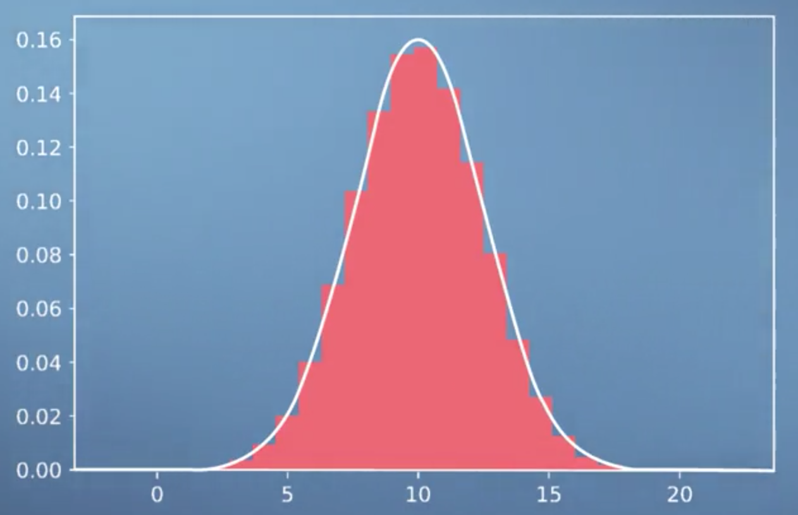
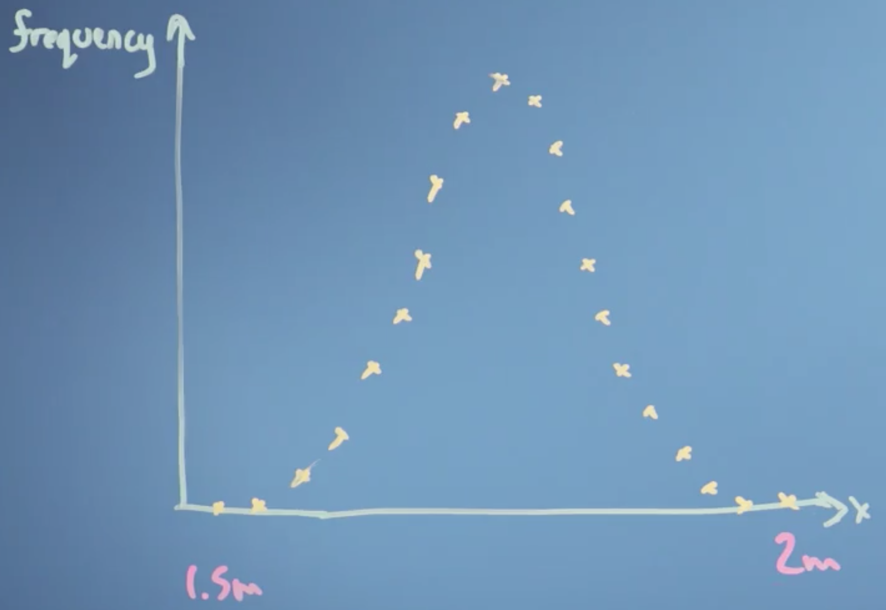
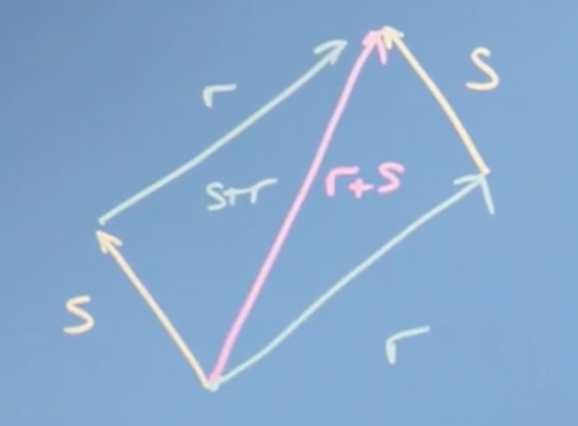
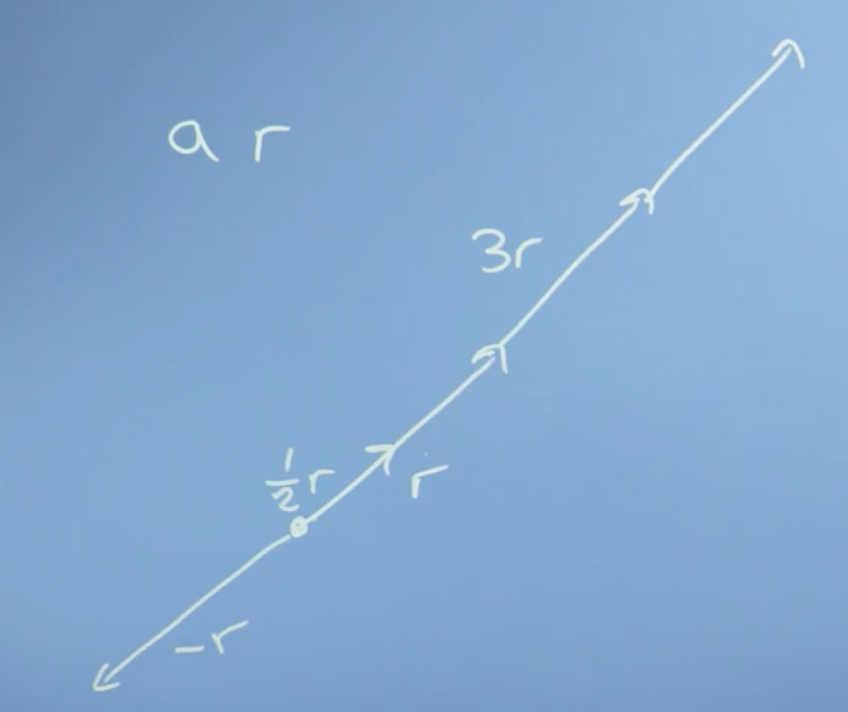
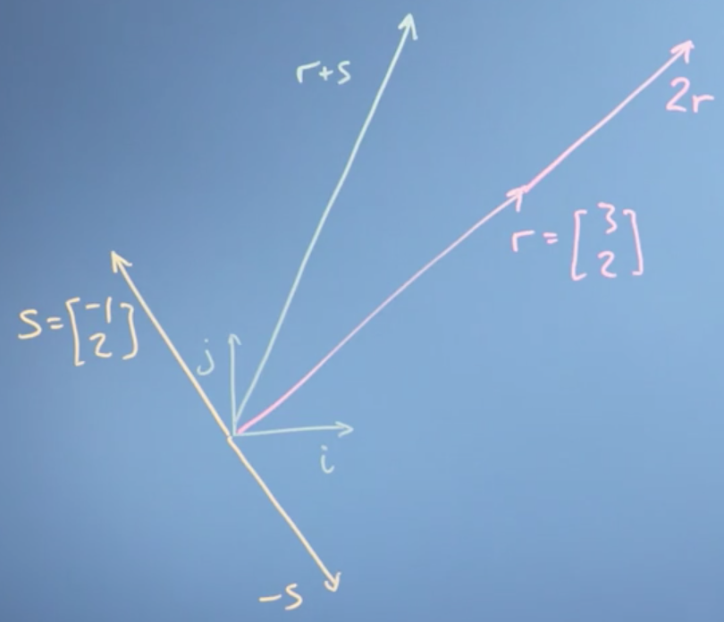

# Week 1: Introduction to Linear Algebra

In this first module we look at how linear algebra is relevant to machine learning and data science. Then we'll wind up the module with an initial introduction to vectors. Throughout, we're focussing on developing your mathematical intuition, not of crunching through algebra or doing long pen-and-paper examples. For many of these operations, there are callable functions in Python that can do the math - the point is to appreciate what they do and how they work, so that when things go wrong or there are special cases, you can understand why and what to do.

_Learning Objectives_

- Recall how machine learning and vectors and matrices are related
- Interpret how changes in the model parameters affect the quality of the fit to the training data
- Recognize that variations in the model parameters are vectors on the response surface - that vectors are a generic concept not limited to a physical real space
- Use substitution / elimination to solve a fairly easy linear algebra problem
- Understand how to add vectors and multiply by a scalar number

## The relationship between machine learning, linear algebra, vectors and matrices

### Motivations for linear algebra

 Lets take a look at the types of problems we might want to solve, in order to expose what **linear algebra** is and how it might help us to solve them.

__Toy problem 1__

The first problem we might think of is [**price discovery**](http://www.wikiwand.com/en/Price_discovery). We can illustrate this problem with a toy example.

Say we go shopping on two occasions, and the first time we buy two apples and three bananas and they cost eight Euros

$$2a + 3b = 8$$

and the second time we buy ten apples and one banana, for a cost of 13 Euros.

$$10a + 1b = 13$$

The $a$'s and $b$'s here, are the price of a single apple and a single banana. What we're going to have to do is solve these [**simultaneous equations**](http://www.wikiwand.com/en/System_of_equations) in order to discover the price of _individual apples and bananas_. Now in the general case, with lots of different types of items and lots of shopping trips, finding out the prices might be _quite hard_.  

This is an example of a linear algebra problem. I have some constant linear coefficients here (2, 10, 3, 1), that relate the **input variables**, $a$ and $b$, to the **outputs** 8 and 13. That is if, we think about a vector $[a,b]$ that describes the prices of apples and bananas, we can write this down as a matrix problem where the 2, 3 is my first trip, and the 10, 1 is my second trip,

$$\begin{pmatrix}2 & 3 \\\ 10 & 1\end{pmatrix} \begin{bmatrix}a \\\ b\end{bmatrix} = \begin{bmatrix} 8 \\\ 3\end{bmatrix}$$

What we're going to do over the course of weeks one to three, is to look at these mathematical objects, [**vectors**](http://www.wikiwand.com/en/Vector_(mathematics_and_physics)) and [**matrices**](http://www.wikiwand.com/en/Matrix_(mathematics)), in order to understand what they are and how to work with them.

__Toy problem 2__

Another type of problem we might be interested in solving is _fitting an equation to some data_. In fact, with neural networks and machine learning, we want the computer to, in effect, not only fit the equation to the data but to figure out _what equation to use_.

Let's say, we have some data like this histogram here:

This looks like a **population** with an **average** and some **variation**. A common problem we  might want to solve is how to find the _optimal value of the parameters_ in the equation describing this line, i.e., the ones that fit the data in the histogram best.

That might be really handy, because with that fitted equation we'd have an easy "portable" description of the population we could carry around, without needing all the original data which would free us, for example, from privacy concerns.

#### Conclusions

In this video, we've set up two problems that can be solved with linear algebra. First, the problem of solving **simultaneous equations**. And secondly, the **optimization problem** of fitting and equation with some parameters to data. These problems and others will motivate our work right through the course on linear algebra, and it's partner course on [multivariate calculus](#multivariate-calculus).

### Geometric and Numeric Interpretations

It is helpful to draw a distinction from the **numerical operations** we can perform using linear algebra, and the **geometric intuitions** underlying them (which are frequently not taught in may introductory courses).

Roughly speaking, the _geometric understanding or intuition_ is what lets us judge what tools to use to solve specific problems, feel why they work, and know how to interpret the results. The _numerical understanding_ is what lets us actually carry through the application of those tools.

If you learn linear algebra without getting a solid foundation in that geometric understanding, the problems can go unnoticed for a while, until you go deeper into whatever field you happen to pursue (e.g. computer science, engineering, statistics, economics, etc.), at which point you may feel disheartened by your lack of understanding of the fundamentals of linear algebra.

With linear algebra (much like trigonometry, for example), there are a handful of useful visual/geometric intuitions underlying much of the subject. When you digest these and really understand the relationship between the geometry and the numbers, the details of the subject as well as how it's used in practice start to feel a lot more reasonable.

!!! note
    Full credit for this section goes to [3Blue1Brown](https://www.youtube.com/channel/UCYO_jab_esuFRV4b17AJtAw). Video [here](https://youtu.be/kjBOesZCoqc).

## Vectors

The first thing we need to do in this course on linear algebra is to get a handle on **vectors**, which will turn out to be really useful to us in solving the linear algebra problems we introduced earlier (along with many more!). That is, problems described by equations which are _linear in their coefficients_, such as most fitting parameters.

!!! tip
    This section maps most closely the the set of Khan Academy courses [here](https://www.khanacademy.org/math/linear-algebra/vectors-and-spaces/vectors/v/vector-introduction-linear-algebra). Take these for more practice.

### Getting a handle on vectors

We're going to first step back and look in some detail at the sort of things we're trying to do with data. And why those vectors you first learned about in high school were even relevant. This will hopefully make all the work with vectors later on in the course a lot more intuitive.

!!! tip
      This is not a great introduction to vectors (IMO). I recommend you first watch [this](https://youtu.be/fNk_zzaMoSs) video, then come back and read this section.

Let's go back to that simpler problem from the last video, the histogram distribution of heights of people in the population:

Say we wanted to try fitting that distribution with an equation describing the variation of height in the population. It turns our that such an equation has just two parameters; one describing the center of the distribution (the [**average**](http://www.wikiwand.com/en/Arithmetic_mean)), which we'll call $\mu$, and one describing how wide it is (or the [**variance**](http://www.wikiwand.com/en/Variance)), which we'll call $\sigma$ .

This equation turns out to be the equation for the **normal** or [(**Gaussian**) **distribution**](http://www.wikiwand.com/en/Normal_distribution):

$$f(x) = \frac{1}{\sigma\sqrt{2\pi}} e^{\frac{-(x-\mu)^2}{2\sigma^2}}$$

So how do we arrive at the best possible values for $\mu$ and $\sigma$? Well, one way is [**gradient descent**](http://www.wikiwand.com/en/Gradient_descent). If we think of some __goodness__ value which measures how well our parameters fit our data (say, the [**mean squared error**](http://www.wikiwand.com/en/Mean_squared_error)) we could imagine plotting this goodness value as a function of our parameters, often called a **cost** or [**loss**](http://www.wikiwand.com/en/Loss_function) function.

The closer our loss function is to zero, the better our parameters fit our data. Gradient descent allows us to choose values for our parameters that minimize the **error**, as measured by our loss function, by taking small incremental steps towards the bottom of the parameter space defined by our loss function.

!!! note
      Gradient descent on a 3D surface.

This process involves computing the partial derivative of our loss function $w.r.t$ to all possible parameters (also known as the [**gradient**](http://www.wikiwand.com/en/Gradient)). If our parameters are stored in a vector,

$$\begin{bmatrix}\mu&\sigma \end{bmatrix}$$

we could subtract from this vector the vector of gradients,

$$\begin{bmatrix}\frac{\partial f}{\partial \mu} & \frac{\partial f}{\partial \sigma}\end{bmatrix}$$

in order to complete the computation in (effectively) one step.

So vectors (and calculus) give us a computational means of navigating a parameter space, in this case by determining the set of parameters for a function $f(x)$ which best explain the data.

__Vectors as abstract lists of numbers__

We can also think of vectors as simply _lists of numbers_. For example, we could describe a car in terms of its price, top speed, safety rating, emissions performance, etc. and store these numbers in a single _vector_.

$$car = \begin{bmatrix}\text{price,} & \text{top speed,} & \text{safety rating, }& ...\end{bmatrix}$$

!!! note
    This is more of a 'computer science' perspective of vectors.

To summarize, a vector is, at the simplest level:

- lists of numbers
- something which moves in a space of parameters

### Operations with vectors

Lets now explore the **operations** we can do with vectors, how these mathematical operations define what vectors are in the first place, and the sort of spaces they can apply to.

We can think of a **vector** as an **object** that moves us about space. This could be a physical space, or a space of data (often called a [**vector space**](http://www.wikiwand.com/en/Vector_space)).

!!! note
      At school, you probably thought of a vector as something that moved you around a physical space, but in computer and data science, we generalize that idea to think of a vector as just a list of attributes of an objects.

More formally, mathematics generalizes the definition of a vector to be an object for which the following two operations are _defined_:

1. **addition**
2. **multiplication** by a scalar

!!! tip
      This is really important, so make sure you understand it. If a mathematical object can be added to another object of the same type, and it can be scaled (i.e. multiplied by a scaler), then its a vector!

__Vector addition__

Intuitively, we can introduce **vector addition** as being the resulting vector of the two vectors we want to add ($s$ and $r$) being placed _head-to-tail_, $s + r$ .

__Multiplication by a scalar__

Multiplying a vector by a **scalar** is also easy to understand. In this case, we simply multiply all elements of our **vector** $r$ by the scalar, $a$ for example.

__Coordinate systems__

At this point, it's convenient to define a **coordinate system**. Imagine we had two dimensions defined by the vectors:

$$\hat i = \begin{bmatrix}1 \\\ 0 \end{bmatrix} \; \hat j = \begin{bmatrix} 1 \\\ 0 \end{bmatrix}$$

!!! note
    These are known as **basis vectors**, and they define the [**basis**](http://www.wikiwand.com/en/Basis_(linear_algebra)).

We could define any vector in this 2D space using the vectors $\hat i$ and $\hat j$ . For example, the vector

$$\begin{bmatrix}3 \\\ 2 \end{bmatrix} = 3 \hat i + 2 \hat j$$

!!! note
     This is also a extremely important point. A vector space is itself _defined by vectors_. We will explore this further later in the course.

This also nicely illustrates that vectors are **associative**, meaning, the sum of a series of vectors is the same regardless of the order we add them in, e.g.,

$$\begin{bmatrix} 3 \\\ 2 \end{bmatrix} = 3 \hat i + 2 \hat{j} = 2 \hat{j} + 3 \hat i$$

__Conclusions__

We've defined _two_ fundamental operations that vectors satisfy: **addition**, (e.g. $r + s$), and **multiplication** by a _scalar_, (e.g. $2r$). We've noted that it can be useful to define a coordinate system in which to do our **addition** and **scaling**, e.g.,

$$  r = \begin{bmatrix}3 \\\ 2 \end{bmatrix} = 3 \hat i + 2 \hat{j}$$

using these fundamental **basis** vectors, $\hat i$ and $\hat{j}$, and explored the properties that this implies, like **associativity** of addition and subtraction.

We've also seen that although, perhaps, it's _easiest_ to think of vector operations _geometrically_, we don't have to do it in a real (number) space. We can also define vector operations on vectors that list different types of objects, like the _attributes of a house_.
