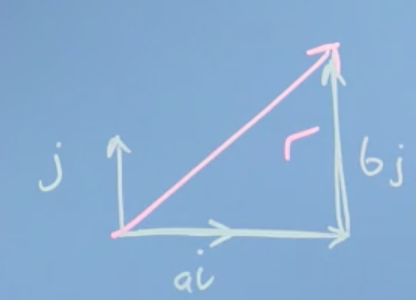
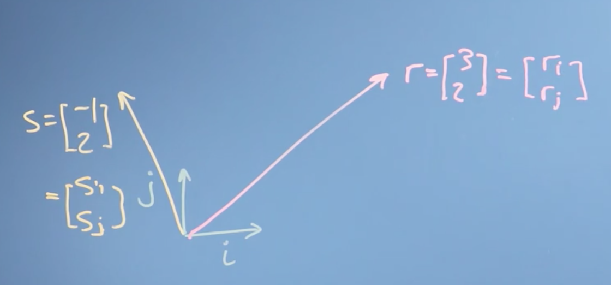
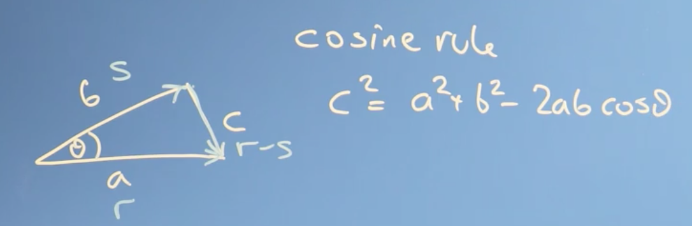
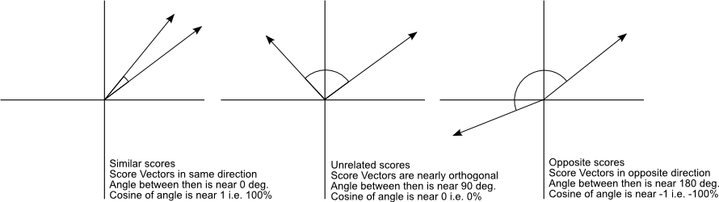
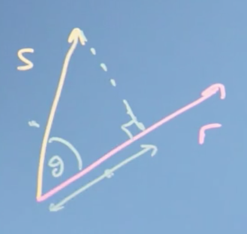
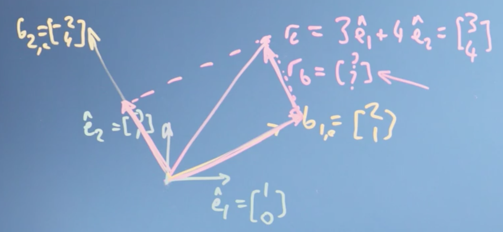
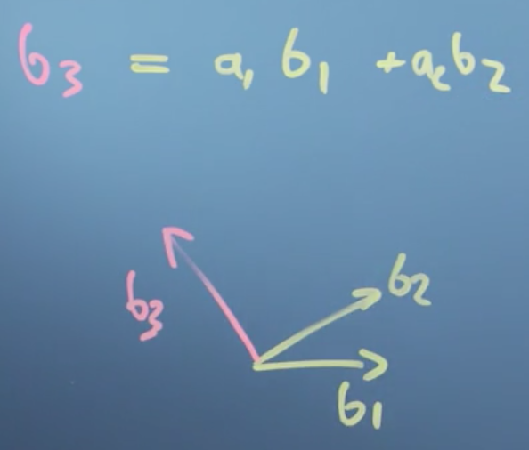

# Week 2: Vectors are Objects that Move Around Space

In this module, we will look at the types operations we can do with vectors - finding the modulus or magnitude (size), finding the angle between vectors (dot or inner product) and projecting one vector onto another. We will then examine how the entries describing a vector will depend on what vectors we use to define the axes - the basis. That will then let us determine whether a proposed set of basis vectors are [**linearly independent**](http://www.wikiwand.com/en/Linear_independence).

This will complete our examination of vectors, allowing us to move on to matrices and then to begin solving linear algebra problems.

_Learning Objectives_

- Calculate basic operations (dot product, modulus, negation) on vectors
- Calculate a change of basis
- Recall linear independence
- Identify a linearly independent basis and relate this to the dimensionality of the space

## Finding the size of a vector, its angle, and projection

!!! tip
    It is probably worth it to watch [this](https://youtu.be/LyGKycYT2v0) 3Blue1Brown video first before reading through this section. However, be warned, it is the most confusing one in the series. If you want even more practice, check out [this](https://www.khanacademy.org/math/linear-algebra/vectors-and-spaces/dot-cross-products/v/vector-dot-product-and-vector-length) Khan Academy track.

### Modulus & inner product

Previously we looked at the two main vector operations of **addition** and **scaling** by a number (multiplication by a **scalar**). As it turns out, those are really the only operations we need to be able to do in order define something as a vector.

Now, we can move on to define two new ideas: the **length of a vector**, also called its _size_, and the [**dot product**](http://www.wikiwand.com/en/Dot_product) of a vector, also called its _inner_, _scalar_ or _projection_ product.

!!! note
    The dot product is a huge and amazing concept in linear algebra with a huge number of implications. We'll only be able to touch on a few parts of it here, but enjoy. It's one of the most beautiful parts of linear algebra.

__Length of a vector__

Lets define a vector $r$ using the basis vectors we introduced earlier, $i$ and $j$,

$$r = a   i + b   j = \begin{bmatrix} a \\\ b \end{bmatrix}$$

To calculate the length of $r$, also called the [**norm**](http://www.wikiwand.com/en/Norm_(mathematics)) $\vert r\vert$ (or $\Vert r\Vert$), we could imagine drawing a triangle, with our vector $r$ as the hypotenuse:

!!! note
    The length, magnitude, modulus and norm of a vector are all the same thing, and just represent a difference in terminology. If we are thinking of a vector as representing the line segment from the origin to a given point (i.e., the geometric interpretation), we may interpret the **norm** as the _length_ of this line segment. If we are thinking of a vector as representing a physical quantity like acceleration or velocity, we may interpret the norm as the **magnitude** of this quantity (how "_large_" it is, regardless of its direction).

By [**Pythagorus's Theorem**](http://www.wikiwand.com/en/Pythagorean_theorem), $\vert r \vert = \sqrt{a^2 + b^2}$

__Vector dot product__

The [**dot product**](http://www.wikiwand.com/en/Dot_product) is one of several ways of multiplying two vectors together, specifically, it is an _algebraic operation that takes two equal-length sequences of numbers (usually coordinate vectors) and returns a single number_.

The dot product has an **algebraic** and **geometric** interpretation. **Algebraically**, the dot product is the _sum of the products of the corresponding entries of the two sequences of numbers_. **Geometrically**, it is the _product of the Euclidean magnitudes of the two vectors and the cosine of the angle between them_.

__Algebraic definition of the dot product__

To illustrate the algebraic definition of the dot product, lets define two vectors $r$ and $s$:

$$r = \begin{bmatrix}r_i \\ r_j\end{bmatrix}, s = \begin{bmatrix}s_i \\ s_j\end{bmatrix}$$

The dot product is then:

$$r \cdot s = r_is_i + r_j s_j = (3)(-1) + (2)(2) = 1$$

More formally, the algebraic definition of the dot product is:

$$r \cdot s = \sum^n_{i=1}a_ib_i = a_1b_1 + a_2b_2 + ... + a_nb_n$$

!!! note
    The algebraic definition of the dot product is simply the sum of the products obtained by multiplying each component from both vectors.

__Properties of the dot product__

The dot product is,

- [**commutative**](http://www.wikiwand.com/en/Commutative_property), e.g., $r \cdot s = s \cdot r$
- [**distributive**](http://www.wikiwand.com/en/Distributive_property), e.g., $r \cdot (s +  {t}) =   r \cdot s +   r \cdot  {t}$
- [**associative**](http://www.wikiwand.com/en/Associative_property) over scalar multiplication, e.g., $r \cdot (a s) = a (   r \cdot s)$

Lets prove the **distributive** property in the general case. Let:

$$r = \begin{bmatrix} r_1 \\\ r_2 \\\ . \\\ . \\\ . \\\ r_n \end{bmatrix}, \; s = \begin{bmatrix} s_1 \\\ s_2 \\\ . \\\ . \\\ . \\\ s_n \end{bmatrix}, \;  {t} = \begin{bmatrix} t_1 \\\ t_2 \\\ . \\\ . \\\ . \\\ t_n \end{bmatrix}$$

then,

$$r \cdot (s +  {t}) = r_1 (s_1 + t_1) + r_2 (s_2 + t_2) + ... + r_n (s_n + t_n)$$

$$= r_1 s_1 + r_1t_1 + r_2s_2 + r_2t_2 + ... + r_ns_n + r_nt_n$$

$$=   r \cdot s +   r \cdot  {t}$$

!!! note
    Proofs for the remaining properties are left as an exercise.

__Link between the dot product and the size of the vector__

If we take $r$ and dot it with itself, we get:

$$r_i r_i + r_j r_j + ... + r_nr_n = r_i^2 + r_j^2 + ... + r_n^2 = \vert r \vert^2$$

So, the size of the vector is just given by $r$ dotted with itself and squared.

### Cosine & dot product

Lets take the time to derive the **geometric** definition of the dot product.

!!! note
    Recall, **geometrically**, the dot product is the _product of the Euclidean magnitudes of the two vectors and the cosine of the angle between them_.

We start with the [**law of cosines**](http://www.wikiwand.com/en/Law_of_cosines) (also known as the **cosine formula** or **cosine rule**) from algebra, which you'll remember, probably vaguely, from school.

The law of cosines states that if we had a triangle with sides $a$, $b$, and $c$, then:

$$c^2 = a^2 + b^2 - 2ab \cos \theta$$

Now, we can translate this into our vector notation:

$$\vert r - s\vert ^2 = \vert r\vert ^2 + \vert s\vert ^2 - 2\vert r\vert \vert s\vert \cos \theta$$

**LHS**

$$\Rightarrow (r-s) \cdot (r-s) = r \cdot r - s \cdot r - s \cdot r - s \cdot s$$

$$= \vert r\vert ^2 - 2 s \cdot r + \vert s\vert ^2$$

!!! note
    $\vert r - s\vert ^2 = (r-s) \cdot (r-s)$ comes straight from the definition of the dot product.

**LHS = RHS**

$$\Rightarrow \vert r\vert ^2 - 2 s \cdot r + \vert s\vert ^2 = \vert r\vert ^2 + \vert s\vert ^2 - 2\vert r\vert \vert s\vert \cos \theta$$

$$\Rightarrow   r \cdot s = \vert r\vert \vert s\vert  \cos \theta$$

So what we notice is that the dot product does something quite _profound_. It takes the size of the two vectors ($\vert r\vert , \vert s \vert$) and multiplies them by $\cos$ of the angle between them. It tells us _something_ about the extent to which the two vectors go in the same direction.

- If $\theta$ is zero, then $\cos \theta$ is one and $r \cdot s$ would just be the size of the two vectors multiplied together.
- If $\theta$ is $90$ degrees (_i.e._ $r$ and $s$ are orthogonal), then $\cos 90$, is $0$ and $r \cdot s$ is $0$.

More generally,

!!! note
    Ignore the word "score" here, this image was taken from a [blog post](http://blog.christianperone.com/2013/09/machine-learning-cosine-similarity-for-vector-space-models-part-iii/) about machine learning. The blog post is worth checking out though. Full credit to [Christian S. Perone](http://blog.christianperone.com) for the image.

In this way, the dot product captures whether the two vectors are pointing in similar directions (positive) or opposite directions (negative).

### Projection

The **vector projection** of a vector $s$ on (or onto) a nonzero vector $r$ (also known as the **vector component** or **vector resolution** of $s$ in the direction of $r$) is the orthogonal projection of $s$ onto a straight line parallel to $r$.

!!! tip
    Understanding projection can be a little tricky. If you want even more practice, check out [this](https://www.khanacademy.org/math/linear-algebra/alternate-bases#orthogonal-projections) Khan Academy series.

For the following triangle,

Recall the geometric definition of the dot product:

$$r \cdot s = \vert r\vert  \vert s\vert  \cos \theta$$

Notice that $\vert s\vert  \cos \theta$ is the _length_ of the **adjacent** side (adjacent to the angle shown). This term is the projection of the vector $s$ into (or onto) the vector $r$. This is why the dot product _is also called_ the **projection product**, because it takes the projection of one vector ($s$) onto another ($r$) times the magnitude or length of the other ($\vert r \vert$).

!!! note
    Note again that if $s$ was orthogonal to $r$ then $\vert s\vert  \cos \theta = \vert s\vert  \cos 90 = 0 = r \cdot s$. This provides a convenient way to check for orthogonality.

Rearranging, we can compute the [**scalar projection**](http://www.wikiwand.com/en/Scalar_projection) of $s$ on $r$:

$$r \cdot s = \vert r\vert\vert s\vert  \cos \theta$$

$$\Rightarrow \frac{  r \cdot s}{\vert r\vert } = \vert s\vert  \cos \theta$$

The scalar projection is a _scalar_, equal to the length of the orthogonal projection of $s$ on $r$, with a negative sign if the projection has an opposite direction with respect to $r$.

We can also define the [**vector projection**](http://www.wikiwand.com/en/Vector_projection)

$$r \cdot s = \vert r\vert\vert s\vert  \cos \theta$$

$$\Rightarrow \frac{  r \cdot s}{\vert r\vert } = \vert s\vert  \cos \theta$$

$$\Rightarrow \frac{r}{\vert r \vert} \cdot \frac{r \cdot s}{\vert r\vert } = \vert s\vert  \cos \theta \cdot \frac{r}{\vert r \vert}$$

which is the orthogonal projection of $s$ onto a straight line parallel to $r$. Notice that this formula is intuitive, we take the __scaler projection__ of $s$ onto $r$ (the length of the orthogonal projection of $s$ on $r$) and multiply it by a unit vector in the direction of $r$, $\frac{r}{\vert r \vert}$.

__Conclusions__

This was really the core video for this week. We found the **size** of a vector and we defined the **dot product**. We've then found out some mathematical operations we can do with the dot product (multiplication by a scalar and the dot product). We also proved that mathematical operations with vectors obey the following properties:

- commutative
- distributive over vector addition
- associative with scalar multiplication

We then found that the dot product actually captures the _angle_ between two vectors, the extent to which they go in the same direction, and also finds the _projection_ of one vector onto another.

## Changing the reference frame

!!! tip
    It is best to watch [this](https://youtu.be/P2LTAUO1TdA) video first, then return to and read through this section. If you want even more exposure to these ideas, try the first three sections of the Khan Academy course [here](https://www.khanacademy.org/math/linear-algebra/alternate-bases).

### Changing basis

So far we haven't really talked about the [**coordinate system**](http://www.wikiwand.com/en/Coordinate_system) of our [**vector space**](http://www.wikiwand.com/en/Vector_space), the coordinates in which all of our vectors exist. In this section we'll look at what we mean by coordinate systems, and walk through a few examples of changing from one coordinate system to another.

Remember that a vector (e.g. $r$) is just an object that takes us from the _origin_ to _some point in space_. This could be some _physical_ space or it could be some _data_ space, like the attributes of a house (bedrooms, price, etc.).

 We could use a coordinate system defined itself by vectors, such as the vectors $\hat{i}$ and $\hat{j}$ that we defined before. Lets give them names $\hat{e_1}$ and $\hat{e_2}$ instead. We will define them to be of unit length, meaning they're of length 1.

!!! note
    The little hat ($\hat i$) denotes unit length.

So,

$$\hat{e_1} = \begin{bmatrix} 1 \\\ 0 \end{bmatrix}, \; \hat{e_2} = \begin{bmatrix} 0 \\\ 1 \end{bmatrix}$$

!!! note
    if we had more dimensions in our space, we could just use more one-hot encoded vectors ($\hat{e_n}$) of dimension equal to the dimensions in our space.

We can then define any other vector in our space in terms of $\hat{e_1}$ and $\hat{e_2}$. For example,

$$r_e = 3\hat{e_1} + 3 \hat{e_2} = \begin{bmatrix} 3 \\\ 4 \end{bmatrix}$$

Here, the instruction is that $r_e$ is going to be equal to doing a vector sum of $3 \hat{e_1}$ and $4 \hat{e_2}$.

If you think about it, our choice of $\hat{e_1}$ and $\hat{e_2}$ is kind of arbitrary. There's no reason we couldn't have used different vectors to define our coordinate system

!!! note
    These vectors don't even need to be at 90 degrees to each other or of the same length

In any case, I could still have described $r$ as being some sum of some vectors I used to define the space. We call the vectors we use to define our vector space (e.g. $\hat{e_1}$ and $\hat{e_2}$) **[basis](http://www.wikiwand.com/en/Basis_(linear_algebra)) vectors**.

What we realize here, is that our vector $r$ exists _independently_ of the coordinate system we use. The vector still takes us from the origin to some point in space, even when we change the coordinate system, more specifically, even when we change the **basis vectors** used to describe our [**vector space**](http://www.wikiwand.com/en/Vector_space).

It turns out, we can actually change the basis of the vector $r$ (call this $r_e$) to a new set of basis vectors, i.e. $\hat{b_1}$ and $\hat{b_2}$, which we will denote $r_b$. Furthermore, we can do this using the dot product so long as

1. The new basis vectors are orthogonal to each other, i.e. $\hat{b_1} \cdot \hat{b_2} = 0$
2. We know the position of $\hat{b_1}$ and $\hat{b_2}$ in the space defined by $\hat{e_1}$ and $\hat{e_2}$.

!!! note
    We can still change basis even when the new basis vectors are not orthogonal to one another, but for this we will need matrices. See later parts of the course.

Lets define $\hat{b_1}$ and $\hat{b_2}$ in the space defined by $\hat{e_1}$ and $\hat{e_2}$:

$$\hat{b_1} = \begin{bmatrix} -2 \\\ 4 \end{bmatrix}, \; \hat{b_2} = \begin{bmatrix} 2 \\\ 1 \end{bmatrix}$$

In order to determine $r_b$, i.e. the vector $r$ defined in terms of the basis vectors $\hat{b_1}$ and $\hat{b_2}$, we need to take _sum_ the **vector projection** of $r_e$ onto $\hat{b_1}$ and the **vector projection** of $r_e$ onto $\hat{b_2}$

So, lets do it:

**Vector projection of $r_e$ onto $\hat{b_1}$**

$$\hat{b_1}\frac{r_e \cdot \hat{b_1}}{\vert \hat{b_1}\vert ^2} = \frac{3 \times 2 + 4 \times 1}{2^2 + 1^2} = \frac{10}{5} = 2 \hat{b_1}  = 2 \begin{bmatrix} 2 \\\ 1\end{bmatrix} = \begin{bmatrix} 4 \\\ 2\end{bmatrix}$$

**Vector projection of $r_e$ onto $\hat{b_2}$**

$$\hat{b_2}\frac{r_e \cdot \hat{b_2}}{\vert \hat{b_2}\vert ^2} = \frac{3 \times -2 + 4 \times 4}{-2^2 + 4^2} = \frac{10}{20} = \frac{1}{2} \hat{b_2}  = \frac{1}{2} \begin{bmatrix} -2 \\\ 4\end{bmatrix} = \begin{bmatrix} -1 \\\ 2\end{bmatrix}$$

Thus,

$$ r_b = \hat{b_1} \frac{r_e \cdot \hat{b_1}}{\vert \hat{b_1}\vert ^2} + \hat{b_2} \frac{r_e \cdot \hat{b_2}}{\vert \hat{b_2}\vert ^2} = 2 \hat{b_1} + \frac{1}{2} \hat{b_2} = \begin{bmatrix}2 \\\ \frac{1}{2}\end{bmatrix}$$

Finally, notice that

$$ r_b = 2 \hat{b_1} + \frac{1}{2} \hat{b_2} = 2 \begin{bmatrix} 2 \\\ 1\end{bmatrix} + \frac{1}{2} \begin{bmatrix} -2 \\\ 4\end{bmatrix} = \begin{bmatrix} 3 \\\ 4\end{bmatrix} =  r_e$$

#### Conclusions

We've seen that our vector describing our data _isn't tied to the axis that we originally used to describe it_. We can redescribe it using _some other axis_, _some other basis vectors_.

It turns out that choosing basis vectors we use to describe the space of data carefully to help us solve our problem will be a very important thing in linear algebra, and in general. We can move the numbers in the vector we used to describe a data item from one basis to another. We can do that change just by taking the _dot_ or _projection product_ so long as the new basis factors are orthogonal to each other.

### Basis, vector space, and linear independence

!!! tip
    Linear independence is really only brushed on here. To go deeper, check out [this](https://www.khanacademy.org/math/linear-algebra/alternate-bases/change-of-basis/v/linear-algebra-coordinates-with-respect-to-a-basis) Khan Academy series.

Previously we've seen that our basis vectors _do not have to be_ the so called [**standard (or natural) basis**](http://www.wikiwand.com/en/Standard_basis). We can actually choose any basis vectors we want, which redefine how we we move about space.

**Standard Basis**

The set of unit vectors pointing in the direction of the axes of a Cartesian coordinate system.

$$\hat{e_x} = \begin{bmatrix} 1 \\\ 0 \\\ 0 \end{bmatrix}, \; \hat{e_y} = \begin{bmatrix} 0 \\\ 1 \\\ 0 \end{bmatrix}, \; \hat{e_z} = \begin{bmatrix} 0 \\\ 0 \\\ 1 \end{bmatrix}$$

!!! note
    Also known as the [orthonormal basis](http://www.wikiwand.com/en/Orthonormal_basis).

 Lets formally define what we mean by a **basis** (vector space), and define **linear independence**, which is going to let us understand how many dimensions our vector space actually has.

 __Basis__

 The **basis** is a set of $n$ vectors that:

 1. are not linear combinations of each other (linear independent)
 2. span the space that they describe

If these two qualities are fulfilled, then the space defined by the basis is $n$-dimensional.

__Linear independence__

A set of vectors is said to be [**linearly dependent**](http://www.wikiwand.com/en/Linear_independence) if one of the vectors in the set can be defined as a linear combination of the others; if no vector in the set can be written in this way, then the vectors are said to be **linearly independent**.

For example, imagine we had some candidate vector ${b_3}$. If we could write ${b_3}$ as a linear combination of, say, ${b_1}$ and ${b_2}$:

$${b_3} = c_1  {b_1} + c_2  {b_2}$$

where $c_1$ and $c_2$ were constants, then we would say that ${b_3}$ is _linearly dependent_ on ${b_1}$ and ${b_2}$.

To drive the point home, we note that the following are true if ${b_3}$ is linearly dependent to the vectors ${b_1}$ and ${b_2}$:

- ${b_3}$ does __not__ lie in the plane spanned by ${b_1}$ and ${b_2}$
- ${b_3} \ne c_1  {b_1} + c_2  {b_2}$ for any $c_1$, $c_2 \in \mathbb R$ OR, equivalently,
- $0 = c_1  {b_1} + c_2 {b_2} + c_3 {b_3}$ implies that $c_1 = c_2 = c_3 = 0$

These concepts are central to the definition of **dimension**. As stated previously, if we have a set of $n$ basis vectors, then these vectors describe an $n$-dimensional space, as we can express any $n$-dimensional vector as a linear combination of our $n$ basis vectors.

Now, notice what our basis vectors ${b_n}$ _don't_ have to be.

- they _don't_ have to be unit vectors, by which we mean vectors of length 1 and
- they _don't_ have to be _orthogonal_ (or _normal_) to each other

But, as it turns out, everything is going to be much easier if they are. So if at all possible, you want to construct what's called an **orthonormal basic vector set**, where all vectors of the set are at $90$ degrees to each other and are all of unit length.

Now, let's think about what happens when we map from one basis to another. The axes of the _original grid_ are projected onto the _new grid_; and potentially have different values on that new grid, but _crucially_, the projection keeps the grid being evenly spaced.

Therefore, any mapping that we do from one set of basis vectors, (one coordinate system) to another set of basis vectors (another coordinate system), keeps the vector space being a _regularly spaced grid_, where our original rules of vector addition and multiplication by a scaler still work.

!!! note
    Basically, it doesn't warp or fold space, which is what the linear bit in linear algebra means geometrically. Things might be stretched or rotated or inverted, but everything remains evenly spaced and linear combinations still work.

Now, when the new basis vectors aren't orthogonal, then we won't be able to use the dot product (really, the projection) to map from one basis to another. We'll have to use matrices instead, which we'll meet in the next module.

!!! tip
    Honestly, this part is tricky. It might be worth it to watch the first three videos of the [Essence of Linear Algebra](https://www.youtube.com/playlist?list=PLZHQObOWTQDPD3MizzM2xVFitgF8hE_ab) series. For the lazy, jumpy straight to this [video](https://youtu.be/kYB8IZa5AuE).

#### Conclusions

In this section, we've talked about the dimensionality of a vector space in terms of the number of independent basis factors that it has. We found a test for independence: vectors are independent if one of them is not a linear combination of the others. Finally, we discussed what that means to map vectors from one space to another and how that is going to be useful in data science and machine learning.

### Summary of week 2

We've looked at vectors as being objects that describe where we are in space which could be a physical space, a space of data, or a parameter space of the parameters of a function. It doesn't really matter. It's just some space.

Then we've defined vector addition and scaling a vector by a number, making it bigger or reversing its direction. Then we've gone on to find the magnitude or modulus of a vector, and the dot scalar and vector projection product. We've defined the basis of a vector space, its dimension, and the ideas of linear independence and linear combinations. We've used projections to look at one case of changes from one basis to another, for the case where the new basis is orthogonal.
