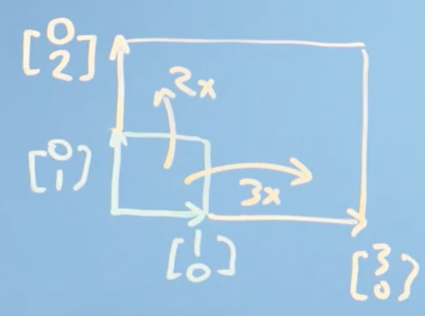
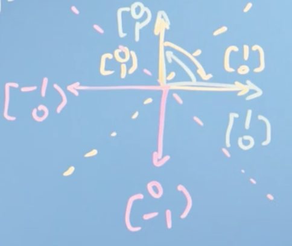
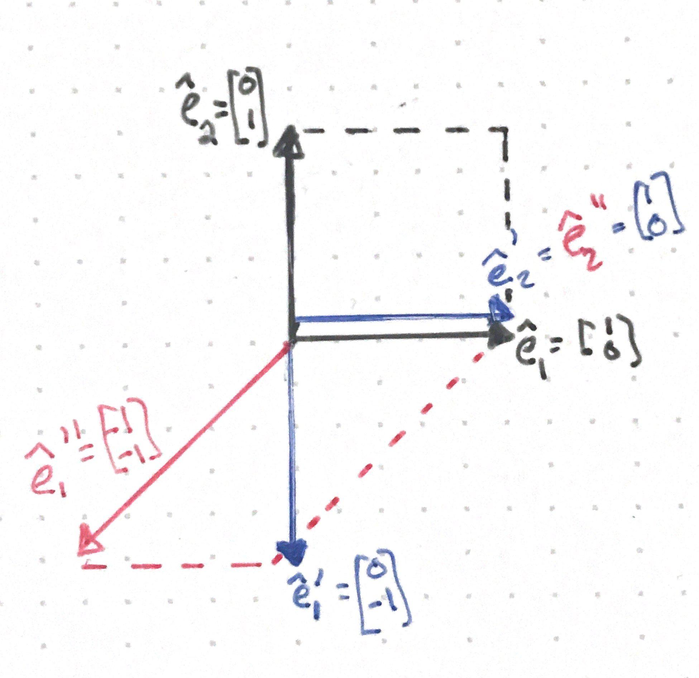
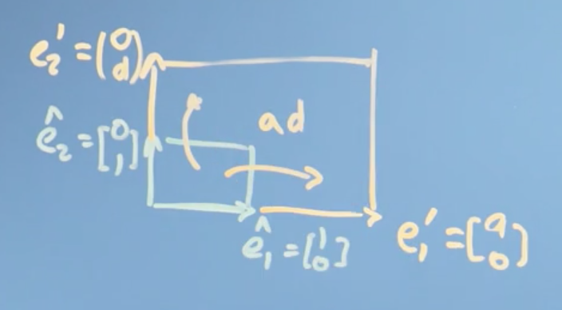
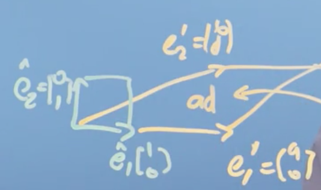
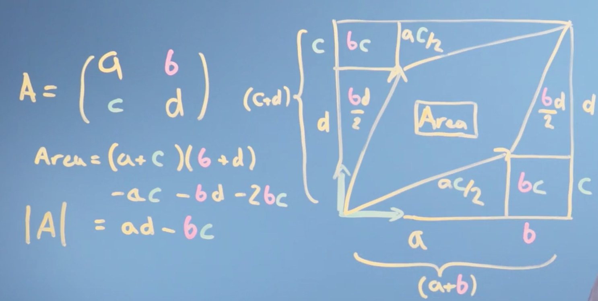
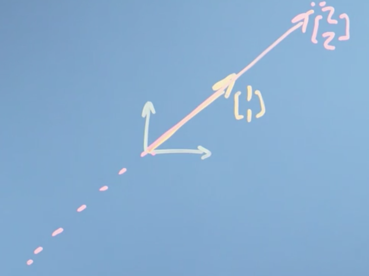

# Week 3: Matrices as Objects that Operate on Vectors

Lets now turn our attention from vectors to [**matrices**](http://www.wikiwand.com/en/Matrix_(mathematics)). First we will look at how to use matrices as tools to solve linear algebra problems, before introducing them as objects that _transform_ vectors. We will then explain how to solve systems of linear equations using matrices, which will introduce the concept of inverse matrices and determinants. Finally, we'll look at cases of special matrices: when the determinant is zero, and where the matrix isn't invertible. Because many algorithms require us to invert a matrix as one of their steps, this special case is important.

**Learning Objectives**

- Understand what a matrix is and how it corresponds to a transformation
- Explain and calculate inverse and determinant of matrices
- Identify and explain how to find inverses computationally
- Explore what it means for a matrix to be inertible

## Matrices

### Introduction to matrices

At the start of the course, we encountered the "apples and bananas" problem: how to find the price of things when we only have the total bill. Now we're going to look at matrices, which can be thought of as objects that rotate and stretch vectors, and how they can be used to solve these sorts of problems.

Let's go back to that apples and bananas problem. Say we walk into a shop and we buy two apples, and three bananas and that costs us 8 euros:

$$2a + 3b = 8$$

On another day and we buy 10 apples and 1 banana, and that costs me 13 euros:

$$10a + 1b = 13$$

!!! note
    Now you might say this is silly. What shop doesn't have sticker prices after all? But actually, businesses with complicated products and service agreements often use [**price discovery**](http://www.wikiwand.com/en/Price_discovery).

Now these are just **simultaneous equations** _but_, I can write them down with matrices as follows:

$$\begin{pmatrix}2 & 3 \\\ 10 & 1\end{pmatrix} \begin{bmatrix}a \\\ b\end{bmatrix} = \begin{bmatrix}8 \\\ 13\end{bmatrix}$$

We can say that the **matrix**

$$\begin{pmatrix}2 & 3 \\\ 10 & 1\end{pmatrix}$$

_operates_ on the **vector**

$$\begin{bmatrix}a \\\ b\end{bmatrix}$$

to give the other **vector**

$$\begin{bmatrix}8 \\\ 13\end{bmatrix}$$

Our question, our problem to solve, is what vector

$$\begin{bmatrix}a \\\ b\end{bmatrix}$$

_transforms_ to give us

$$\begin{bmatrix}8 \\\ 13\end{bmatrix}$$

Now, what if we use our matrix

$$\begin{pmatrix}2 & 3 \\ 10 & 1\end{pmatrix}$$

to transform our basis vectors $\hat e_1$ and  $\hat e_2$?

$$\begin{pmatrix}2 & 3 \\\ 10 & 1\end{pmatrix} \cdot \hat e_1 = \begin{pmatrix}2 & 3 \\\ 10 & 1\end{pmatrix} \begin{pmatrix}1 \\\ 0 \end{pmatrix} = \begin{pmatrix}2 \\\ 10 \end{pmatrix}$$

$$\begin{pmatrix}2 & 3 \\\ 10 & 1\end{pmatrix} \cdot \hat e_2 = \begin{pmatrix}2 & 3 \\\ 10 & 1\end{pmatrix} \begin{pmatrix}0 \\\ 1 \end{pmatrix} = \begin{pmatrix}3 \\\ 1 \end{pmatrix}$$

It becomes clear that what this matrix is doing is actually _transforming_ the basis vectors $\hat e_1$ and  $\hat e_2$ to give us the vectors

$$\begin{pmatrix}2 \\\ 10 \end{pmatrix} \text{ , } \begin{pmatrix}3 \\\ 1 \end{pmatrix}$$

Generally speaking, we can think of the matrix

$$\begin{pmatrix}2 & 3 \\\ 10 & 1\end{pmatrix}$$

as a _function_ that operates on _input_ vectors in order to give us _output_ vectors. A set of simultaneous equations, like the ones we have here, is asking, in effect, what _input_ vector I need in order to get a transformed product (the _output vector_) at position

$$\begin{bmatrix}8 \\\ 13\end{bmatrix}$$

#### Conclusions

Hopefully, it is a little more clear now what we mean now by the term _linear_ algebra. Linear algebra is _linear_, because it just takes input values, our $a$ and $b$ for example, and multiplies them by _constants_. _Everything is linear_. Finally, it's algebra simply because it is a notation describing mathematical objects and a system of manipulating those notations.

So linear algebra is a _mathematical_ system for _manipulating vectors_ in the spaces _described by vectors_.

!!! note
    This is important! We are noticing some kind of deep connection between simultaneous equations, these things called matrices, and the vectors we were talking about last week. It turns that the key to solving simultaneous equation problems is appreciating how vectors are transformed by matrices, which is the heart of linear algebra.

## Matrices as objects that operate on vectors

### How matrices transform space

!!! tip
    Watch [this](https://youtu.be/kYB8IZa5AuE) video before reading through this section.

So far, we have introduced the idea of a matrix and related it to the problem of solving **simultaneous equations**. We showed that the **columns** of a matrix can be thought of as the transformations applied to **unit basis vector** along each axis. This is a pretty profound idea, so lets flesh it out.

We know that we can make any (2D) vector out of a vector _sum_ of the _scaled_ versions of $\hat e_1$ and $\hat e_2$ (our basis vectors).

This means that the result of any _linear_ transformation is just going to be some sum of the transformed basis vectors, ($\hat e_1$ and $\hat e_2$ here). This is a bit hard to see but what it means is that the grid lines of our space stay _parallel_ and _evenly spaced_. They might be stretched or sheared, but the origin stays where it is and there isn't any curviness to the space, it doesn't get warped --- a consequence of our scalar addition and multiplication rules for vectors.

 If we write down the matrix $A$ and the vector it is transforming as $r$, we can represent our apples and bananas problem introduced earlier as:

$$\begin{pmatrix}2 & 3 \\\ 10 & 1\end{pmatrix} \begin{bmatrix}a \\\ b\end{bmatrix} = \begin{bmatrix}8 \\\ 13\end{bmatrix}$$

$$A   r =    r' $$

Where $r'$ is our _transformed_ vector. We can generalize further, and add a scalar, $n$:

$$A (n  r) =  n  r' $$

We notice that:

$$A (r +   s) =  A   r + A   s $$

Putting it together, we can represent any vector in 2D space as:

$$A (n \hat e_1 + m \hat e_2) =  n A \hat e_1 + m A \hat e_2 $$

$$\;\;\;\;\;\;\;\;\;\;\;\;\;\;\;\;\;\;\;= n \hat e_1' + m \hat e_2' $$

Now let's try an example. Let,

$$A = \begin{pmatrix}2 & 3 \\\ 10 & 1\end{pmatrix}$$

$$  r = \begin{bmatrix}3 \\\ 2\end{bmatrix}$$

Then,

$$A   r =    r' $$

$$\Rightarrow \begin{pmatrix}2 & 3 \\\ 10 & 1\end{pmatrix} \begin{bmatrix}3 \\\ 2\end{bmatrix} = \begin{bmatrix}12 \\\ 32\end{bmatrix}$$

Which is no different than how we might have multiplied matrices and vectors in school. But, we can think of this another way:

$$A (n \hat e_1 + m \hat e_2) =  r'$$

$$\Rightarrow \begin{pmatrix}2 & 3 \\\ 10 & 1\end{pmatrix} \Biggl (3 \begin{bmatrix}1 \\\ 0\end{bmatrix} + 2 \begin{bmatrix}0 \\\ 1\end{bmatrix} \Biggl) = $$

$$3 \begin{pmatrix}2 & 3 \\\ 10 & 1\end{pmatrix} \begin{bmatrix}1 \\\ 0\end{bmatrix} + 2 \begin{pmatrix}2 & 3 \\\ 10 & 1\end{pmatrix} \begin{bmatrix}0 \\\ 1\end{bmatrix} = $$

$$= 3 \begin{bmatrix}2 \\\ 10\end{bmatrix} + 2 \begin{bmatrix}3 \\\ 1\end{bmatrix} = \begin{bmatrix}12 \\\ 32\end{bmatrix}$$

The take home idea here is that the matrix $A$ just _tells us where the basis vectors go_. That's the _transformation_ it does.

### Types of matrix transformation

Lets illustrate the type of transformations we can perform with matrices with a number of examples.

!!! note
    Remember, in linear algebra, linear transformations can be represented by matrices!

We are only going to scratch the surface here and to continue to build up our intuition of viewing matrices as _functions_ that apply _transformations_ to some _input vector_.

__Identity matrix__

First, let's think about a matrix that doesn't change anything. Such a matrix is just composed of the **basis vectors** of the space,

$$\begin{bmatrix} 1 & 0  \\\ 0 & 1\end{bmatrix} \begin{bmatrix} x  \\\ y\end{bmatrix} = \begin{bmatrix} x  \\\ y\end{bmatrix}$$

this is known as the [**identity matrix**](http://www.wikiwand.com/en/Identity_matrix). It's the matrix that does nothing and leaves everything preserved, typically denoted $I_m$ where $m$ is the number of dimensions in our vector space.

__Scaling__

When our matrix contains values other than $0$ in the diagnonal, we get a __scaling__:

$$\begin{bmatrix} m & 0  \\\ 0 & n\end{bmatrix} \begin{bmatrix} x  \\\ y\end{bmatrix} = \begin{bmatrix} mx  \\\ ny\end{bmatrix}$$

If $m = 3$ and $n=2$, visually this looks like:

This transformation simply _scales_ each dimension of the space by the value at the corresponding diagonal of the matrix.

!!! note
    Note that when $m \lt 1$ and/or $n \lt 1$, our space is actually _compressed_ along the axes.

__Reflections__

When one or more of our diagonal values is negative, we get a __reflection__:

$$\begin{bmatrix} -1 & 0  \\\ 0 & k\end{bmatrix} \begin{bmatrix} x  \\\ y\end{bmatrix} = \begin{bmatrix} -x  \\\ ky\end{bmatrix}$$

In this case, our coordinate system is flipped across the _vertical_ axis. When $k = 2$, visually this looks like:

In another example,

$$\begin{bmatrix} -1 & 0  \\\ 0 & -1\end{bmatrix} \begin{bmatrix} x  \\\ y\end{bmatrix} = \begin{bmatrix} -x  \\\ -y\end{bmatrix}$$

This transformation inverts _all_ axes, and is known as an __inversion__.

We can also produce mirror reflections over a straight line that crosses through the origin:

$$\begin{bmatrix} 0 & 1  \\\ 1 & 0\end{bmatrix} \begin{bmatrix} x  \\\ y\end{bmatrix} = \begin{bmatrix} y  \\\ x\end{bmatrix}$$

or,

$$\begin{bmatrix} 0 & -1  \\\ -1 & 0\end{bmatrix} \begin{bmatrix} x  \\\ y\end{bmatrix} = \begin{bmatrix} -y  \\\ -x\end{bmatrix}$$

!!! note
    Of course, we can also produce mirror transformations over the $x$ or $y$ axis as well, by making one of the diagonals $1$ and the other $-1$.

__Shears__

[**Shears**](http://www.wikiwand.com/en/Shear_mapping) are visually similar to _slanting_. There are two possibilities:

A shear parallel to the $x$ axis looks like:

$$\begin{bmatrix} 1 & k \\\ 0 & 1\end{bmatrix} \begin{bmatrix} x  \\\ y\end{bmatrix} = \begin{bmatrix} x + ky  \\\ y\end{bmatrix}$$

If $k=1$, then visually this looks like:

Or a shear parallel to the $y$ axis:

$$\begin{bmatrix} 1 & 0 \\\ k & 1\end{bmatrix} \begin{bmatrix} x  \\\ y\end{bmatrix} = \begin{bmatrix} x  \\\ kx + y\end{bmatrix}$$

__Rotations__

Finally, we can rotate the space about the orign. For example,

$$\begin{bmatrix} 0 & -1 \\\ 1 & 0\end{bmatrix} \begin{bmatrix} x  \\\ y\end{bmatrix} = \begin{bmatrix} y  \\\ -x\end{bmatrix}$$

would rotate the entire space $90^0$ counterclockwise.

More generally, for a rotation by a angle $\theta$ **clockwise** about the orgin:

$$\begin{bmatrix} \cos \theta & \sin \theta \\\ - \sin \theta & \cos \theta \end{bmatrix} \begin{bmatrix} x \\\ y\end{bmatrix} = \begin{bmatrix} x \cos \theta + y \sin \theta  \\\  - x \sin \theta + y \cos \theta\end{bmatrix}$$

and for a rotation by a angle $\theta$ **counterclockwise** about the orgin

$$\begin{bmatrix} \cos \theta & - \sin \theta \\\ \sin \theta & \cos \theta \end{bmatrix} \begin{bmatrix} x \\\ y\end{bmatrix} = \begin{bmatrix} x \cos \theta - y \sin \theta  \\\  x \sin \theta + y \cos \theta\end{bmatrix}$$

#### Conclusions

In this section, we described the major transformations that a matrix can perform on a vector. Next, we will look at how we can combine these transformations (known as __composition__) to produce more complex matrix transformations

### Composition or combination of matrix transformations

!!! tip
    Watch [this](https://youtu.be/XkY2DOUCWMU) video before reading through this section.

So what is the point of introducing these different geometric transformations in this class? Well, if you want to do any kind of _shape_ alteration, say of all the pixels in an image, or a face, then you can always make that shape change out of some combination of _rotations_, _shears_, _stretches_, and _inverses_.

!!! note
    One example where these geometric transformations may be useful is in [**facial recognition**](http://www.wikiwand.com/en/Facial_recognition_system), where we may preprocess every image by transforming it so that the person(s) face(s) are directly facing the camera.

Lets illustrate this _composition_ of matrix transformations with an example. Here, we will first apply a $90^o$ rotation clockwise about the $x$-axis, and then a shear parallel to the $x$-axis. Let the first transformation matrix be $A_1$:

$$\begin{bmatrix} 0 & 1  \\\ -1 & 0\end{bmatrix} \begin{bmatrix} x  \\\ y\end{bmatrix} = \begin{bmatrix} y  \\\ -x\end{bmatrix}$$

And our second transformation matrix $A_2$:

$$\begin{bmatrix} 1 & 1  \\\ 0 & 1\end{bmatrix} \begin{bmatrix} x  \\\ y\end{bmatrix} = \begin{bmatrix} x + y  \\\ y\end{bmatrix}$$

Applying $A_1$ to our basis vectors $\hat e_1$ and $\hat e_2$ gives us $\hat e_1'$ and $\hat e_1'$:

$$\hat e_1' = A_1 \cdot \hat e_1 = \begin{bmatrix} 0  \\\ -1\end{bmatrix}$$

$$\hat e_2' = A_1 \cdot \hat e_2 = \begin{bmatrix} 1  \\\ 0\end{bmatrix}$$

Applying $A_2$ to our new transformed vectors $\hat e_1'$ and $\hat e_2'$ gives us $\hat e_1''$ and $\hat e_1''$:

$$\hat e_1'' = A_2 \cdot \hat e_1' = \begin{bmatrix}-1 \\\ -1\end{bmatrix}$$

$$\hat e_2'' = A_2 \cdot \hat e_2' = \begin{bmatrix} 1  \\\ 0\end{bmatrix}$$

Notice that if we stack our final transformed vectors $\hat e_1''$ and $\hat e_1''$ as columns we get the matrix:

$$\begin{bmatrix} -1 & 1  \\\ -1 & 0\end{bmatrix}$$

Which is equal to $A_2 \cdot A_1$. Geometrically, this looks like:

__Conclusions__

The take home message here is that the transformation $A_2 \cdot (A_1 \cdot r)$ for some transformation matrices $A_1$ and $A_2$ and some vector $r$, is equivalent to the transformation $(A_2A_1) \cdot r$

!!! note
    Note that $A_2 \cdot (A_1 \cdot r) \ne A_1 \cdot (A_2 \cdot r)$, that is, the order in which we apply our transformations _matters_.

As it turns out, the key to solving simultaneous equation problems is appreciating how vectors are _transformed_ by matrices, which is at the the heart of linear algebra.

## Matrix inverses

In this section, we are finally going to present a way to solve the _apples and bananas_ problem with matrices. Along the way, we're going to find out about a thing called the [**inverse**](http://www.wikiwand.com/en/Invertible_matrix) of a matrix and a method for finding it.

!!! tip
    Watch [this](https://youtu.be/uQhTuRlWMxw) video before reading this section. For more practice with matrix inverses, see Khan Academy sections [here](https://www.khanacademy.org/math/linear-algebra/matrix-transformations/inverse-transformations/v/linear-algebra-introduction-to-the-inverse-of-a-function) and [here](https://www.khanacademy.org/math/linear-algebra/matrix-transformations/inverse-of-matrices/v/linear-algebra-deriving-a-method-for-determining-inverses).

### Gaussian elimination: Solving the apples and bananas problem

First, recall our apples and bananas problem in matrix form:

$$\begin{pmatrix}2 & 3 \\\ 10 & 1\end{pmatrix} \begin{bmatrix}a \\\ b\end{bmatrix} = \begin{bmatrix} 8 \\\ 3\end{bmatrix}$$

Where we want to find the price of individual apples ($a$) and bananas ($b$). Simplifying, lets say that:

$$A\cdot r =   s$$

!!! note
    This, in effect is saying: "$A$ _operates_ on vector $r$ to give us $s$".

To solve for $r$, we need to move $A$ to the other side of the equation. _But how?_. Well, to "undo" a division (and isolate $x$), you multiply by the reciprocal:

$$\frac{1}{2}x = 4$$

$$\Rightarrow x = 8$$

Likewise, to undo a multiplication, we divide by the reciprocal:

$$2x = 4$$

$$\Rightarrow x = 2$$

How do we _undo_ the transformation performed by $A$? The answer is to find the matrix $A^{-1}$ (known as the __inverse__ of $A$) such that:

$A^{-1}A = I$

where $I$ is the [identity matrix](http://www.wikiwand.com/en/Identity_matrix). We call $A^{-1}$ the __inverse__ of $A$ because is it _reverses whatever transformation_ $A$ does, giving us back $I$. We note that:

$$A^{-1}A\cdot r = A^{-1}   s$$

$$\Rightarrow\ I \cdot r = A^{-1}   s$$

$$\Rightarrow\   r = A^{-1}   s$$

So, if we could find the inverse of $A$ (i.e. find $A^{-1}$), we can solve our problem (i.e. find $a$ and $b$). We can solve for $A^{-1}$ with a series of _row operations_ or _substitutions_ (known as [**Gaussian elimination**](http://www.wikiwand.com/en/Gaussian_elimination)).

Let's look at a slightly more complicated problem to see how this is done:

$$\begin{pmatrix}1 & 1 & 3 \\\ 1 & 2 & 4 \\\ 1 & 1 & 2\end{pmatrix} \begin{bmatrix}a \\\ b \\\ c\end{bmatrix} = \begin{bmatrix} 15 \\\ 21 \\\ 13\end{bmatrix}$$

We start by subtracting row 1 from rows 2 and 3, which gives us a matrix in [**row echelon form**](http://www.wikiwand.com/en/Row_echelon_form) (technically, [reduced row echelon form](http://www.wikiwand.com/en/Row_echelon_form#/Reduced_row_echelon_form)):

$$\begin{pmatrix}1 & 1 & 3 \\\ 0 & 1 & 1 \\\ 0 & 0 & 1\end{pmatrix} \begin{bmatrix}a \\\ b \\\ c\end{bmatrix} = \begin{bmatrix} 15 \\\ 6 \\\ 2\end{bmatrix}$$

We then perform two steps of [**back substitution**](http://www.wikiwand.com/en/Triangular_matrix#/Forward_and_back_substitution) to get the identify matrix:

$$\begin{pmatrix}1 & 1 & 0 \\\ 0 & 1 & 0 \\\ 0 & 0 & 1\end{pmatrix} \begin{bmatrix}a \\\ b \\\ c\end{bmatrix} = \begin{bmatrix} 9 \\\ 4 \\\ 2\end{bmatrix}$$

$$\begin{pmatrix}1 & 0 & 0 \\\ 0 & 1 & 0 \\\ 0 & 0 & 1\end{pmatrix} \begin{bmatrix}a \\\ b \\\ c\end{bmatrix} = \begin{bmatrix} 5 \\\ 4 \\\ 2\end{bmatrix}$$

We can then read the solution right from the matrices $a = 5$, $b = 4$, $c = 2$.

!!! tip
    If you are still feeling uneasy about using Gaussian elimination to solve a system of linear equations, see [here](https://youtu.be/2j5Ic2V7wq4) for an example walked through step-by-step example. Full credit to [PatrickJMT](http://patrickjmt.com).

__Conclusions__

As it turns out, we don't have to compute the inverse at all to solve a system of linear equations. Although we showed the process of Gaussian elimination for some vectors $r$ and $s$, we can use it in the general case to solve for any linear equation of the form $A\cdot r =   s$. This actually one of the most computationally efficient ways to solve this problem, and it's going to work every time.

### From Gaussian elimination to finding the inverse matrix

Now, let's think about how we can apply this idea of _elimination_ to find the inverse matrix, which solves the more general problem no matter what vectors I write down on the right hand side.

Say I have a 3 $\times$ 3 matrix $A$ and its inverse $B$ ($B = A^{-1})$. By the definition of the [**inverse**](http://www.wikiwand.com/en/Invertible_matrix),

$$AB = BA = I_n$$

If we use our matrix $A$ from the last section:

$$\begin{pmatrix}1 & 1 & 3 \\\ 1 & 2 & 4 \\\ 1 & 1 & 2\end{pmatrix} \begin{pmatrix}b_{11} & b_{12} & b_{13} \\\ b_{21} & b_{22} & b_{23} \\\ b_{31} & b_{32} & b_{33}\end{pmatrix} = I$$

!!! note
    Where $b_{ij}$ is the element at the $i^{th}$ row and $j^{th}$ column of matrix $B$.

we notice that the first column of $B$ is just a vector. It's a vector that describes what the $B$ matrix, the inverse of $A$, does to space.

!!! note
    Actually, it's the transformation that that vector does to the x-axis.

This means that:

$$\begin{pmatrix}1 & 1 & 3 \\\ 1 & 2 & 4 \\\ 1 & 1 & 2\end{pmatrix} \begin{pmatrix}b_{11} \\\ b_{21} \\\ b_{31}\end{pmatrix} = \begin{pmatrix} 1 \\\ 0 \\\ 0\end{pmatrix}$$

Now, we could solve this by the elimination method and back substitution in just the way we did before. Then, we could do it again for the second column of $B$, and finally the third. In this way, we would have solved for $B$, in other words, we would have found $A^{-1}$.

It turns out, we can actually solve for $B$ all at once. So lets do that:

$$\begin{pmatrix}1 & 1 & 3 \\\ 1 & 2 & 4 \\\ 1 & 1 & 2\end{pmatrix} \begin{pmatrix}b_{11} & b_{12} & b_{13} \\\ b_{21} & b_{22} & b_{23} \\\ b_{31} & b_{32} & b_{33}\end{pmatrix} = I$$

Subtract row 1 from row 2 and 3:

$$\Rightarrow \begin{pmatrix}1 & 1 & 3 \\\ 0 & 1 & 1 \\\ 0 & 0 & -1\end{pmatrix} \begin{pmatrix}b_{11} & b_{12} & b_{13} \\\ b_{21} & b_{22} & b_{23} \\\ b_{31} & b_{32} & b_{33}\end{pmatrix} = \begin{pmatrix}1 & 0 & 0 \\\ -1 & 1 & 0 \\\ -1 & 0 & 1\end{pmatrix}$$

Multiply row 3 by $-1$:

$$\Rightarrow \begin{pmatrix}1 & 1 & 3 \\\ 0 & 1 & 1 \\\ 0 & 0 & 1\end{pmatrix} \begin{pmatrix}b_{11} & b_{12} & b_{13} \\\ b_{21} & b_{22} & b_{23} \\\ b_{31} & b_{32} & b_{33}\end{pmatrix} = \begin{pmatrix}1 & 0 & 0 \\\ -1 & 1 & 0 \\\ 1 & 0 & -1\end{pmatrix}$$

Now that row 3 is in [row echelon form](http://www.wikiwand.com/en/Row_echelon_form), we can substitute it back into row 2 and row 1:

$$\Rightarrow \begin{pmatrix}1 & 1 & 0 \\\ 0 & 1 & 0 \\\ 0 & 0 & 1\end{pmatrix} \begin{pmatrix}b_{11} & b_{12} & b_{13} \\\ b_{21} & b_{22} & b_{23} \\\ b_{31} & b_{32} & b_{33}\end{pmatrix} = \begin{pmatrix} -2 & 0 & 3 \\\ -2 & 1 & 1 \\\ 1 & 0 & -1\end{pmatrix}$$

And finally, back substitute row 2 into row 1:

$$\Rightarrow \begin{pmatrix}1 & 0 & 0 \\\ 0 & 1 & 0 \\\ 0 & 0 & 1\end{pmatrix} \begin{pmatrix}b_{11} & b_{12} & b_{13} \\\ b_{21} & b_{22} & b_{23} \\\ b_{31} & b_{32} & b_{33}\end{pmatrix} = \begin{pmatrix} 0 & -1 & 2 \\\ -2 & 1 & 1 \\\ 1 & 0 & -1\end{pmatrix}$$

Because any matrix times its identity is that matrix itself:

$$\begin{pmatrix}1 & 0 & 0 \\\ 0 & 1 & 0 \\\ 0 & 0 & 1\end{pmatrix} \begin{pmatrix}b_{11} & b_{12} & b_{13} \\\ b_{21} & b_{22} & b_{23} \\\ b_{31} & b_{32} & b_{33}\end{pmatrix} = \begin{pmatrix} 0 & -1 & 2 \\\ -2 & 1 & 1 \\\ 1 & 0 & -1\end{pmatrix}$$

$$\Rightarrow \begin{pmatrix}b_{11} & b_{12} & b_{13} \\\ b_{21} & b_{22} & b_{23} \\\ b_{31} & b_{32} & b_{33}\end{pmatrix} = \begin{pmatrix} 0 & -1 & 2 \\\ -2 & 1 & 1 \\\ 1 & 0 & -1\end{pmatrix}$$

!!! note
    You can actually prove to yourself that we got the right answer by checking that $A \cdot B = I$.

So that's our answer. We've found the identity matrix, $B = A^{-1}$ for $A$, and we did this by transforming $A$ into it's identity matrix via elimination and back substitution. Moreover, because $B$ could be any matrix, we have solved this in the general case. The solution is the same regardless of the number of dimensions, and this leads to a computationally efficient way to invert a matrix.

!!! note
    There are computationally faster methods of computing the inverse, one such method is known as  a **decomposition process**. In practice, you will simply call the solver of your problem or function, something like `inv(A)`, and it will pick the best method by inspecting the matrix you give it and return the answer.

__Conclusions__

We have figured out how to solve sets of linear equations in the general case, by a procedure we can implement in a computer really easily (known as [**Gaussian elimination**](http://www.wikiwand.com/en/Gaussian_elimination)), and we've generalized this method to the to find the **inverse** of a matrix, regardless of what is on the right hand side of our system of equations.

## Special matrices

In the final section of this week, we're going to look at a property of a matrix called the [**determinant**](http://www.wikiwand.com/en/Determinant).

!!! note
    The **determinant** is a value that can be computed from the elements of a [**square matrix**](http://www.wikiwand.com/en/Square_matrix#Square_matrices). The determinant of a matrix $A$ is denoted $det(A)$, $det A$, or $\vert A \vert$. Geometrically, it can be viewed as the scaling factor of the [**linear transformation**](http://www.wikiwand.com/en/Linear_map) described by the matrix.

We'll also look at what happens when a matrix _doesn't_ have linearly independent basis vectors.  

!!! tip
    Watch [this](https://youtu.be/Ip3X9LOh2dk) video before reading this section. For more practice with matrix inverses, see Khan Academy sections [here](https://www.khanacademy.org/math/linear-algebra/matrix-transformations/inverse-of-matrices/v/linear-algebra-deriving-a-method-for-determining-inverses) and [here](https://www.khanacademy.org/math/linear-algebra/matrix-transformations/determinant-depth/v/linear-algebra-determinant-when-row-multiplied-by-scalar).

### The determinant

Let's start by looking at the simple matrix:

$$\begin{pmatrix} a & 0 \\\ 0 & d\end{pmatrix}$$

If we multiply this matrix by our basis vectors $\hat e_1$ and  $\hat e_2$, we get

$$\hat e_1' = \begin{bmatrix} a \\\ 0 \end{bmatrix}$$

$$\hat e_2' = \begin{bmatrix} 0 \\\ d \end{bmatrix}$$

So, in plain english, we have stretched our $x$-axis by a factor of $a$ and our $y$-axis by a factor of $d$ and, therefore, scaled the area of the grid cells of the vector space by a factor of $ad$.

!!! note
    This is a property of the fact that any linear transformation keeps grid lines parallel and evenly spaced.

We call this number, $ad$ the **determinant**.

Now, if I instead have a matrix:

$$\begin{pmatrix} a & b \\\ 0 & d\end{pmatrix}$$

then this is still going to stretch $\hat e_1$ out by a factor of $a$, _but_ on the other axis, I am going to move $\hat e_2$ hat to:

$$\hat e_2 = \begin{pmatrix} b \\\ d\end{pmatrix}$$

What we have done is taken the original grid and stretched it along the $x$-axis by $a$ and, along the $y$-axis by $d$ and sheared it (parallel to the $x$-axis) by $b$.

!!! note
    We've still changed the size, the scale of the space (which is what the determinant really is) by a factor of $ad$.

Notice that the area defined by our transformed vectors $\hat e_1'$ and $\hat e_2'$ is _still_ just the base times the perpendicular height, $ad$ (the determinant).

Lets flesh this out in the _general_ case. Say we have the matrix:

$$A = \begin{pmatrix} a & b \\\ c & d\end{pmatrix}$$

Multiplying this matrix by our basis vectors yields a parallelogram (stretched by $a$ and $d$ and sheared by $b$ and $c$). We can actual compute the area of this parallelogram as follows:

!!! note
    We find the area of this parallelogram by finding the area of the whole box the encloses it, and subtracting off combined area of the the little bits around it.

The exact method for solving the area is not important (although it is pretty trivial). What is important, is that the **determinant** of $A$ can be computed as $\vert A \vert =  ad - bc$, and that this computation has a _geometric interpretation_.

!!! note
    This is the formula for the determinant of a square $2 \times 2$ matrix. See [here](http://www.wikiwand.com/en/Determinant#/3_×_3_matrices) for the formula for higher dimensional matrices.

Now, in school when you looked at matrices, you probably saw that you could find the inverse in the following way. For a matrix:

$$A = \begin{pmatrix} a & b \\\ c & d\end{pmatrix}$$

1. Exchange $a$ and the $d$, and switch the sign on the $b$ and the $c$
2. Multiply $A$ by this matrix
3. Scale the transformation by $\frac{1}{ad - bc}$

In the general case, this looks like:

$$\frac{1}{ad - bc} \begin{pmatrix} a & b \\\ c & d\end{pmatrix} \begin{pmatrix} d & -b \\\ -c & a\end{pmatrix} = \frac{1}{ad - bc} \begin{pmatrix} ad - bc & 0 \\\ 0 & ad - bc\end{pmatrix} = I$$

This demonstrates that

$$\frac{1}{ad - bc} \begin{pmatrix} d & -b \\\ -c & a\end{pmatrix}$$

is in fact the inverse of the matrix $A$.

This helps capture what the determinant really is. It's the _amount_ by which the original matrix _scaled_ vector space. In the above example, dividing by the determinant normalizes the space back to its _original_ size.

!!! note
    We could spend a lot of time talking about how to solve for the determinant. However, knowing how to do the operations isn't really a useful skill. Many programming libraries (e.g. `python`) have linear algebra libraries (e.g. `Numpy`) which makes computing the determinant as easy, for example, as calling `det(A)`. If you really want to know how to compute determinants by hand, then look up a [**QR decomposition**](http://www.wikiwand.com/en/QR_decomposition) online.

#### A determinant of zero

Now, let's think about the matrix

$$A = \begin{pmatrix} 1 & 2 \\\ 1 & 2\end{pmatrix}$$

If we multiply this matrix by our basis vectors $\hat e_1$ and  $\hat e_2$, we get

$$\hat e_1' = \begin{bmatrix} 1 \\\ 1 \end{bmatrix}$$

$$\hat e_2' = \begin{bmatrix} 2 \\\ 2 \end{bmatrix}$$

So this matrix, when applied to our vector space, actually _collapses it onto a line_. All our $y$'s are mapped to the vector

$$\begin{bmatrix}2 \\\ 2 \end{bmatrix}$$

and our $x$'s to

$$\begin{bmatrix}1 \\\ 1 \end{bmatrix}$$

Correspondingly, we notice that $\vert A \vert = 0$. Therefore, the area enclosed by the new basis vectors is _zero_.

#### A negative determinant

A negative determinant simply means that the transformation has _flipped_ the orientation of our vector space. This is much easier to _see_ than to _explain_; check out [this](https://youtu.be/Ip3X9LOh2dk) video which presents some awesome visualizations of the determinant.

#### What the determinant means numerically

To drive home the numerical interpretation of the determinant, lets start with this set of simultaneous equations:

$$\begin{pmatrix} 1 & 1 & 3 \\\ 1 & 2 & 4 \\\ 2 & 3 & 7\end{pmatrix} \begin{pmatrix} a \\\ b \\\ c\end{pmatrix} = \begin{pmatrix} 12 \\\ 17 \\\ 29\end{pmatrix}$$

You'll notice that both the _rows_ and the _columns_ are _linearly dependent_. Thinking about the columns of this matrix as the basis vectors of some 3-dimensional space, we note that this transformation collapses our vector space from being 3D to 2D (by collapsing every point in space onto a plane). Let's see what this means numerically by trying to reduce our matrix to row-echelon form:

$$\begin{pmatrix} 1 & 1 & 3 \\\ 1 & 2 & 4 \\\ 2 & 3 & 7\end{pmatrix} \begin{pmatrix} a \\\ b \\\ c\end{pmatrix} = \begin{pmatrix} 12 \\\ 17 \\\ 29\end{pmatrix}$$

Subtract row 1 from row 2,

$$\Rightarrow \begin{pmatrix} 1 & 1 & 3 \\\ 0 & 1 & 1 \\\ 2 & 3 & 7\end{pmatrix} \begin{pmatrix} a \\\ b \\\ c\end{pmatrix} = \begin{pmatrix} 12 \\\ 5 \\\ 29\end{pmatrix}$$

Subtract row 1 plus row 2 from row 3,

$$\Rightarrow \begin{pmatrix} 1 & 1 & 3 \\\ 0 & 1 & 1 \\\ 0 & 0 & 0\end{pmatrix} \begin{pmatrix} a \\\ b \\\ c\end{pmatrix} = \begin{pmatrix} 12 \\\ 5 \\\ 0\end{pmatrix}$$

while the matrix is now is row-echelon form, _we don't have a final entry of the matrix_ ($0\cdot c = 0$). Because we don't have a solution for $c$ we can't back substitute, and we can't solve our system of equations.

!!! note
    The reason we can't solve this system is because we don't have enough information. In keeping with our apples and bananas problem, imagine that when we went in to buy apples and bananas and carrots the third time, we ordered just a the _sum_ of first two orders. Therefore, we didn't get any _new_ information and thus don't have enough data to find out the solution for how much apples and bananas and carrots cost. This third order wasn't _linearly independent_ from our first two, in the language of matrices and vectors.

So, when the basis vectors describing a matrix aren't linearly independent, then the **determinant** is _zero_, and we can't solve the system. The loss of information when we map from $n$-dimensional to $(n-x)$-dimensional space (where $x \ge 1$) means we cannot possibly know what the inverse matrix is (as it is impossible to map a lower dimensional space back to the original, higher dimensional space). When a matrix has no inverse, we say that it is **singular**.

!!! note
    There are situations where we might want to do a transformation that collapses the number of dimensions in a space, but it means that we cannot possibly reverse the mapping, meaning the matrix has no inverse. This also means we cannot solve a system of linear equations defined by a singular matrix using Gaussian elimination and back substitution.

### Summary

In the last section of this week, we took a look at the determinant, which is how much a given transformation _scales_ our space. In 2-dimensions, this can be thought as the scalar multiple appleid to any _area_ of our space, and in 3-dimensions any _volume_ of our space. We also looked at the special case where the determinant is zero and found that this means that the basis vectors aren't linearly independent, which in turn means that the inverse doesn't exist.

To summarize [Week 3](#week-3-matrices-as-objects-that-operate-on-vectors), we

- introduced matrices as objects that transforms space.
- looked at different archetypes of matrices, like **rotations**, **inverses**, **stretches**, and **shears**,
- how to combine matrices by doing successive transformations, known as m**atrix multiplication** or **composition**
- how to solve systems of linear equations by elimination and how to find **inverses**
- and finally, we introduced **determinants** and showed how that relates to the concept of **linear independence**.
