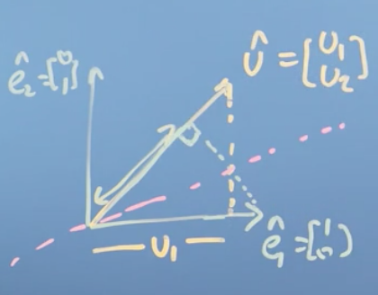

## Week 4: Matrices Make Linear Mappings

In Module 4, we continue our discussion of matrices; first we think about how to code up matrix multiplication and matrix operations using the Einstein Summation Convention, which is a widely used notation in more advanced linear algebra courses. Then, we look at how matrices can transform a description of a vector from one basis (set of axes) to another. This will allow us to, for example, manipulate images. We'll also look at how to construct a convenient basis vector set in order to do such transformations. Then, we'll write some code to do these transformations and apply this work computationally.

**Learning Objectives**

- Identify matrices as operators
- Relate the transformation matrix to a set of new basis vectors
- Formulate code for mappings based on these transformation matrices
- Write code to find an orthonormal basis set computationally

## Matrices as objects that map one vector onto another

### Introduction to Einstein summation convention and the symmetry of the dot product

There is a different, important way to write matrix transformations that we have not yet discussed. It's called the [**Einstein's Summation Convention**](http://www.wikiwand.com/en/Einstein_notation). In this convention, we write down the actual operations on the elements of a matrix, which is useful when you're coding or programming. It also lets us see something neat about the dot product, and it lets us deal with _non-square_ matrices.

When we started, we said that multiplying a matrix by a vector or with another matrix is a process of taking every element in each row of the first matrix multiplied with the corresponding element in each column of the other matrix, summing the products and putting them in place. In Einstein's Summation Convention, we represent the matrix product $C = AB$:

$$\begin{pmatrix} a_{11} & a_{12} & . & . & . & a_{1n} \\\ a_{21} & a_{22} &  &  &  & . &\\\ . & & & & & .  \\\ . & & & & & .  \\\ . & & & & & . \\\ a_{n1} & . & . & . & . & a_{nm}\end{pmatrix} \begin{pmatrix} b_{11} & b_{12} & . & . & . & b_{1m} \\\ b_{21} & b_{22} &  &  &  & . &\\\ . & & & & & .  \\\ . & & & & & .  \\\ . & & & & & . \\\ b_{m1} & . & . & . & . & b_{mp}\end{pmatrix} = AB$$

as,

$$c_{ij} = a_{i1}b_{1j} + ... + a_{im}b_{mj} =  \sum_{k=1}^m a_{ik}b_{kj}$$

!!! note
    To be clear, its the $c_{ij}$ itself that is written Einstein's Summation Convention, not everything that comes to the right of the $=$ sign.

For $i = 1, ..., n$ and $j = 1, ..., p$, where $A$ is a $n \times m$ matrix, $B$ is a $m \times p$ matrix, and $C$ is a $n \times p$ matrix.

This is useful when we are implementing matrix multiplication in code, because it makes it obvious exactly what operations we need to perform. In this case, it should be obvious that we can run three loops over $i$, $j$ and $k$, and then use an accumulator on the $k$'s to find the elements of the product matrix $AB$.  

!!! note
    We haven't talked about this yet, but now we can see it clearly. There's no reason, so long as the matrices have the same number of entries in $k$, that the matrices we multiply need to be the same shape!

Let's revisit the **dot product** in light of the Einstein Summation Convention. If we've got two vectors, let's call them $u$ and $v$, where $u$ is a column vector having elements $u_i$ and $v$ is another column vector having elements $v_i$.

$$\begin{pmatrix}u_i \\\ \vdots \\\ u_{n}\end{pmatrix} \cdot \begin{pmatrix}v_i \\\ \vdots \\\ v_n \end{pmatrix}$$

When we dot them together, we are computing the following:

$$  u \cdot v = \sum^n_{i=1}u_iv_i = u_1v_1 + u_2v_2 + ... + u_nv_n$$


Notice that,

$$\begin{pmatrix}u_i \\\ \vdots \\\ u_{n}\end{pmatrix} \cdot \begin{pmatrix}v_i \\\ \vdots \\\ v_n \end{pmatrix} = \begin{pmatrix}u_i & \cdots & u_{n}\end{pmatrix} \cdot \begin{pmatrix}v_i \\\ \vdots \\\ v_n \end{pmatrix}$$

and so we notice that there's some equivalence between a **matrix transformation** (or _multiplication_) and the **dot product**. Lets explore this in more detail.

__Symmetry of the dot product__

Say we have the vector $\hat u$, with components $u_1$ and $u_2$. Let's imagine what happens if we dot $\hat u$ with the basis vector $\hat e_1$. We know from previous sections that this gives us the length of the projection of $\hat u_1$ on $\hat e_1$ multiplied by the norm of $\hat e_1$. But what if we do the reverse? What if we dot $\hat e_1$ with $\hat u$? We already know that numerically, the result will be the same, as the dot product is [**commutative**](http://www.wikiwand.com/en/Commutative_property). So geometrically, we can imagine drawing a line of symmetry between the point where the two projections cross:



Previously, we stated (without proof, although the numerical proof is trivial) that the dot product is commutative, and now, we have shown geometrically why that is true.

__Conclusions__

In this section, we introduced [**Einstein's Summation Convention**](http://www.wikiwand.com/en/Einstein_notation), which is a compact and computationally useful (but not very visually intuitive) way to write down matrix operations. This led to a discussion on the similarities between the dot product and matrix multiplication, where we noticed a connection between **matrix multiplication**, and the **dot product**, which itself has a geometric understanding as the concept of **projection**, i.e. projecting one vector onto another. This allows us to think about matrix multiplication _with a vector_ as being the projection of that vector _onto the vectors composing the matrix_ (i.e. the columns of the matrix).

## Matrices transform into the new basis vector set

!!! tip
    Watch [this](https://youtu.be/P2LTAUO1TdA) video before reading this section. For more practice with changing basis, see [this](https://www.khanacademy.org/math/linear-algebra/alternate-bases#change-of-basis) Khan Academy section.

### Matrices changing basis

We have said before that the _columns_ of a transformation matrix are the _axes_ of the new basis vectors after applying the mapping. We're now going to spend a little time looking at how to transform a vector _from one set of basis vectors to another_.

Let's say we have two sets of basis vectors, which define a first coordinate system ($\text{CS}_1)$ and a second coordinate system ($\text{CS}_2)$. Let the basis vectors of $\text{CS}_2$, from the perspective of $\text{CS}_1$ be:

$$\hat b_1 = \begin{bmatrix}3 \\\ 1\end{bmatrix}, \hat b_2 = \begin{bmatrix}1 \\\ 1\end{bmatrix} $$

Lets package these basis vectors into a matrix $\text{CS}_{21}$, for convenience

$$\text{CS}_{21} = \begin{bmatrix}3 & 1 \\\ 1 & 1\end{bmatrix}$$


Think of these as the basis vectors of $\text{CS}_2$ as they would appear in $\text{CS}_1$. If we wanted to change the basis of any vectors in $\text{CS}_2$ to $\text{CS}_1$, we simply do:

$$\text{CS}_{21} \cdot \text{vector in CS}_2 = \text{vector in CS}_1$$

 E.g., for the vector

$$\begin{bmatrix}\frac{3}{2} \\\ \frac{1}{2}\end{bmatrix}$$

defined in terms of $\text{CS}_2$

$$\begin{bmatrix}3 & 1 \\\ 1 & 1\end{bmatrix} \begin{bmatrix}\frac{3}{2} \\\ \frac{1}{2}\end{bmatrix} = \begin{bmatrix}5  \\\ 2\end{bmatrix}$$

That is, a vector

$$\begin{bmatrix}\frac{3}{2} \\\ \frac{1}{2}\end{bmatrix}$$

described in $\text{CS}_2$, is described as

$$\begin{bmatrix}5 \\\ 2\end{bmatrix}$$

in $\text{CS}_1$. Why does this make sense? Well, you can think of $\text{CS}_{21}$ as the transformation that takes the basis vectors of $\text{CS}_1$ and moves them to the positions of the basis vectors of $\text{CS}_2$. Applying this transformation to a vector in $\text{CS}_2$, therefore, gives us the corresponding vector in $\text{CS}_1$.

Now, how do we do the reverse? How do we _translate_ a vector in $\text{CS}_1$ to a vector in $\text{CS}_2$? All we need to do to change basis in the reverse case is to multiply a vector in one coordinate system by the inverse of the matrix containing the basis vectors of another:

$$\text{CS}^{-1}_{21} \cdot \text{vector in CS}_1 = \text{vector in CS}_2$$

E.g.,

$$\frac{1}{2}\begin{bmatrix}1 & -1 \\\ -1 & 3\end{bmatrix}\begin{bmatrix}5  \\\ 2\end{bmatrix} = \begin{bmatrix}\frac{3}{2} \\\ \frac{1}{2}\end{bmatrix}$$

Notice that this process gave us the coordinates of the vector

$$\begin{bmatrix}\frac{3}{2} \\\ \frac{1}{2}\end{bmatrix}$$

in $\text{CS}_2$, which is equal to the vector that we started with.

#### Generalizing

This is a little bit tricky, so lets generalize. Imagine we have two coordinate systems, "ours" and "theirs". We can translate vectors in "their" coordinate system to "our" coordinate system by applying a transformation $A$, where $A$ is a matrix whose columns contain the basis vectors of "their" coordinate system as they appear in "our coordinate system":

$$\text{(1) } A \cdot \text{vector in "their" coordinate system} = \text{vector in "our" coordinate system}$$

To do the reverse, i.e. take a vector in "our" coordinate system and translate it to "their" coordinate system, we simply multiply "our" vector by the inverse of A

$$\text{(2) } \text{vector in "their" coordinate system} = A^{-1} \cdot \text{vector in "our" coordinate system}$$

It should be obvious now why this is the case, we simply moved $A$ over in the (1) to get (2)!

__Orthonormal basis set__

When we discussed vectors and projections, we said that if the new basis vectors were orthogonal then we could use projection to easily change basis.

!!! note
    see [Changing basis](#changing-basis) for a fleshed out example.

__Summary__

Not orthogonal, use matrix multiplication. Orthogonal, use projection product.

### Doing a transformation in a changed basis

!!! tip
    Watch the last little bit of [this](https://youtu.be/P2LTAUO1TdA?t=8m50s) video first.

Lets discuss the process of applying a transformation in a changed basis. Say again that the basis vectors of coordinate system $\text{CS}_2$ from the perspective of coordinate system $\text{CS}_1$ are:

$$\text{CS}_{21} = \begin{bmatrix}3 & 1 \\\ 1 & 1\end{bmatrix}$$

Say further that we have a vector in $\text{CS}_2$ that we want to transform:

$$ {c_2} = \begin{bmatrix}x \\\ y\end{bmatrix}$$

And the tranformation we want to apply is:

$$N = \frac{1}{\sqrt{2}}\begin{bmatrix}1 & -1 \\\ 1 & 1\end{bmatrix}$$

!!! note
    This rotates the vector space $45^0$ counter-clockwise.

How do we apply the transformation $N$ to a vector defined by the coordinate system $\text{CS}_2$?

The first thing to do is take the vector ${c_2}$ and multiply it by $\text{CS}_{21}$, that is, change the basis of the vector ${c_2}$ from $\text{CS}_2$ to $\text{CS}_1$:

$$ {c_1} = \begin{bmatrix}3 & 1 \\\ 1 & 1\end{bmatrix} \begin{bmatrix}x \\\ y\end{bmatrix}$$

Then, we can apply the transformation:

$${c_1}' = R \cdot \text{CS}_{21} \cdot  {c_2}$$

$$ {c_1}' = \frac{1}{\sqrt{2}}\begin{bmatrix}1 & -1 \\\ 1 & 1\end{bmatrix} \begin{bmatrix}3 & 1 \\\ 1 & 1\end{bmatrix} \begin{bmatrix}x \\\ y\end{bmatrix}$$

$$= \frac{1}{\sqrt{2}}\begin{bmatrix}2 & 0 \\\ 4 & 2\end{bmatrix} \begin{bmatrix}x \\\ y\end{bmatrix}$$

What if, once we obtained this output vector, we wanted to change its basis _back_ to $\text{CS}_2$? Recall from the last section that we multiply the whole thing by the inverse of $\text{CS}_{21}^{-1}$

$${c_2}' = \text{CS}_{21}^{-1} \cdot R \cdot \text{CS}_{21} \cdot {c_2}$$

$${c_2}' = \frac{1}{2} \begin{bmatrix}1 & -1 \\\ -1 & 3\end{bmatrix} \frac{1}{\sqrt{2}}\begin{bmatrix}1 & -1 \\\ 1 & 1\end{bmatrix} \begin{bmatrix}3 & 1 \\\ 1 & 1\end{bmatrix} \begin{bmatrix}x \\\ y\end{bmatrix}$$

$$= \frac{1}{2} \begin{bmatrix}1 & -1 \\\ -1 & 3\end{bmatrix}\frac{1}{\sqrt{2}}\begin{bmatrix}2 & 0 \\\ 4 & 2\end{bmatrix} \begin{bmatrix}x \\\ y\end{bmatrix}$$

$$= \frac{1}{\sqrt{2}}\begin{bmatrix}-1 & -1 \\\ 5 & 3\end{bmatrix} \begin{bmatrix}x \\\ y\end{bmatrix}$$

This operation essentially builds on the previous operation to return the transformed output vector, ${c_1}'$ relative to $\text{CS}_2$, that is it returns ${c_2}'$, where ${c_2}'$ is where $c_2$ ends up after in the basis $\text{CS}_2$ after some transformation $M$ has been applied.

#### Generalizing

Again, this is tricky, so lets generalize. Imagine we have two coordinate systems, "ours" and "theirs". If we are given:

- a vector with its basis in "their" coordinate system
- $A$, a matrix whose columns are the basis vectors of "their" coordinate system as they appear in "our" coordinate system
- $M$ some transformation, with its basis in "our" coordinate system

Then,

**Change the vector in "their" basis to "ours":**

$$A \cdot \text{vector in "their" coordinate system}$$

**Apply the transformation in "our" coordinate system:**

$$M \cdot A \cdot \text{vector in "their" coordinate system}$$

**Change the resulting vector back to "their" coordinate system:**

$$A^{-1} \cdot M \cdot A \cdot \text{vector in "their" coordinate system}$$

In sum, the transformation $A^{-1}MA$ will take any vector in "their" coordinate system, apply some transformation in "our" coordinate system, and return the resulting vector in "their" coordinate system.

## Making multiple mappings, deciding if these are reversible

### Orthogonal matrices

It is very useful to compose a transformation matrix whose column and row vectors make up a _new basis_, with the additional constraint of making all of these component vectors orthogonal. Such a square matrix of  orthonormal columns and rows is known as an [**orthogonal matrix**](http://www.wikiwand.com/en/Orthogonal_matrix).

 In this section we are going to look at _how_ to construct such a matrix, and why it's useful.

__(Aside) Transpose__

First, we need to define a new matrix operation called the [**transpose**](http://www.wikiwand.com/en/Transpose). The transpose of a matrix is an _operator_ which flips a matrix _over its diagonal_, that is it switches the row and column indices of the matrix by producing another matrix denoted as $A^T$. It is achieved by any one of the following equivalent actions:

- reflect $A$ over its main diagonal (which runs from top-left to bottom-right) to obtain $A^T$,
- write the rows of $A$ as the columns of $A^T$,
- write the columns of $A$ as the rows of $A^T$.


Formally, the _i_-th row, _j_-th column element of $A^T$ is the _j_-th row, _i_-th column element of $A$:

$$[A^T]_{ij} = [A]_{ji}$$

Now let's imagine I have a $n \times n$ matrix $A$, with a series of column vectors which are going to be the basis vectors of the some new transformed vector space:

$$A = \begin{pmatrix} \begin{pmatrix}\vdots \\\ \hat a_1 \\\ \vdots\end{pmatrix} & \begin{pmatrix} \vdots \\\ \hat a_2\\\ \vdots \end{pmatrix} & \dots \begin{pmatrix} \vdots \\\ \hat a_n\\\ \vdots \end{pmatrix} \end{pmatrix}$$

Lets place two more constaints on this matrix $A$:

- First, the column vectors $a_i$ have unit length
- Second, the column vectors $a_i$ are orthogonal to each other.

!!! note
    That is, $\hat a_i \cdot \hat a_j = 0$ for $\forall i \ne j$ and $\hat a_i \cdot \hat a_i = 1$.

Lets think about what happens when we multiply $A$ by its transpose, $A^T$:

$$A^TA =  \begin{pmatrix} \begin{pmatrix}\dots & \hat a_1 & \dots\end{pmatrix} \\\ \begin{pmatrix} \dots & \hat a_2 & \dots \end{pmatrix} \\\ \vdots \\\ \begin{pmatrix} \dots & \hat a_n & \dots \end{pmatrix} \end{pmatrix}  \begin{pmatrix} \begin{pmatrix}\vdots \\\ \hat a_1 \\\ \vdots\end{pmatrix} & \begin{pmatrix} \vdots \\\ \hat a_2\\\ \vdots \end{pmatrix} & \dots \begin{pmatrix} \vdots \\\ \hat a_n\\\ \vdots \end{pmatrix} \end{pmatrix} = I_n$$

So what we notice is that in the case where $A$ is composed of vectors that are _normal_ to each other and have _unit length_, (i.e. when they're **orthonormal**), then $A^TA = I$. Stated another way, $A^T$ in this situation is actually the _inverse_ of $A$! This special case is known as an **orthogonal matrix**.


Another thing to note is that because all the basis vectors are of unit length, it must scale space by a _factor of one_. Stated another way, the determinant of an orthogonal matrix must be either plus or minus one.

$$\vert A \vert = \pm 1$$

Where the minus one arises if the new basis vector set _flip space around_ (from right-handed to left-handed or vice versa). Notice that if $A^T$, the inverse of $A$, then by the definition of the inverse:

$$A^TA = AA^T = I_n$$

So, we could pre- or post- multiply and still get the identity. This means that the rows of the orthogonal matrix are also orthonormal to each other! So, the transpose matrix of an orthogonal basis set, is itself another orthogonal basis set.

Now, remember that in the last module on vectors, we said that transforming a vector onto a new coordinate system was as easy as taking the projection or dot product of that vector onto each of the new bases vectors, _as long as they were orthogonal to each other_. So, if we have a vector $r$ and we want to project $r$ into a new set of axes, let's call them $\hat e_1$ and  $\hat e_2$, as long as these vectors are orthogonal to each other, then we  can project into the new vector space just by taking the dot product of $r$ with $\hat e_2$, and the dot product of $r$ with $\hat e_1$, and then we'd have its components in the new set of axis.

!!! note
    See [Changing basis](#changing-basis) for a walked-through example.

__Conclusions__

In this section, we introduced the most convenient basis vector set of all, the **orthonormal bases vector set**.

 Wherever possible we want to use an orthonormal basis vector set represented as a orthogonal matrix $A$. This set of vectors has the following properties and consequences that make it easy to work with:

 - the **transpose** of such a matrix will be its **inverse**, which makes the inverse incredibly easy to compute,
 - the transformation will be **reversible** because space doesn't get collapsed by any dimensions,
 - the projections (i.e. the result of computing the projection of a vector onto the matrix $A$) are just the dot products.

One final note. If we arrange the bases vectors in the correct order, then the _determinant will be one_.

$$ \vert A \vert = 1$$

An easy way to check if they aren't in the right order, is to check if the determinant is minus one. This means we've transformed our space from right to left handed orientation. All we have to do to remedy this is to exchange a pair of vectors in $A$ such that $\vert A \vert = 1$.

## Recognizing mapping matrices and applying these to data

### The Gram–Schmidt process

In the last section, we motivated the idea that life is much easier if we can construct an orthonormal basis vector set, but we haven't talked about how to do it. In this section, we will explore just that.

We'll start from the assumption that we already have some linearly independent vectors that span the space we're interested in. Say we have some such vectors $V = \{v_1, v_2, ..., v_n\}$,

!!! note
    If you want to check linear independence, you can write down your vectors as the the columns in a matrix and check that the determinant of that matrix isn't zero.

but they aren't orthogonal to each other or of unit length. Our life would probably be easier if we could construct some orthonormal basis. As it turns out, there's a process for doing just that which is called the [**Gram-Schmidt process**](http://www.wikiwand.com/en/Gram–Schmidt_process).

 Let's take the first vector in the set to be $v_1$. In this first step, we're just going to normalize $v_1$ to get our eventual first basis vector $e_1$

$$e_1 = \frac{v_1}{\vert v_1 \vert} $$

Now, we can think of $v_2$ as being composed of two things: a component that is in the direction of $e_1$ and a component that's perpendicular to $e_1$. We can find the component that's in the direction of $e_1$ by taking the vector projection $v_2$ onto $e_1$:

$$v_2 = (v_2 \cdot e_1) \frac{e_1}{\vert e_1 \vert} $$

!!! note
    $|e_1|$ is 1 so we could actually omit it.

If we subtract this vector projection from $v_2$ we get $u_2$, a vector which is orthogonal to $e_1$:

$$u_2 = v_2 - (v_2 \cdot e_1) e_1$$

Finally, dividing $u_2$ by its length gives us $e_2$, the unit vector orthogonal to $e_1$:

$$e_2 = \frac{u_2}{\vert u_2 \vert} $$

We could continue this process for all vectors in our set $V$. The general formula (in pseudocode) is:

```python
# For all vectors in our set V
for i in |V|:
  # For all vectors in our set V that come before v_i
  for j in i:
    # Subtract the component of v_i in the direction of the previous vectors v_j
    v_i = v_i - v_i.dot(v_j) * v_j
  # If |v_i| is not zero, normalize it to unit length. Otherwise it is linearly dependent on a
  # previous vector, so set it equal to the zero vector.
  if |v_i| !!! note
    0:
    v_i = v_i / |v_i|
  else:
    v_i = zero_vector
```


__Conclusions__

So that's how we construct an orthonormal basis set, which makes our lives much easier for all the reasons we discussed [here](#orthogonal-matrices).

### Reflecting in a plane

This is a rather involved example, and is probably best if you just watch it yourself [here](https://www.coursera.org/learn/linear-algebra-machine-learning/lecture/oXE0Y/example-reflecting-in-a-plane). If I can find the time, i'll make notes for the video!
