# Week 5: Eigenvalues and Eigenvectors

**Eigenvectors** are particular vectors that are unrotated by a transformation matrix (i.e., they _remain on their own span_) and **eigenvalues** are the amount by which the eigenvectors are scaled. These special 'eigen-things' are very useful in linear algebra and will let us examine Google's famous PageRank algorithm for presenting web search results. Then we'll apply this in code, which will wrap up the course.

!!! tip
    It is best to watch [this](https://youtu.be/PFDu9oVAE-g) video first, then return to and read through this section. If you want even more exposure to these ideas, try the first three sections of the Khan Academy course [here](https://www.khanacademy.org/math/linear-algebra/alternate-bases#eigen-everything).

## Learning Objectives

- Identify geometrically what an eigenvector/value is
- Apply mathematical formulation in simple cases
- Build an intuition of larger dimensional eigensystems
- Write code to solve a large dimensional eigen problem

## What are eigen-things?

### What are eigenvalues and eigenvectors?

The word, "eigen" is perhaps most usefully translated from German as meaning _characteristic_. So when we talk about an _eigenproblem_, we're talking about finding the _characteristic properties of something_. But characteristic of what? This module, like the previous weeks, will try and explain this concept of _"eigen-ness"_ primarily through a geometric interpretation, which allows us to discuss images rather than immediately getting tangled up in the math.

!!! Note
    This topic is often considered by students to be quite tricky. But once you know how to sketch these problems, the rest is just algebra.

As you've seen from previous weeks, it's possible to express the concept of **linear transformations** using **matrices**. These operations can include **scalings**, **rotations**, and **shears**.

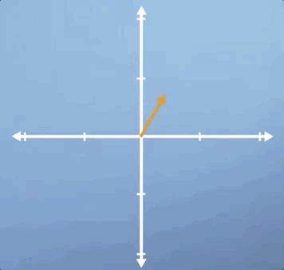

Often, when applying these transformations, we are thinking about what they might do to a _specific vector_. However, it can also be useful to think about what it might look like when they are applied to every vector in this space. This is most easily visualized by drawing a square centered at the origin, and then observing how the square is _distorted_ when you apply the transformation. For example, if we apply a scaling of 2 in the vertical direction, the square would become a rectangle. Whereas, if we applied a horizontal shear to this space, it would become a trapezoid:

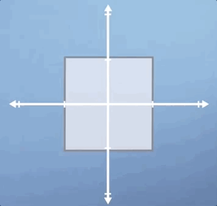

Now, here's the key concept. Notice that, after the transformation is applied, some vectors end up lying on the same line that they started on whereas, others do not. To highlight this, lets draw three specific vectors onto our initial square. Now, consider our vertical scaling again, and think about what will happen to these three vectors.

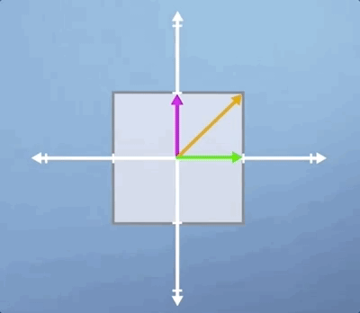

As you can see, the horizontal **green** vector is unchanged, i.e., it is pointing in the same direction and having the same length. The vertical **pink** vector is also still pointing in the same direction as before but its length is doubled. Lastly, the diagonal **orange** vector used to be exactly 45 degrees to the axis, but it's angle has now increased as has its length.

Besides the horizontal and vertical vectors, any other vectors' direction would have been changed by this vertical scaling. So in some sense, the horizontal and vertical vectors are _special_, they are _characteristic_ of this particular transformation. These are our [**eigenvectors**](https://en.wikipedia.org/wiki/Eigenvalues_and_eigenvectors), and the value they are scaled by is know as an [**eigenvalue**](https://en.wikipedia.org/wiki/Eigenvalues_and_eigenvectors).

!!! note
    From a conceptual perspective, that's about it for 2D eigen-problems, we simply take a transformation and we look for the vectors who are still laying on the same span as before, and then we measure how much their length has changed. This is basically what eigenvectors and their corresponding eigenvalues are.

Let's look at two more classic examples to make sure that we can generalize what we've learned. First, let look look at pure **shear**, where pure means that we aren't performing any scaling or rotation in addition, so the area is unchanged:

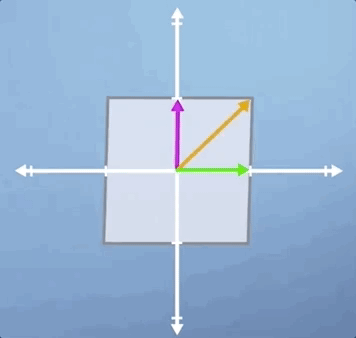

Notice that it's only the **green** horizontal line that is still laying along its original span, and all the other vectors will be shifted

Finally, let's look at **rotation**. Clearly, this thing has got no **eigenvectors** at all, as all of the vectors have been rotated off their original span:

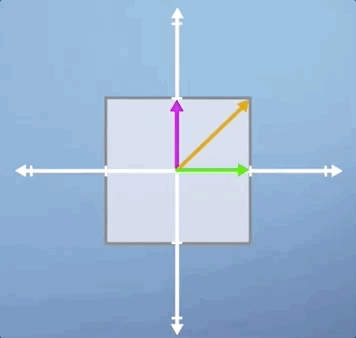

__Conclusions__

In this lecture, we've already covered almost all of what you need to know about eigenvectors and eigenvalues. Although we've only been working in two dimensions so far, the concept is exactly the same in three or more dimensions. In the rest of the module, we'll have a look at some special cases, as well as discussing how to describe what we've observed in more mathematical terms.

## Getting into the detail of eigenproblems

### Special eigen-cases

As we saw previously, **eigenvectors** are those which lie along the same span both _before and after_ applying a linear transform to a space. **Eigenvalues** are simply the amount that each of those vectors has been _stretched_ in the process. In this section, we're going to look at **three** special cases to make sure the intuition we've built so far is robust, and then we're going to try and extend this concept into three dimensions.

The first example we're going to consider is that of a _uniform_ scaling, which is where we scale by the same amount in each direction:

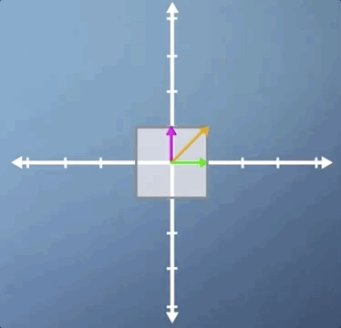

As you will hopefully have spotted, not only are all three of the vectors that we've highlighted eigenvectors, but in fact, for a uniform scaling, _any vector_ would be an eigenvector.

In this second example, we're going to look at rotation. In the previous section, we applied a small rotation, and we found that it had no eigenvectors. However, there is one case of non-zero pure rotation which does have at least some eigenvectors, and that is $180$ degrees:

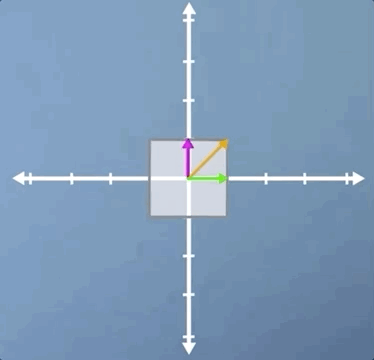

As you can see, the three eigenvectors are still laying on the same spans as before, but pointing in the opposite direction. This means that once again, all vectors for this transform are eigenvectors, and they all have eigenvalues of $-1$, which means that although the eigenvectors haven't changed length, they are all now pointing in the opposite direction.

In this third case, we're going to look at a combination of a **horizontal shear** and a **vertical scaling**, and it's slightly less obvious than some of the previous examples. Just like the pure shear case we saw previously, the **green** horizontal vector is an eigenvector and its eigenvalue is still $1$. However, despite the fact that neither of the other two vectors shown are eigen, this transformation does have two eigenvectors:

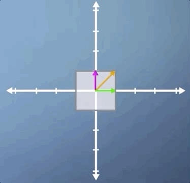

Let's apply the inverse transform and watch our parallelogram go back to its original square. But this time, with our other eigenvector visible. Hopefully, you're at least convinced that it is indeed an eigenvector as it stays on its own span:

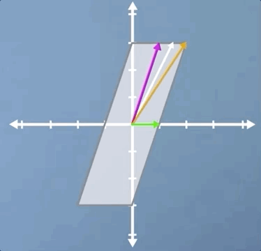

This shows us that while the concept of eigenvectors is fairly straightforward, eigenvectors aren't always easy to spot. This problem is even tougher in three or more dimensions, and many of the uses of eigen theory in machine learning frame the system as being composed of hundreds of dimensions or more. So, clearly, we're going to need a more robust mathematical description of this concept to allow us to proceed.

Before we do, let's take a quick look at one example in 3D. Clearly, scaling and shear are all going to operate much the same way in 3D as they do in 2D. However, rotation does take on a neat new meaning. As you can see from the image, although both the **pink** and **green** vectors have changed direction, the **orange** vector has not moved. This means that the **orange** vector is an eigenvector, but it also tells us, as a physical interpretation, that if we find the eigenvector of a 3D rotation, it means we've also found the **axis of rotation**.

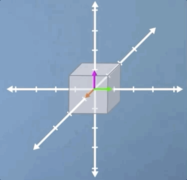

In this video, we've covered a range of special cases, which I hope have prompted the questions in your mind about how we're going to go about writing a formal definition of an eigen-problem.

### Calculating eigenvectors

At this point, we should now have a reasonable feeling for what an eigen-problem looks like, at least geometrically. In this section, we're going to formalize this concept into an algebraic expression, which will allow us to calculate eigenvalues and eigenvectors whenever they exist.

Consider a transformation $A$. An **eigenvector** of this transformation is any vector that can be written as a scaled version of itself after the transformation is applied, i.e.,

$$Ax = \lambda x$$

This expression captures the idea that applying the transformation $A$ to an eigenvector $x$ is the same as scaling that eigenvector $x$ by some number, $\lambda$ (the eigenvalue). In order to solve for the eigenvectors of the transformation $A$, we need to find values of $x$ that make the two sides equal.

To help us find the solutions to this expression, we can rewrite it by putting all the terms on one side and then factorizing

$$(A - \lambda I) x = 0$$

!!! note
      If you're wondering where the $I$ term came from, it's just an $n \times n$ identity matrix. We didn't need this in the first expression we wrote, as multiplying vectors by scalars is defined. However, subtracting scalars from matrices is _not defined_, so the $I$ just tidies up the math, without changing the meaning.

Now that we have this expression, we can see that for the left-hand side to equal $0$, either the contents of the brackets must be $0$ or the vector $x$ must be $0$. As it turns out, we're not interested in the case where the vector $x$ is $0$, i.e., when it has no length or direction, as this represents a [_trivial solution_](https://en.wikipedia.org/wiki/Triviality_(mathematics)). Instead, we are interested in the case where the term in brackets is $0$.

Referring back to the material in the previous parts of the course, we can test if a matrix operation will result in a $0$ output by calculating its determinant

$$det (A - \lambda I) = 0$$

Calculating the determinants manually is a lot of work for high dimensional matrices. So let's try applying this to an arbitrary $2 \times 2$ transformation. Let

$$A = \begin{pmatrix}a & b \\ c & d\end{pmatrix}$$

substituting this into our eigen-finding expression gives the following:

$$det \Biggl( \begin{pmatrix}a & b \\\ c & d\end{pmatrix}- \begin{pmatrix}\lambda & 0 \\\ 0 & \lambda\end{pmatrix} \Biggl ) = 0$$

Evaluating this determinant, we get what is referred to as the [**characteristic polynomial**](http://www.wikiwand.com/en/Characteristic_polynomial), which looks like this

$$\lambda^2 - (a + d) \lambda + ad - bc = 0 $$

Our eigenvalues are simply the _solutions_ of this equation. Once we solve for them, we can then plug them back into the original expression to calculate our eigenvectors. Click the dropdown below for a fully-worked out solution to computing eigenvalues and eigenvectors.

??? Example
    Let's take the case of a **vertical scaling** by a factor of $2$, which is represented by the transformation matrix

    $$A = \begin{pmatrix} 1 &  0 \\\ 0 & 2\end{pmatrix}$$

    We start with our equation for finding eigenvalues

    $$Ax = \lambda x$$

    Rearranging, we get

    $$(A-\lambda I)x = 0$$

    Solving $(A-\lambda I) = 0$ is equivalent to asking when the determinant of the matrix is $0$

    $$det((A- \lambda I)) = 0$$

    Subbing in our matrix $A$ and solving the resulting characteristic polynomial

    $$det \begin{pmatrix} 1 - \lambda & 0 \\\ 0 & 2- \lambda \end{pmatrix} = (1 - \lambda)(2-\lambda) = 0$$

    This means that our equation must have solutions at $\lambda = 1$ and $\lambda = 2$. Thinking back to our original eigen-finding formula, $(A - \lambda I)x = 0$, we can now sub these two solutions back in. Thinking about the case where $\lambda = 1$,

    $$@\lambda = 1: \begin{pmatrix} 1 - 1 & 0 \\\ 0 & 2 - 1 \end{pmatrix}\begin{pmatrix} x_1 \\\ x_2\end{pmatrix}  = \begin{pmatrix} 0 & 0 \\\ 0 & 1 \end{pmatrix}\begin{pmatrix} x_1 \\\ x_2\end{pmatrix} = \begin{pmatrix} 0 \\\ x_2\end{pmatrix} = 0$$

    Now, thinking about the case where $\lambda = 2$,

    $$@\lambda = 2: \begin{pmatrix} 1 - 2 & 0 \\\ 0 & 2 - 2 \end{pmatrix}\begin{pmatrix} x_1 \\\ x_2\end{pmatrix}  = \begin{pmatrix} -1 & 0 \\\ 0 & 0 \end{pmatrix}\begin{pmatrix} x_1 \\\ x_2\end{pmatrix} = \begin{pmatrix} -x_1 \\\ 0 \end{pmatrix} = 0$$

    So what do these two expressions tell us? Well, in the case where our eigenvalue $\lambda = 1$, we've got an eigenvector where the $x_2$ term must be zero. But we don't really know anything about the $x_1$ term. Well, this is because _any vector that points along the horizontal axis could be an eigenvector of this system_. We say that by writing

    $$@\lambda = 1: \begin{pmatrix} t  \\\ 0 \end{pmatrix}$$

    using an arbitrary parameter $t$. Similarly for the $\lambda = 2$ case, we can say that our eigenvector must equal

    $$@\lambda = 2: \begin{pmatrix} 0  \\\ t \end{pmatrix}$$

    because as long as it doesn't move at all in the horizontal direction, any vector that's purely vertical would be an eigenvector of this system, as they would lie along the same span. So now we have two eigenvalues, and their two corresponding eigenvectors.

#### Conclusions

Despite all the fun that we've just been having, the truth is that you will almost certainly never have to perform this calculation by hand.

!!! note
    Indeed, with libraries like numpy this is as easy as
    ```python
    import numpy as np

    A = np.array([[1, 0],
                  [0, 2]] )

    eigenvalues, eigenvectors = numpy.linalg.eig(A)
    ```

Furthermore, we saw that our approach required finding the roots of a polynomial of order $n$, i.e., the dimension of your matrix, which means that the problem will very quickly stop being possible by analytical methods alone. When a computer finds the eigensolutions of a 100 dimensional problem it's forced to employ iterative numerical methods. Therefore, developing a strong conceptual understanding of eigen problems will be much more useful than being really good at calculating them by hand.

In this sections, we translated our geometrical understanding of eigenvectors into a robust mathematical expression, and validated it on a few test cases. But I hope that I've also convinced you that working through lots of eigen-problems, as is often done in engineering undergraduate degrees, is not a good investment of your time if you already understand the underlying concepts. This is what computers are for. Next video, we'll be referring back to the concept of basis change to see what magic happens when you use eigenvectors as your basis. See you then.

## When changing to the eigenbasis is really useful

### Changing to the eigenbasis

Now that we know what eigenvectors are and how to calculate them, we can combine this idea with the concept of changing basis (which was covered earlier in the course). What emerges from this synthesis is a particularly powerful tool for performing efficient matrix operations called [**diagonalisation**](http://www.wikiwand.com/en/Matrix_diagonalization).

Sometimes, we need to apply the same matrix multiplication many times. For example, imagine a transformation matrix, $T$, that represents the change in location of a particle after a single time step. We can write that: our initial position, described by vector $v_0$, multiplied by the transformation $T$ gives us our new location, $v_1$.

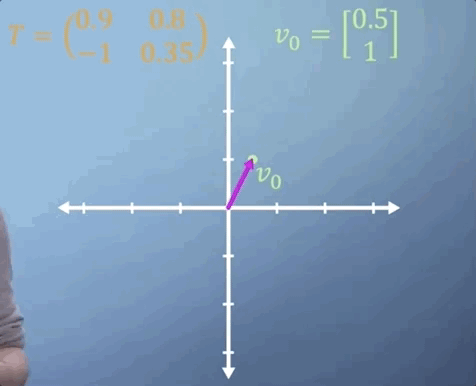

To work out where our particle will be after two time steps, we can find $v_2$ by simply multiplying $v_1$ by $T$, which is the same thing as multiplying $v_0$ by $T$ two times. So $v_2 = T^2 v_0$.

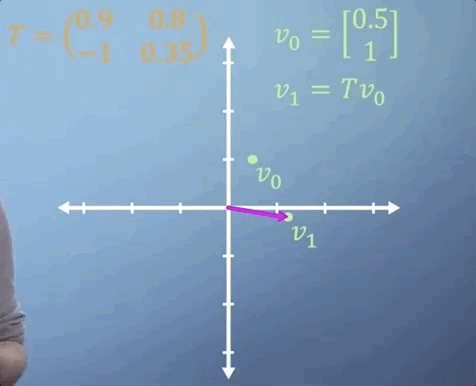

Now imagine that we expect the same linear transformation to occur every time step for $n$ time steps. We can write this transformation as

$$v_n = T^n v_0$$

You've already seen how much work it takes to apply a single 3D matrix multiplication. If we were to imagine that $T$ tells us what happens in one second, but we'd like to know where our particle is in two weeks from now, then $n$ is going to be around 1.2 million, i.e., we'd need to multiply $T$ by itself _more than a million times_, which may take quite a while.


If all the terms in the matrix are zero except for those along the leading diagonal, we refer to it as a [**diagonal matrix**](http://www.wikiwand.com/en/Diagonal_matrix). When raising matrices to powers, diagonal matrices make things a lot easier. All you need to do is put each of the terms on the diagonal to the power of $n$ and you've got the answer. So in this case,

$$T^n = \begin{pmatrix} a^n & 0 & 0 \\\ 0 & b^n & 0 \\\ 0 & 0 & c^n\end{pmatrix}$$

Thats simple enough, but what if $T$ is not a diagonal matrix? Well, as you may have guessed, the answer comes from eigen-analysis. Essentially, what we're going to do is change to a basis where our transformation $T$ _becomes_ diagonal, which is what we call an **eigen-basis**. We can then easily apply our power of $n$ to the diagonalized form, and finally transform the resulting matrix back again, giving us $T^n$, but avoiding much of the work.

!!! tip
    If this is confusing, watch the last 4 minutes of [this](https://youtu.be/PFDu9oVAE-g?t=13m2s) video.

As we saw in the section on changing basis, each column of our transform matrix simply represents the new location of the transformed unit vectors. So, to build our eigen-basis conversion matrix, we just plug in each of our eigenvectors as columns:

$$C = \begin{pmatrix}x_1 & x_2 & x_3 \\\ \vdots & \vdots & \vdots\end{pmatrix}$$

!!! note
    The basic idea here is that the transformation $T$ just becomes a uniform scaling (represented by a diagonal matrix) in a basis composed strictly of eigenvectors of $T$.

Applying this transform, we find ourselves in a world where multiplying by $T$ is effectively just a pure scaling, which is another way of saying that it can now be represented by a diagonal matrix. Crucially, this diagonal matrix, $D$, contains the corresponding eigenvalues of the matrix $T$. So,

$$D = \begin{pmatrix} \lambda_1 & 0 & 0 \\\ 0 & \lambda_2 & 0 \\\ 0 & 0 & \lambda_3\end{pmatrix}$$

 We're so close now to unleashing the power of eigen. The final link that we need to see is the following. Bringing together everything we've just said, it should now be clear that applying the transformation $T$ is just the same as converting to our eigenbasis, applying the diagonalized matrix, and then converting back again. So

$$T = CDC^{-1}$$

which suggests that

$$T^2 = CDC^{-1}CDC^{-1} = CDDC^{-1} = CD^2C^{-1}$$

!!! note
    $C^{-1}C = I$, so we omit it.

We can then generalize this to any power of $T$ we'd like

$$T^n = CD^nC^{-1}$$

We now have a method which lets us apply a transformation matrix as many times as we'd like without paying a large computational cost.

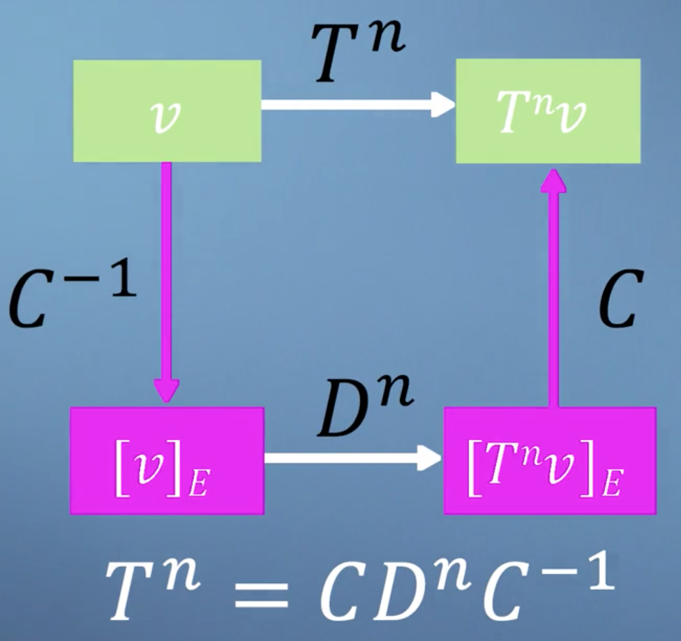

__Conclusions__

This result brings together many of the ideas that we've encountered so far in this course. Check out [this](https://www.coursera.org/learn/linear-algebra-machine-learning/lecture/zYzjM/eigenbasis-example) video, where we'll work through a short example just to ensure that this approach lines up with our expectations when applied to a simple case.

## Making the PageRank algorithm

### PageRank

The final topic of this module on eigenproblems, as well as the final topic of this course as a whole, will focus on an algorithm called [**PageRank**](http://www.wikiwand.com/en/PageRank).

!!! info
    This algorithm was famously published by and named after Google founder Larry Page and colleagues in 1998. And was used by Google to help them decide which order to display their websites when they returned from search.

The central assumption underpinning PageRank is that the importance of a website is related to its links to and from other websites. This bubble diagram represents a model mini Internet, where each bubble is a webpage and each arrow from A, B, C, and D represents a link on that webpage which takes you to one of the others.

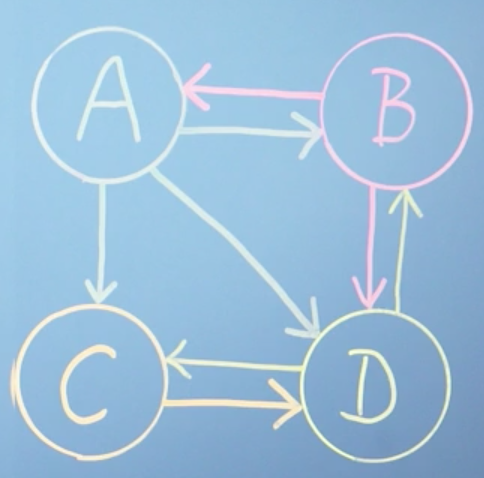

We're trying to build an expression that tells us, based on this network structure, which of these webpages is most relevant to the person who made the search. As such, we're going to use the concept of _Procrastinating Pat_ who is an imaginary person who goes on the Internet and just randomly click links to avoid doing their work. By mapping all the possible links, we can build a model to estimate the amount of time we would expect Pat to spend on each webpage.

We can describe the links present on page A as a vector, where each row is either a one or a zero based on whether there is a link to the corresponding page. And then normalize the vector by the total number of the links, such that they can be used to describe a probability for that page.

For example, the vector of links from page A will be

$$\begin{bmatrix} 0 & 1 & 1 & 1\end{bmatrix}$$

because vector A has links to sites B, to C, and to D, but it doesn't have a link to itself. Also, because there are three links in this page in total, we would normalize by a factor of a third. So the total click probability sums to one. We can write,

$$L_A =  \begin{bmatrix}0 & \frac{1}{3} & \frac{1}{3} & \frac{1}{3}\end{bmatrix}$$

Following the same logic, the link vectors in the next two sites are shown here:

$$L_B =  \begin{bmatrix} \frac{1}{2} & 0 & 0 &  \frac{1}{2}\end{bmatrix}, \;  L_C =  \begin{bmatrix}0 & 0 & 0 & 1\end{bmatrix}$$

and finally, for page D, we can write

$$L_D =  \begin{bmatrix} 0 & \frac{1}{2} & \frac{1}{2} & 0 \end{bmatrix}$$

We can now build our link matrix $L$ by using each of our linked vectors as a column, which you can see will form a square matrix

$$L =  \begin{bmatrix} 0 & \frac{1}{2} & 0 & 0 \\\ \frac{1}{3} & 0 & 0 & \frac{1}{2} \\\ \frac{1}{3} & 0 & 0 & \frac{1}{2}  \\\ \frac{1}{3} & \frac{1}{2} & 1 & 0 \end{bmatrix}$$

What we're trying to represent here with our matrix $L$ is the probability of ending up on each of the pages. For example, the only way to get to A is by being at B. So you then need to know the probability of being at B, which you could've got to from either A or D. As you can see, this problem is self-referential, as the ranks on all the pages depend on all the others. Although we built our matrix from columns of outward links, we can see that the rows of $L$ describe inward links normalized with respect to their page of origin.

We can now write an expression which summarises the approach. We're going to use the vector \(r\) to store the rank of all webpages. To calculate the rank of page A, you need to know three things about all other pages on the Internet:

1. What's your rank?
2. Do you link to page A?
3. And how many outgoing links do you have in total?

The following expression combines these three pieces of information for webpage A only

$$r_A = \sum_{j=1}^n L_{A, j}r_j$$

This expression states that the rank of A is the _sum of the ranks of all the pages which link to it_, weighted by their specific link probability taken from matrix $L$. It would be nice, however, if we could modify this expression to solve for all pages simultaneously. We can rewrite the above expression applied to all webpages as a simple matrix multiplication

$$r = Lr$$

!!! tip
    If this is confusing, think of it as saying, in english: the rank of some page $i$ is equal to probability that it is linked to from $j$ times the rank of $j$ for all pages $i, j$.

Clearly, we start off not knowing $r$, so we simply assume that all the ranks are equal and normalize them by the total number of webpages in our analysis, which in this case is 4

$$r = \begin{bmatrix}\frac{1}{4} \\ \frac{1}{4} \\ \frac{1}{4} \\ \frac{1}{4}\end{bmatrix}$$

Then, each time we multiply $r$ by our matrix $L$, we get an updated value for $r$

$$r^{i+1} = Lr^i$$

Applying this expression repeatedly means that we are solving this problem iteratively. Each time we do this, we update the values in $r$ until, eventually, $r$ stops changing, i.e. $r = Lr$. Quite beautifully, this implies that $r$ is now an eigenvector of matrix $L$, with an eigenvalue of 1!

!!! note
    At this point, you might well be thinking, if we want to multiply $r$ by $L$ many times, perhaps we should apply the diagonalization method that we saw in the last video. But don't forget, this would require us to already know all of the eigenvectors, which is what we're trying to find in the first place.

Now that we have an equation, and hopefully some idea of where it came from, we can ask our computer to iteratively apply it until it converges to find our rank vector:


Although it takes about ten iterations for the numbers to settle down, the order is already established after the first iteration. However, this is just an artifact of our system being so tiny. Finally, we can read off our result, which says that as Procrastinating Pat randomly clicks around our network, we'd expect them to spend about 40% of their time on page D, but only about 12% of their time on page A and 24% on each of pages B and C


As it turns out, although there are many approaches for efficiently calculating eigenvectors that have been developed over the years, repeatedly multiplying a randomly selected initial guest vector by a matrix, which is called the **power method**, is still very effective for the PageRank problem for two reasons. Firstly, although the power method will clearly only give you one eigenvector, when we know that there will be $n$ for an $n$ webpage system, it turns out that because of the way we've structured our link matrix, the vector it gives you will always be the one that you're looking for, with an eigenvalue of 1. Secondly, although this is not true for the full webpage mini Internet, when looking at the real Internet you can imagine that almost every entry in the link matrix will be zero, i.e,, most pages don't connect to most other pages. This is referred to as a **sparse matrix**. And algorithms exist such that multiplications can be performed very efficiently.

#### Damping factor

One key aspect of the PageRank algorithm that we haven't discussed so far is the **damping factor**, $d$. This adds an additional term to our iterative formula. So $r^{i + 1}$ is now going to equal

$$r^{i + 1}= d Lr^i + \frac{1 - d}{n}$$

where $d$ is something between 0 and 1. You can think of it as 1 minus the probability with which procrastinating Pat suddenly, randomly types in a web address, rather than clicking on a link on his current page. The effect that this has on the actual calculation is about finding a compromise between speed and stability of the iterative convergence process. There are over one billion websites on the Internet today, compared with just a few million when the PageRank algorithm was first published in 1998, and so the methods for search and ranking have had to evolve to maximize efficiency, although the core concept has remained unchanged for many years.

__Conclusions__

This brings us to the end of our introduction to the PageRank algorithm. There are, of course, many details which we didn't cover in this video. But I hope this has allowed you to come away with some insight and understanding into how the PageRank works, and hopefully the confidence to apply this to some larger networks yourself.

## Summary

This brings us to the end of the fifth module and also, to the end of this course on linear algebra for machine learning.

We've covered a lot of ground in the past five modules, but I hope that we've managed to balance, the speed with the level of detail to ensure that you've stayed with us throughout.

There is a tension at the heart of mathematics teaching in the computer age. Classical teaching approaches focused around working through lots of examples by hand without much emphasis on building intuition. However, computers now do nearly all of the calculation work for us, and it's not typical for the methods appropriate to hand calculation to be the same as those employed by a computer. This can mean that, despite doing lots of work, students can come away from a classical education missing both the detailed view of the computational methods, but also the high level view of what each method is really doing. The concepts that you've been exposed to over the last five modules cover the core of linear algebra. That you will need as you progress your study of machine learning. And we hope that at the very least, when you get stuck in the future, you'll know the appropriate language. So that you can quickly look up some help when you need it. Which, after all, is the most important skill of a professional coder.
