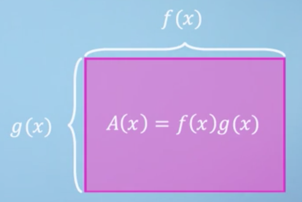
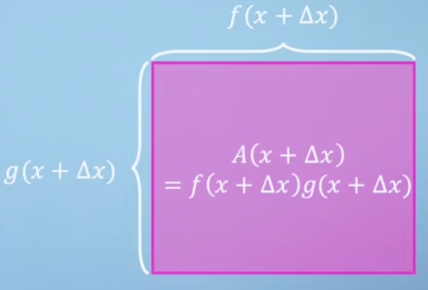
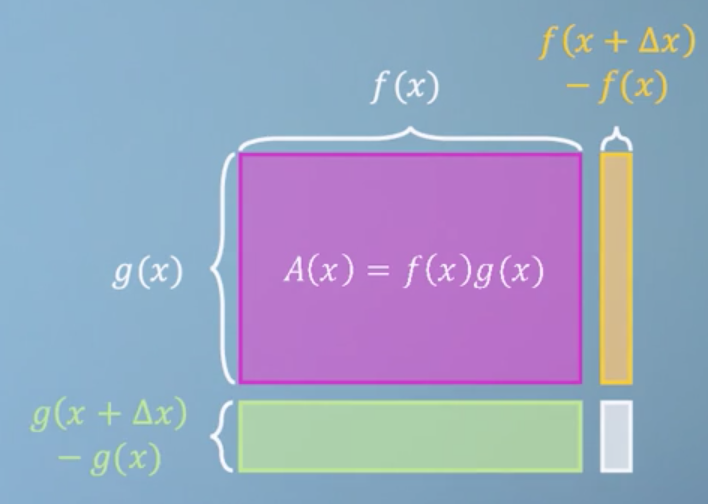
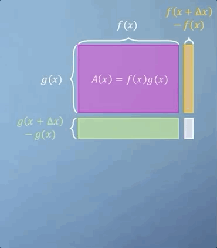
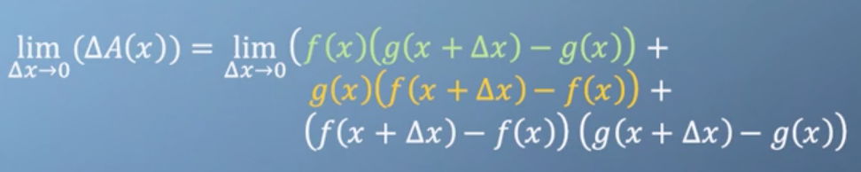
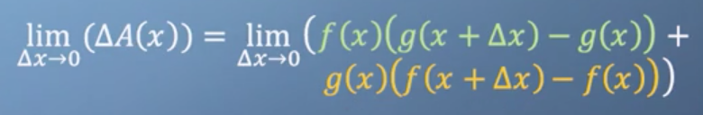
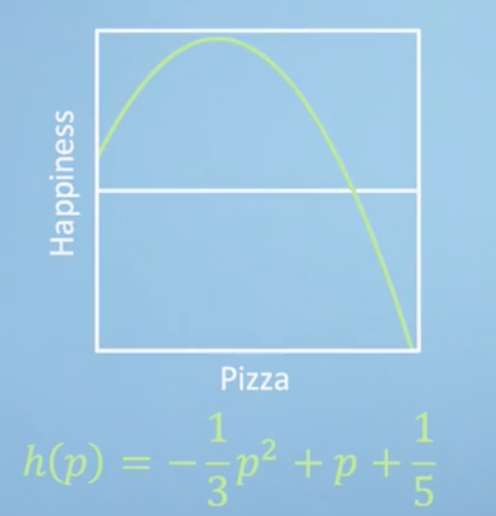
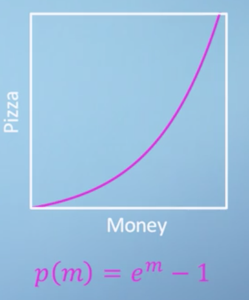
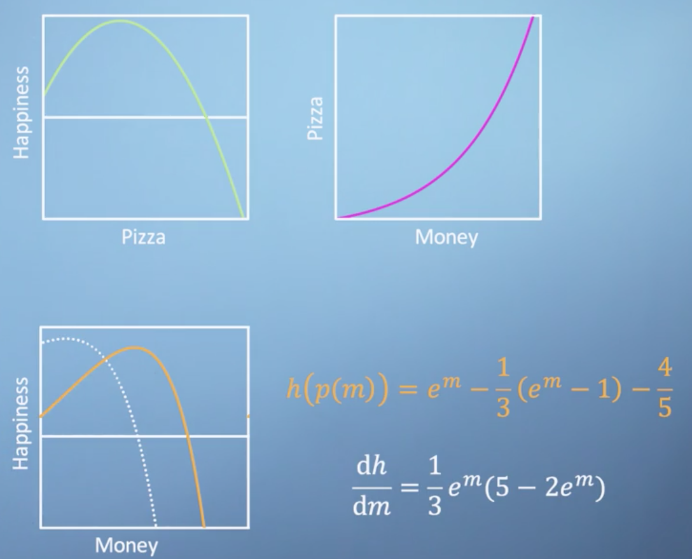

# Week 1: What is calculus?

Understanding calculus is central to understanding machine learning! You can think of calculus as a set of tools for analyzing the relationship between _functions_ and their _inputs_. We start this module from the basics, by recalling what a function is and where we might encounter one. Following this, we talk about how the slope of a graph at a given point describes the _rate of change_ of the output of the graphed function with respect to an input at that point. Using this visual intuition, we derive a robust mathematical definition of a derivative, which we then use to differentiate some interesting functions. Finally, by studying a few examples, we develop four handy time saving rules that enable us to speed up differentiation for many common scenarios.

_Learning Objectives_

- Recall the definition of differentiation
- Apply differentiation to simple functions
- Describe the utility of time saving rules
- Apply [sum](https://en.wikipedia.org/wiki/Sum_rule_in_differentiation), [product](https://en.wikipedia.org/wiki/Product_rule) and [chain rule](https://en.wikipedia.org/wiki/Chain_rule)

## Back to basics: functions

### Welcome to this course

Welcome to module one of six. We start right from the basics, but build you up fairly quickly to some interesting applications in modules five and six. This week, we'll be focusing on the [fundamental theory of calculus](https://en.wikipedia.org/wiki/Fundamental_theorem_of_calculus), as well as some handy rules to speed things up. Where possible, we're going to try and represent the concepts graphically so that you can _see_ the derivations rather than just reading them. This sometimes means that we'll be skimming over a few details, but we'll also provide you with links to the more rigorous descriptions so that you can check them out if you're interested.

### Functions

!!! tip
    Try watching [this](https://youtu.be/WUvTyaaNkzM) video at first for quickly building up your intuition for what calculus is all about.

Before diving into calculus, we should first talk briefly about what functions are and where we use them. Essentially, a [function](https://en.wikipedia.org/wiki/Function_(mathematics)) is a relationship between some inputs and an output. For example, if I had a function for modeling the distribution of temperature in a room, I might input the $x$, $y$, and $z$ coordinates of a specific location I'm interested in as well as the time, $t$. The function would return to me the temperature at that specific point in space at that moment in time.

??? note
    Like so many areas of math, even if the idea is quite straightforward, often, the notation can make things unnecessarily confusing. We'll be confronted by this again later in the course and although it's sometimes fairly arbitrary historical reasons that decide this, like different people inventing different parts of math at different times, it can also be because a particular notation style is more convenient for the specific application it was developed for. However, and here is where a lot of the problems seem to arise, in order to use and play with the interesting applications of math, it requires you to have done quite a large amount of often quite boring groundwork. Mathematical language is like learning any other language in that respect. You can't enjoy French poetry until you've learned a lot of French vocabulary and grammar including all its quirks and irregularities! Quite understandably, some people find this off-putting. This is made worse by the fact that most people have not even realized that there is math poetry waiting for them at the end of this algebra tunnel. Machine learning is a whole genre of this poetry, so stick with us for the rest of the specialization and you'll be ready to appreciate it and even write some of your own.

We often see expressions such as

$$f(x) = x^2 + 3$$

It is rather absurd that you should somehow just know that $f(x)$ means "$f$ is a function of $x$" and not "$f$ multiplied by $x$". Sometimes, this gets genuinely unclear when other bracketed terms appear in your expression. For example, in the expression

$$f(x) = g(x) + h(x - a)$$

you can assume that $g$, $h$, and $a$ are all not variables. Otherwise, we would have to write

$$f(x, g, h, a)$$

but you could only know for sure what was going on here if it was explained to you with more context. For example, is $g$ a function being applied to $x$? What about $h$ and $a$ over here? Learning to read between the lines and fill in the missing context is a skill you build up over time.

#### Conclusions

Calculus is simply the study of how these functions change with respect to their input variables and it allows you to investigate and manipulate them. But ultimately, it's just a set of tools. By the end of this course, you'll be using them yourself to model some real world data.

??? warning
    This video was confusing and likely unnecessary for anyone taking this course, as some high-school math is presumed. Might delete this section.

## Gradients and derivatives

### Rise Over Run

Previously we said that calculus is just a set of tools for describing the relationship between a function and the change in its variables. In this lecture, we're going to explore what this means and how it might be useful.

Let's start by having a look at a classic example, _a speed vs. time_ graph for a moving car

The most obvious thing this graph tells us is that the car's speed is not constant, as a constant speed would be represented with a flat horizontal line. Furthermore, starting from zero speed at zero time, this car's speed is initially increasing with time, which is another way of saying that it is _accelerating_. Towards the end of the time period, the car's speed is shown to be rapidly decreasing, meaning that it is _decelerating_.

As we've already said, a _horizontal_ line implies a _constant_ speed and an acceleration of $0$. A steep positive slope represents _increasing_ speed and an acceleration $\gt 1$.

!!! note
    In fact, acceleration can be defined as the local gradient of a speed-time graph.

We refer to the [**gradient**](https://en.wikipedia.org/wiki/Gradient) at a single point as the **local gradient**. We can illustrate this concept by drawing a tangent line, which is a straight line that touches the curve at a particular point

In our example, after the initial acceleration, the car's speed reaches a peak and then begins to decelerate again. By recording the slope of these tangent lines at every point, we could plot an entirely new graph which would show us [acceleration](https://en.wikipedia.org/wiki/Acceleration) versus time rather than [speed](https://en.wikipedia.org/wiki/Speed) versus time.

!!! note
    Before you look at such a plot, think about what this acceleration-time graph would look like for a car traveling at constant speed. For constant speed, we get a flat horizontal line on our speed-time graph. It's gradient is, therefore, zero and so the acceleration-time graph would also just be a horizontal line!

Initially, the gradient is positive and fairly constant before it drops to zero at the peak. It then becomes negative for a period before returning to zero. Overlaying the acceleration-time graph on our axes, we get

!!! note
    Don't forget the vertical axis for the blue line is speed and will have units of distance per time, whereas the vertical axis for the orange line is acceleration and will have units of distance per time squared. Because they have different units, we can scale either of these two lines vertically in this block, and the meaning would still be identical. However, these have been scaled just to make the most use of this plot area available.

You can see the points at which the acceleration function is zero, i.e. where it crosses the horizontal axis, coincide with where the speed-time graph is flat and has zero gradient. Although we will be discussing the formal definition of a [**derivative**](https://en.wikipedia.org/wiki/Derivative) in a later section, what we've just done by eye is the _essence of calculus_. We took a continuous function and described its slope at every point by constructing a new function, which is its derivative.

We can, of course, plot the derivative of the acceleration function following the same procedure, which would give us the rate of change of acceleration (which we can also think of as being the second derivative of the speed) referred to [**jerk**](https://en.wikipedia.org/wiki/Jerk_%28physics%29).

!!! note
    Think of the jerky motion of a car as it stops and starts. Now, you may have never heard of this concept before, but hopefully, just by telling you that it's the derivative of the acceleration curve, this should be all you need to know to approximately sketch the jerk.

Also very interesting is the idea of taking our baseline speed function and trying to imagine what function this would have been the gradient of, as in applying the inverse procedure to the one that we have just discussed. We can refer to this as the [**anti-derivative**](https://en.wikipedia.org/wiki/Antiderivative), which is closely related to something called the [**integral**](https://en.wikipedia.org/wiki/Integral). For the example we are discussing here, it would represent the [distance](https://en.wikipedia.org/wiki/Distance) of the car from its starting position. This should make more sense when you consider that the change in distance with respect to time, i.e. the slope of the distance-time graph, is how much distance you are covering per unit time, or speed!

#### Conclusions

This analysis of slopes is all we are going to discuss in the section. Even though we haven't yet laid out the formal definition of calculus, you are already in a very strong position to start thinking about differentiation more formally.

### Definition of a derivative

!!! tip
    Watch [this](https://youtu.be/9vKqVkMQHKk) video first before reading through this section.

Now that we've explored the relationship between functions and their gradient, we should be ready to lay out a more formal definition of a derivative. All we're going to do is translate the understanding about gradients that we saw in the previous section into some mathematical notation that we can write down.

We talked in the last section about horizontal lines having a gradient of zero, whilst upwards and downward sloping lines having positive or negative gradients respectively. We can write down a definition of this concept by taking the example of a linear function, which has the same gradient everywhere. If we start by picking any two points, we can say that the gradient of this line is equal to the _amount that the function increases in this interval_, divided by the _length of the interval_.

This description is often just condensed to the expression "_rise over run_", where rise is the increase in the vertical direction, and run is the distance along the horizontal axis

$$\text{gradient} = \frac{\text{rise}}{\text{run}}$$

Fairly straightforward so far; but how does it relate to the more complicated functions we saw previously, where the gradient is different at every point?

Let's pick a single point on our speed-time graph from earlier, which we'll call $x$. The value of our function at this point is clearly just $f(x)$. We now need to pick a second point to draw our rise over run triangle. We can call the horizontal distance between our two points $\Delta x$, where $\Delta$ is being used to express a small change in _something_. By definition, our second point must be at position $x + \Delta x$. We can also write down the vertical position of our second point as a function $f$ evaluated at our new location $x + \Delta x$, i.e. $f(x + \Delta x)$.

We can now build an expression for the approximate gradient of the function $f$ at our point $x$, based on the rise over run gradient between point $x$ and $\Delta x$

The last step in this process is simply to notice that for nice smooth continuous functions like the one we're showing here, as $\Delta x$ gets smaller, the line connecting two points becomes a better and better approximation of the actual gradient at our point $x$! We can express this concept formally by using the limit notation scheme $\lim_{\Delta x \rightarrow 0}$

Our expression will give us a function for our gradient at any point we choose, which we write as $f'(x)$ or $\frac{d_f}{d_x}$, depending on which notation scheme you prefer. This is a slightly strange concept as we're not allowing $\Delta x = 0$, because dividing by zero is not defined, but instead investigating what happens when $x$ is _extremely close to zero_. This, in a nutshell, is the process of **differentiation**.

!!! note
    We could fill up several videos with more robust interpretations of this infinitely small but non-zero $\Delta x$; but for now, don't worry about it too much. We know more than enough to continue on our journey.

Let's now put our new derivative expression into practice and see if it works. First, we should try this out on a linear function, once again, as we know that the answer is just going to be a constant. Given the function

$$f(x) = 3x + 2$$

what is its derivative?

$$f'(x) = \lim_{\Delta x \rightarrow 0} \Biggl(\frac{3(x + \Delta x) + 2 - (3x + 2)}{\Delta x}\Biggl)$$

$$ = \lim_{\Delta x \rightarrow 0}\Biggl(\frac{3x + 3 \Delta x + 2 - 3x - 2}{\Delta x}\Biggl)$$

$$ = \lim_{\Delta x \rightarrow 0}\Biggl(\frac{3 \Delta x}{\Delta x}\Biggl)$$

$$ = 3$$

Therefore, the gradient of our linear function is a constant, just as we expected.

!!! note
    We actually differentiated two things at once. A $3x$ term, and a $+ 2$ term. We could have differentiated them separately, and then added them together, and still got the same result. This interchangeability of the approach is called the [Sum Rule](https://en.wikipedia.org/wiki/Sum_rule_in_differentiation), and it's pretty handy.

Let's now try a slightly more complicated example

$$f(x) = 5x^2$$

Again, lets take this thing and put it into the differentiation expression we derived earlier. So,

$$f'(x) = \lim_{\Delta x \rightarrow 0} \Biggl(\frac{5(x + \Delta x)^2 - 5x^2}{\Delta x} \Biggl)$$

$$ = \lim_{\Delta x \rightarrow 0} \Biggl(\frac{ 5x^2 + 10 x \Delta x + 5 \Delta x^2 - 5x^2}{\Delta x} \Biggl)$$

$$ = \lim_{\Delta x \rightarrow 0} \Biggl(10x + 5 \Delta x \Biggl)$$

$$ = 10 x$$

We can generalize the lesson from this example to a rule for handling functions with powers of $x$. For example, if we take the function

$$f(x)= ax^b$$

and substitute it into our differentiation expression, we will find that the derivative is always

$$f'(x) = abx^{b-1}$$

The original power gets multiplied by the front and then the new power is just one less than it was before. This is known as the [**power rule**](https://en.wikipedia.org/wiki/Power_rule), and you can put this into your calculus toolbox along with [sum rule](https://en.wikipedia.org/wiki/Sum_rule_in_differentiation), which we saw earlier.

#### Conclusions

You've now seen two examples in which we apply the limit of rise over run method to differentiate two simple functions. As you can probably imagine, if we wanted to differentiate a long complicated expression, this process is going to become quite tedious. What we are going to see in later videos are _more rules_ (like the sum rule and the power rule) which will help us speed up the process. However, before we do that, we're going to look at some special case functions, which differentiate in an interesting way.

### Differentiation examples & special cases

In this section, we're going to run through three _special cases_: functions which give us interesting results when differentiated.

#### Special case 1: discontinuities

The first example we're going to work through is the function $f(x) = \frac{1}{x}$, which you can see plotted here

Take a minute to notice that the gradient of this function is negative everywhere except the point $x = 0$, where it is undefined. On the negative side, the function drops down, presumably towards negative infinity, but then it somehow reemerges from above on the positive side. This sudden break in our otherwise smooth function is what we refer to as a [**discontinuity**](https://en.wikipedia.org/wiki/Classification_of_discontinuities#Essential_discontinuity). We've mentioned already that dividing by zero is undefined, which means that this function simply doesn't have a value at the point $x=0$. But, what about the gradient at this point? Well, let's sub our function into the differentiation expression to investigate

$$f(x) = \frac{1}{x}$$

$$\Rightarrow f'(x) = \lim_{\Delta x \rightarrow 0} \Biggl(\frac{\frac{1}{x + \Delta x} - \frac{1}{x}}{\Delta x} \Biggl)$$

$$\Rightarrow f'(x) = \lim_{\Delta x \rightarrow 0} \Biggl(\frac{\frac{-\Delta x}{x(x + \Delta x)}}{\Delta x} \Biggl)$$

$$\Rightarrow f'(x) = \lim_{\Delta x \rightarrow 0} \Biggl(\frac{-1}{x^2 + x \Delta x} \Biggl)$$

$$\Rightarrow f'(x) = \frac{-1}{x^2}$$

As we realized just by looking, this derivative function is negative everywhere, and like our base function, the derivative is also undefined at $x = 0$!

#### Special case 2: exponentials

For our second function, lets start by describing a few special properties of the function. The first property is that $f(x)$ is always equal to the value of its own gradient $f'(x)$. As it turns out, $f(x) = 0$ has this property, but it is not the function we are talking about. This means that our mystery function must always either be positive or negative, as if it ever tried to cross the horizontal axis, then both the function and the gradient would be zero, and we would be back to $f(x) = 0$. Another property of our mystery function is that it is always increasing or always decreasing, i.e. it can never return to the same value again. Plenty of functions could fit these criteria, and focusing on the positive case, they all look something like this

However, besides the zero function, there is only one function that will satisfy all our demands. This is the exponential function, $f(x) = e^x$, where $e$ is Euler's number, named after the 18th century Mathematician.

!!! note
    The number $e$, which is approximately $2.718$, is very important for the study of Calculus. But more than that, $e$ like $\pi$, turns up all over mathematics and seems to be written all over the fabric of the universe.

Differentiating $e^x$ gives us $e^x$ so, clearly, we can just keep differentiating this thing as many times as we'd like and nothing is going to change. This self similarity is going to come in very handy.

#### Special case 3: trigonometric functions

The last special case function that we're going to talk about are the trigonometric functions, [Sine](https://en.wikipedia.org/wiki/Sine) and [Cosine](https://en.wikipedia.org/wiki/Sine). You may recall that for a right angled triangle, $r\sin(x)$ gives you the length of the opposite side to the angle

Let's take a look at the function $\sin(x)$ and see if we can work out what shape its derivative would be by eye. So, $\sin(x)$, starts with a positive gradient which gently decreases until at zero at the top of the bump, and then it starts being negative again until it gets to the bottom of the next bump, and so forth and so on

As it turns out, the derivative of $\sin(x)$ is actually just $\cos(x)$! Now, what happens when we differentiate $\cos(x)$? As it turns out, we get $-\sin(x)$. Differentiating a third time gives us $-\cos(x)$. Amazingly, differentiating a fourth time brings us all the way back to our original function, $\sin x$

and then the pattern of repeats. This self similarity may remind you of the exponential function we discussed above, and that is because these trigonometric functions are actually just exponentials in disguise, albeit quite a convincing disguise.

!!! note
    Indeed, $\sin(x) = \frac{e^{ix} - e^{ix}}{2i}$.

#### Conclusions

Many of the details of the functions that we talked about in this section were skimmed over rather quickly. For the benefit of this particular course, all you need to understand is that differentiation is fundamentally quite a simple concept. Even when you might not be able to battle through all the algebra, you're ultimately still just looking for the rise over run gradient at each point. This pragmatic approach to calculus is going to come up again when we start talking about calculating gradients with computers.

## Time saving rules

!!! tip
    Before going through this section, consider watching [this](https://youtu.be/S0_qX4VJhMQ) and [this](https://www.youtube.com/watch?v=YG15m2VwSjA) video.

### Product rule

Now that we've defined the differentiation operation in terms of an exact mathematical formula, it's become clear that even for relatively simple functions, calculating derivatives can be quite tedious. However, there exists convenient rules that allow us to avoid working through the limit of the rise over run operation whenever possible. So far, we've met the [sum rule](https://en.wikipedia.org/wiki/Sum_rule_in_differentiation) and the [**power rule**](https://en.wikipedia.org/wiki/Power_rule). In this section, we will cover a convenient shortcut for differentiating the product of two functions, known as the [**product rule**](https://en.wikipedia.org/wiki/Product_rule).

!!! note
    It is of course possible to derive the product rule purely _algebraically_ but it doesn't really help you to develop much insight into what's going on. Instead we will take a _geometric_ approach to deriving the product rule.

Imagine a rectangle where the length of one side is the function $f(x)$ and the other side is the function $g(x)$. The product of these two functions, therefore, give us the rectangle's area, which we can call $A(x)$

Now, consider that if we differentiate $f(x)g(x)$, what we're really looking for is the _change in area of our rectangle as we vary_ $x$. Let's see what happens to the area when we increase $x$ by some small amount, $\Delta x$

!!! note
    For the case we've shown, we've picked a particular friendly pair of functions, where they both happen to increase with $x$. However, this won't necessarily always be the case. It does however, make drawing things a lot easier and the conclusions would ultimately be the same.

We can now divide up our rectangle into four regions, one of which was our original area, $A(x)$. As the total edge length along the top, is now $f(x + \Delta x)$, this means that the width of the new region must be the difference between the original width and the new width. Of course, the same logic applies to the height

We can now write an expression for just the extra area, which we will call $\Delta A$. This is the sum of the area of the three new rectangles

Although we are trying to avoid a drawn out conversation about limits, you should notice that as $\Delta x$ goes to $0$, although all of the new rectangles will shrink, it's the _smallest rectangle that is going to shrink the fastest_!

This is the intuition that justifies how we can ultimately ignore the small rectangle and leave its contribution to the area out of our differential expression altogether

Now that we've got our expression for approximating $\Delta x$, we return to our original question. What is the derivative of $A$ with respect to $x$? We want the limit of $\Delta A$ divided by $x$, i.e. rise over run, which means we also need to divide the right hand side by delta $x$

$$\lim_{\Delta x \rightarrow 0} \Biggl(\frac{\Delta A(x)}{\Delta x} \Biggl) = \lim_{\Delta x \rightarrow 0} \Biggl( \frac{f(x)(g(x + \Delta x) - g(x)) + g(x)(f(x + \Delta x) - f(x))}{\Delta x} \Biggl)$$

We are so close at this point, all we need to do is slightly rearrange this equation. Firstly, by splitting it into two fractions, and then secondly, by moving $f(x)$ and $g(x)$ out of the numerators

$$\lim_{\Delta x \rightarrow 0} \Biggl(\frac{\Delta A(x)}{\Delta x} \Biggl) = \lim_{\Delta x \rightarrow 0} \Biggl( f(x) \frac{(g(x + \Delta x) - g(x))}{\Delta x} + g(x) \frac{(f(x + \Delta x) - f(x))}{\Delta x} \Biggl)$$

$$= \lim_{\Delta x \rightarrow 0} \Biggl(f(x)g'(x) + g(x)f'(x)\Biggl)$$

What I hope you can see now is that first part contains the definition of the derivative of $g(x)$, and the second part contains the derivative of $f(x)$. We're now ready to write down our final expression for the derivative of $A$ with respect to $x$, which has now just been reduced to this

$$A'(x) = f(x)g'(x) + g(x)f'(x)$$

#### Conclusions

So, we can now add the product rule to the list of tools in our calculus toolbox. If we want to differentiate the product of two functions, $f(x)$ and $g(x)$, we simply find the sum of $f(x)g'(x)$ and $g(x)f'(x)$. This is going to come in really handy in later videos as we start to deal with some more complicated functions. See you then.

### Chain rule

So far, we have learned about the [sum rule](https://en.wikipedia.org/wiki/Sum_rule_in_differentiation), the [power rule](https://en.wikipedia.org/wiki/Power_rule), and the [product rule](https://en.wikipedia.org/wiki/Product_rule). In this section, we introduce the [**chain rule**](https://en.wikipedia.org/wiki/Chain_rule).

!!! note
    After this, our toolbox will then be sufficiently well-stocked that we'll be ready to start tackling some heftier, more interesting problems.

Sometimes, we use functions as the inputs of other functions. As you can probably imagine, describing this can get a little bit confusing. What we're going to do is give each of our functions meanings, so that we can hopefully keep track of what's going on. Consider the nested function

$$h(p(m))$$

We have the function $h$, which is describing how happy I am, as a function of $p$, how many pizzas I've eaten that day. Then, the pizzas I get to eat per day is itself a function of $m$, which is how much money I make. We're still ultimately relating money to happiness, but via the concept of pizza.

!!! note
    This nested function scenario comes up a whole lot in science and engineering, as you relate chains of concepts together.

First I'm going to give you the function relating happiness and pizza, which has the following polynomial form:

$$h(p) = - \frac{1}{3}p^2 + p + \frac{1}{5}$$

which is easily understandable from a plot

What we can see is that, although without any pizza it's still possible to be happy, in principle, my peak happiness is with about one and a half pizzas. Any more pizza than this and I become less happy, and then, beyond about three pizzas, my happiness becomes rapidly negative. Next is our function relating pizza and money

$$p(m) = e^m - 1$$

which is also fairly straightforward to understand by looking at a plot. If you've got no money, you can't buy any pizza. But the more money you have, your pizza purchasing power increases exponentially. As at first you can take advantage of bulk-buy discounts, but as you start getting really rich, you can buy your own pizza oven, and eventually even build your own pizza factory.

What we'd like to know is, by considering how much money I have now, how much effort should I put into making more, if my aim is to be happy? To work this out, we're going to need to know what the rate of change of happiness is, with respect to money, which is of course just $\frac{dh}{dm}$. For now, this relatively simple example, we could just directly substitute our pizza-money function into our happiness-pizza function, and then differentiate the resulting function directily,

$$h(p(m)) =  - \frac{1}{3}(e^m - 1)^2 + (e^m - 1) + \frac{1}{5}$$

$$h'(p(m)) =  \frac{1}{3}e^m(5 - 2e^m)$$

However, the **chain rule** provides us with a more elegant approach, which importantly will still work even for complicated functions, where direct substitution like this may not be an option. Consider the derivatives $\frac{dh}{dp}$ and $\frac{dp}{dm}$. You'll notice that in this particular notation convention, where the derivatives are represented by quotients, the product of these two quantities looks like it would give you the desired function $\frac{dh}{dm}$, i.e.,

$$\frac{dh}{dp} \times \frac{dp}{dm} = \frac{dh}{dm}$$

And in actual fact, this is a perfectly sensible way to think about what's going on. This approach is called the chain rule, because, in a sense, we are making a chain of derivative relationships. Now, this is certainly not what you might describe as a formal derivation, but it is already good enough to enable you to make use of the chain rule effectively.

So, let's now apply this rule to our function. Firstly, let's differentiate our two functions,

$$h(p) = - \frac{1}{3}p^2 + p + \frac{1}{5}$$

$$\Rightarrow \frac{dh}{dp} = 1 - \frac{2}{3}p$$

$$p(m) = e^m - 1$$

$$\Rightarrow \frac{dp}{dm} = e^m$$

And then multiplying these together is simple enough.

$$\frac{dh}{dp} \times \frac{dp}{dm} = \Biggl(1 - \frac{2}{3}p\Biggl)e^m$$

However, we just need to remember that if we don't want pizzas, $p$, to appear in our final expression, then we need to sub in our expression for $p$ in terms of $m$. And then finally, by simply rearranging the terms, we recover the expression that we saw at the start of the video.

$$\frac{dh}{dm} = \Biggl(1 - \frac{2}{3}(e^m-1)\Biggl)e^m$$

$$ = \frac{1}{3}e^m(5 - 2e^m)$$

Now, don't forget, that although for this simple example the chain rule didn't save us a huge amount of time, compared to substituting in before the differentiation, don't let that fool you. What's magic about the chain rule is that for some real-world applications, we may not have a nice analytical expression for our function. But we may still have the derivatives. So, being able to simply combine them with the chain rule becomes very powerful, indeed. Before we finish, let's have a quick look at our money-happiness function and its derivative on a graph. As we can see, if you're broke, and it's really worthwhile making some money, but the benefit of getting more, especially once you have enough pizza, decreases dramatically and quickly becomes negative.

#### Conclusisons

We now have a fourth and final tool for the module, and in the next section we'll be putting them all to use in an example.

## Assessment

### Taming a beast

In this section, we're going to work through a nasty looking function that will require us to use all four of the time-saving rules that we've learned so far. To make matters worse, this function isn't going to describe anything familiar. So, we'll just be flying blind and have to trust the maths. This will hopefully give you the confidence to dive into questions in the following exercise. Consider the rather nasty function

$$f(x) = \frac{\sin(2x^5 + 3x)}{e^{7x}}$$

The essence of the sum, product and the chain rules are all about breaking your function down into manageable pieces. So, the first thing to spot is that although it is currently expressed as a fraction, we can rewrite $f(x)$ as a product by moving the denominator up and raising it to the power of minus one.

!!! note
    There is actually another rule specifically for dealing with fractions directly called the [quotient](https://en.wikipedia.org/wiki/Quotient_rule) rule, but it requires memorizing an extra expression. So we're not going to cover it in this course as you can always use the approach that we've used here and rewrite your friction as a product.

Next, we'll split $f(x)$ up into the two parts of the product and work out how to differentiate each parts separately, ready to apply the product rule later on.

Let's start with the first part, which we can call $g(x)$. We've got the trigonometric functions $sin$ applied to a polynomial $2x^5 + 3x$. This is a classic target for the chain rule. So, all we need to do is take our function and split up into the two parts in order to apply the chain rule.

$$g(u) = sin(u)$$

$$u(x) = 2x^5 + 3x$$

Now, we've got these two separate functions, and we're going to want to differentiate each of them in order to apply the chain rule. So we say,

$$g'(u) = cos(u)$$

$$u'(x) = 10x^4 + 3$$

Now we've got these two expressions, and I'm going to use a mix of notation for convenience. And I'm going to say,

$$\frac{dg}{du} \times frac{du}{dx} = cos(u)(10x^4 + 3)$$

$$\Rightarrow \frac{dg}{dx} = cos(2x^5 + 3x)(10x^4 + 3)$$

And that's it. We now have an expression for the derivative $g(x)$ and already we've made use of the chain rule, the sum rule, and the power rule. Now, for the second half of our original expression, which we will call $h(x)$, once again, we can simply apply the chain rule after splitting our function up. So we can say that

$$h(v) = e^v$$

$$v(x) = -7x$$

Now, once again, we've got our two functions. We just want to find the derivatives. So,

$$h'(v) = e^v$$

$$v'(x) = -7$$

So, combining these two back together and using different notation, we can say that

$$\frac{dh}{dv} \times \frac{dv}{du} = -7e^{-7x}$$

As we now have expressions for the derivatives of both parts of our product, we can just apply the product rule to generate the final answer, and that's it.

$$\frac{df}{dx} = \frac{dg}{dx}h + g\frac{dh}{dx}$$

We could rearrange and factorize this in various fancy ways or even express it in terms of the original function. However, there is a saying amongst coders that I think can be applied quite generally, which is that premature optimization is the root of all evil, which in this case means, don't spend time tidying things up and rearranging them until that you're sure that you've finished making a mess.

#### Conclusions

I hope that you've managed to follow along with this example, and will now have the confidence to apply our four rules to other problems yourself. In calculus, it's often the case that some initially scary looking functions, like the ones we worked with just now, turn out to be easy to tame if you have the right tools. Meanwhile, other seemingly simple functions occasionally turn out to be beasts, but this can also be fun. So, happy hunting.
