# Week 1: What is calculus?

Understanding calculus is central to understanding machine learning! You can think of calculus as a set of tools for analysing the relationship between functions and their inputs. Typically, in machine learning, we are trying to find the inputs which enable a function to best match the data. We start this module from the basics, by recalling what a function is and where we might encounter one. Following this, we talk about the how, when sketching a function on a graph, the slope describes the rate of change of the output with respect to an input. Using this visual intuition, we derive a robust mathematical definition of a derivative, which we then use to differentiate some interesting functions. Finally, by studying a few examples, we develop four handy time saving rules that enable us to speed up differentiation for many common scenarios.

_Learning Objectives_

- Recall the definition of differentiation
- Apply differentiation to simple functions
- Describe the utility of time saving rules
- Apply [sum](https://en.wikipedia.org/wiki/Sum_rule_in_differentiation), [product](https://en.wikipedia.org/wiki/Product_rule) and [chain rule](https://en.wikipedia.org/wiki/Chain_rule)

## Back to basics: functions

### Welcome to this course

Welcome to module one of six. We start right from the basics, but build you up fairly quickly to some interesting applications in modules five and six. This week, we'll be focusing on the [fundamental theory of calculus](https://en.wikipedia.org/wiki/Fundamental_theorem_of_calculus), as well as some handy rules to speed things up. Where possible, We're going to try and represent the concepts graphically so that you can see the derivations rather than just reading them. This sometimes means that we'll be skimming over a few details, but we'll also provide you with links to the more rigorous descriptions so that you can check them out if you're interested.

### Functions

!!! tip
    Try watching [this](https://youtu.be/WUvTyaaNkzM) video at first for quickly building up your intuition for what calculus is all about.

Before diving into calculus, we should first talk briefly about what functions are and where we use them. Essentially, a [function](https://en.wikipedia.org/wiki/Function_(mathematics)) is a relationship between some inputs and an output. For example, if I had a function for modeling the distribution of temperature in a room, I might input the $x$, $y$, and $z$ coordinates of a specific location I'm interested in as well as the time, $t$. And then the function would return me the temperature at that specific point in space at that moment in time.

??? note
    Like so many areas of math, even if the idea is quite straightforward, often, the notation can make things unnecessarily confusing. We'll be confronted by this again later in the course and although it's sometimes fairly arbitrary historical reasons that decide this, like different people inventing different parts of math at different times, it can also be because a particular notation style is more convenient for the specific application it was developed for. However, and here is where a lot of the problems seem to arise, in order to use and play with the interesting applications of math, it requires you to have done quite a large amount of often quite boring groundwork. Mathematical language is like learning any other language in that respect. You can't enjoy French poetry until you've learned a lot of French vocabulary and grammar including all its quirks and irregularities! Quite understandably, some people find this off-putting. This is made worse by the fact that most people have not even realized that there is math poetry waiting for them at the end of this algebra tunnel. Machine learning is a whole genre of this poetry, so stick with us for the rest of the specialization and you'll be ready to appreciate it and even write some of your own.

We often see expressions such as

$$f(x) = x^2 + 3$$

It is rather absurd that you should somehow just know that $f(x)$ means "$f$ is a function of $x$" and not "$f$ multiplied by $x$". Sometimes, this gets genuinely unclear when other bracketed terms appear in your expression. For example, in the expression

$$f(x) = g(x) + h(x - a)$$

you can assume that $g$, $h$, and $a$ are all not variables. Otherwise, we would have to write

$$f(x, g, h, a)$$

but you could only know for sure what was going on here if it was explained to you with more context. For example, is $g$ a function being applied to $x$? What about $h$ and $a$ over here? Learning to read between the lines and fill in the missing context is a skill you build up over time.

Calculus is simply the study of how these functions change with respect to their input variables and it allows you to investigate and manipulate them. But ultimately, it's just a set of tools. And by the end of this course, you'll be using them yourself to model some real world data.

??? warning
    This video was confusing and likely unnecessary for anyone taking this course, as some highschool math is presumed. Might delete this section.

## Gradients and derivatives

### Rise Over Run

Previously we said that calculus is just a set of tools for describing the relationship between a function and the change in its variables. In this lecture, we're going to explore what this means and how it might be useful.

Let's start by having a look at a classic example, a speed versus time graph for a car

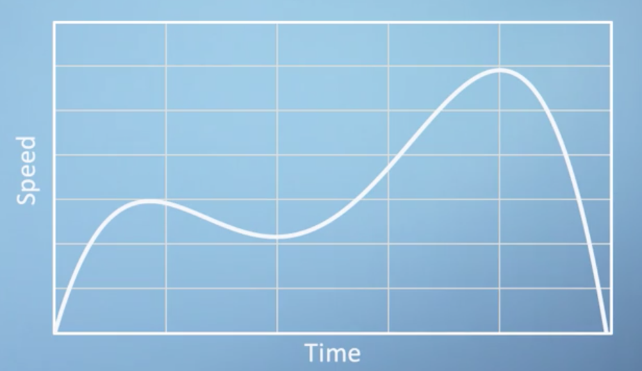

The most obvious thing this graph tells us is that the car's speed is not constant, as a constant speed would be represented with a flat horizontal line. Furthermore, starting from zero speed at zero time, this car's speed is initially increasing with time, which is another way of saying that it is _accelerating_. Towards the end of the time period, the car's speed is shown to be rapidly decreasing, meaning that it is _decelerating_.

As we've already said, a _horizontal_ line implies a _constant_ speed and an acceleration of $0$. A steep positive slope represents _increasing_ speed and an acceleration $\gt 1$.

!!! info
    In fact, acceleration can be defined as the local gradient of a speed-time graph.

We refer to the [**gradient**](https://en.wikipedia.org/wiki/Gradient) at a single point as the **local gradient**. We can illustrate this concept by drawing a tangent line, which is a straight line that touches the curve at a particular point

In our example, after the initial acceleration, the car's speed reaches a peak and then begins to decelerate again. By recording the slope of these tangent lines at every point, we could plot an entirely new graph which would show us acceleration against time rather than speed against time.

Before we plot this, let's think about what this acceleration-time graph would look like for a car traveling at constant speed. For constant speed, we get a flat horizontal line on our speed-time graph. It's gradient is therefore 0 and so the acceleration-time graph would also just be a horizontal line.

Going back to our more complex example, initially, the gradient is positive and fairly constant before it drops to zero at the peak. It then becomes negative for a period before returning to zero. Let's now take a look at the graph for acceleration versus time overlaid onto the speed-time graph

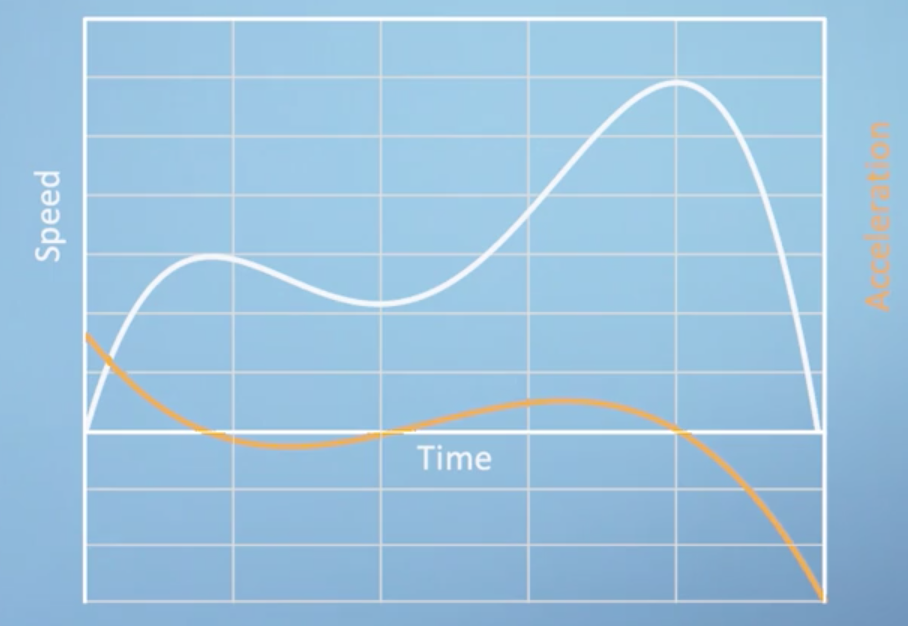

!!! note
    Don't forget the vertical axis for the blue line is speed and will have units of distance per time, whereas the vertical axis for the orange line is acceleration and will have units of distance per time squared. Because they have got different units, we can scale either of these two lines vertically in this block, and the meaning would still be identical. However, these have been scaled just to make the most use of this plot area available.

You can see the points at which the acceleration function is zero, i.e. where it crosses the horizontal axis, coincide with where the speed-time graph is flat and has zero gradient. Although we will be discussing the formal definition of a [**derivative**](https://en.wikipedia.org/wiki/Derivative) in a later section, what we've just done by eye is the _essence of calculus_, where we took a continuous function and described its slope at every point by constructing a new function, which is its derivative. We can, in principle, plot the derivative of the acceleration function following the same procedure, where we simply take the slope of the acceleration function at every point. This is the rate of change of acceleration which we can also think of as being the second derivative of the speed, and it's referred to as the [**jerk**](https://en.wikipedia.org/wiki/Jerk_%28physics%29) of the car

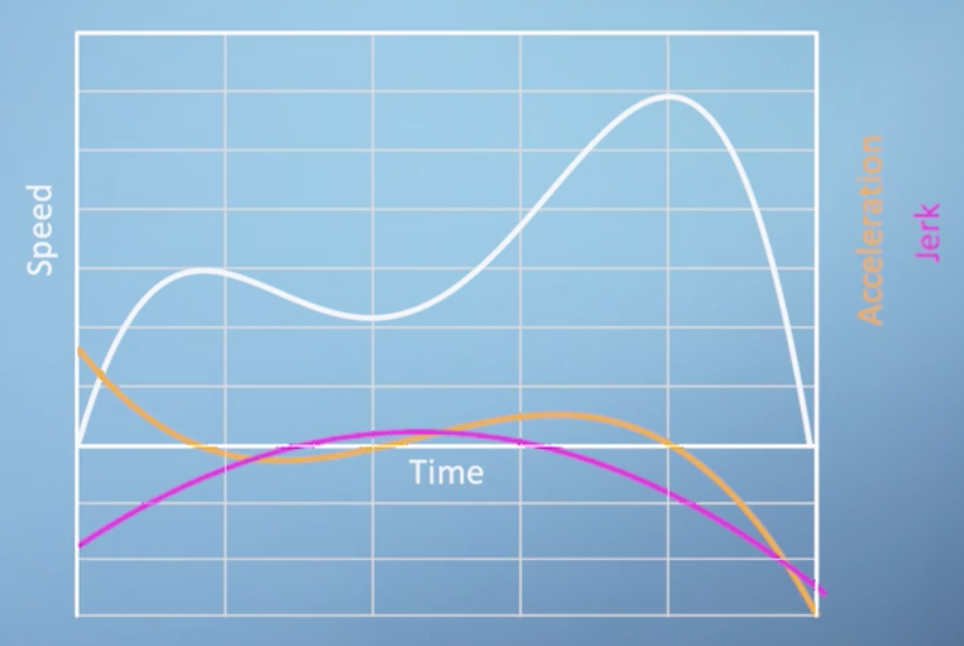

!!! note
    Think of the jerky motion of a car as it stops and starts. Now, you may have never heard of this concept before, but hopefully, just by telling you that it's the derivative of the acceleration curve, this should be all you need to know to approximately sketch the jerk.

Also very interesting is the idea of taking our baseline speed function and trying to imagine what function this would have been the gradient of, as in applying the inverse procedure to the one that we have just discussed. We can refer to this as the [**anti-derivative**](https://en.wikipedia.org/wiki/Antiderivative), which is closely related to something called the [**integral**](https://en.wikipedia.org/wiki/Integral). For the example we are discussing here, it would represent the distance of the car from its starting position. This should make more sense when you consider the change in the distance with respect to time, i.e. the slope of the distance time graph, i.e. how much distance you are covering per unit time, is just the speed.

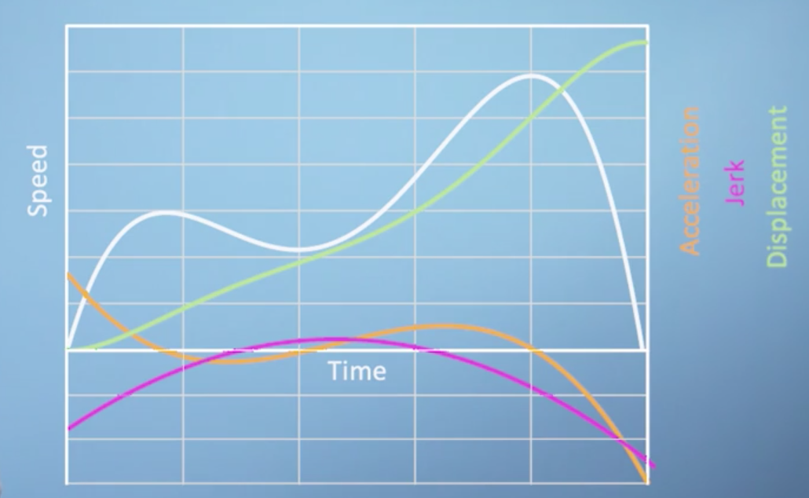

#### Conclusions

This analysis of slopes is all we are going to discuss in the section. Even though we haven't laid out yet the formal definition of calculus, you are already in a very strong position to start thinking about differentiation more formally.

### Definition of a derivative

!!! tip
    Watch [this](https://youtu.be/9vKqVkMQHKk) video first before reading through this section.

Now that we've explored the relationship between functions and their gradient, we should be ready to lay out the more formal definition of a derivative. All we're going to do, is translate the understanding about gradients that we saw in the previous video, into some mathematical notation that we can write down. Unfortunately, this is the bit that a lot of people seem to find uncomfortable so we will do my best to make it as painless as possible.

We talked in the last section about horizontal lines having a gradient of zero, whilst upwards and downward sloping lines having positive or negative gradients respectively. We can write down a definition of this concept by taking the example of a linear function, which has the same gradient everywhere. If we start by picking any two points, say here and here, we can then say that the gradient of this line is equal to the amount of that function that increases in this interval, divided by the length of the interval, that we're considering.

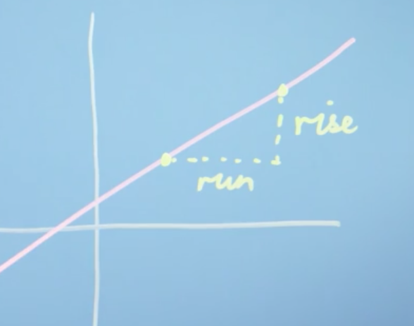

This description is often just condensed to the expression, _rise over run_, where rise is the increase in the vertical direction, and run is the distance along the horizontal axis. If our function was sloping down, and we pick points at the same horizontal locations, then our run would be the same, but our rise would now be negative. So,

$$\text{gradient} = \frac{\text{rise}}{\text{run}}$$

Fairly straightforward so far; but how does it relate to the more complicated functions we saw previously, where the gradient is different at every point?

Let's pick a single point on our speed-time graph from earlier where we'd like to know the gradient, which we'll say is at point $x$ on the horizontal axis. The value of our function at this point is clearly just $f(x)$. We're going to use the same logic as before. We now need to pick a second point to draw our rise over run triangle. We can call the horizontal distance between our two points, $\Delta x$, where as usual, a $\Delta$ is being used to express a small change in something. Which means our second point must be at position $x + \Delta x$. We can also write down the vertical position of our second point as a function $f$ evaluated at our new location $x + \Delta x$, i.e. $f(x + \Delta x$. We can now build an expression for the approximate gradient at our point $x$, based on the rise over run gradient between point $x$, and any second point remembering that the run will be our distance $\Delta x$, and our rise is just a difference in height of the two points.

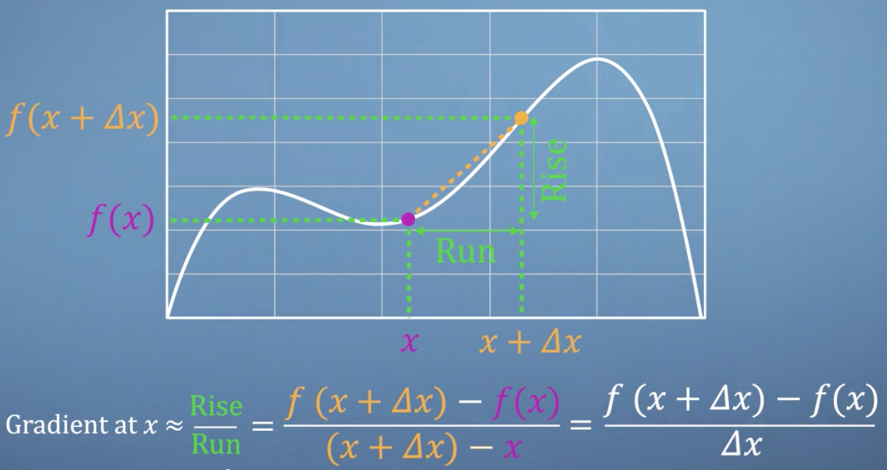

The last step in this process is simply to notice that for nice smooth continuous functions like the one we're showing here, as $\Delta x$ gets smaller, the line connecting two points becomes a better and better approximation of the actual gradient at our point $x$.

We can express this concept formally, by using the limit notation scheme, which says that as delta goes to zero. Our expression will give us a function for our gradient at any point we choose, which we write as $f'(x)$ or $\frac{d_f}{d_x}$, depending on which notation scheme you prefer. This is a slightly strange concept as we're not allowing $\Delta x = 0$, as dividing by zero is not defined. But instead investigating what happens when $x$ is extremely close to zero. This, in a nutshell, is the process of differentiation. When you are asked to differentiate a function, this literally just mean, substitute the function into this expression. We could fill up several videos with more robust interpretations of this infinitely small but non-zero $\Delta x$; but for now, don't worry about it too much. We know more than enough to continue on our journey.

Let's now put our new derivative expression into practice and see if it works. First, we should try this out on a linear function, once again, as we know that the answer is just going to be a constant. Given the function

$$f(x) = 3x + 2$$

what is its derivative?

$$f'(x) = \lim_{\Delta x \rightarrow 0} \Biggl(\frac{3(x + \Delta x) + 2 - (3x + 2)}{\Delta x}\Biggl)$$

$$ = \lim_{\Delta x \rightarrow 0}\Biggl(\frac{3x + 3 \Delta x + 2 - 3x - 2}{\Delta x}\Biggl)$$

$$ = \lim_{\Delta x \rightarrow 0}\Biggl(\frac{3 \Delta x}{\Delta x}\Biggl)$$

$$ = 3$$

Therefore, the gradient of our linear function is a constant, just as we expected.

!!! note
    We actually differentiated two things at once. A $3x$ term, and a $+ 2$ term. We could have differentiated them separately, and then added them together, and still got the same result. This interchangeability of the approach is called the [Sum Rule](https://en.wikipedia.org/wiki/Sum_rule_in_differentiation), and it's pretty handy.

Let's now try a slightly more complicated example

$$f(x) = 5x^2$$

All we're going to do is take this thing and put it into the differentiation expression we derived earlier. So,

$$f'(x) = \lim_{\Delta x \rightarrow 0} \Biggl(\frac{5(x + \Delta x)^2 - 5x^2}{\Delta x} \Biggl)$$

$$ = \lim_{\Delta x \rightarrow 0} \Biggl(\frac{ 5x^2 + 10 x \Delta x + 5 \Delta x^2 - 5x^2}{\Delta x} \Biggl)$$

$$ = \lim_{\Delta x \rightarrow 0} \Biggl(10x + 5 \Delta x \Biggl)$$

$$ = 10 x$$

We can generalize the lesson from this example to a rule for handling functions with powers of $x$. For example, if we take the function

$$f(x)= ax^b$$

and substitute it into our differentiation expression, we will find that the derivative is always

$$f'(x) = abx^{b-1}$$

The original power gets multiplied by the front and then the new power is just one less than it was before. This is known as the [**power rule**](https://en.wikipedia.org/wiki/Power_rule), and you can put this into your calculus toolbox along with [**sum rule**](https://en.wikipedia.org/wiki/Sum_rule_in_differentiation), which we saw earlier.

#### Conclusions

You've now seen two examples in which we apply the limit of rise over run method, to differentiate two simple functions. As you can probably imagine, if we wanted to differentiate a long complicated expression, this process is going to become quite tedious. What we are going to see in later videos are more rules, like this sum rule and the power rule, which will help us speed up the process. However, before we do that, we're just going to look at some fairly magical special case functions, which differentiate in an interesting way.

### Differentiation examples & special cases

In this video, we're going to run through three _special cases_: functions which give us interesting results when differentiated.

#### Special case 1: discontinuities

The first example we're going to work through is the function $f(x) = \frac{1}{x}$, which you can see plotted here

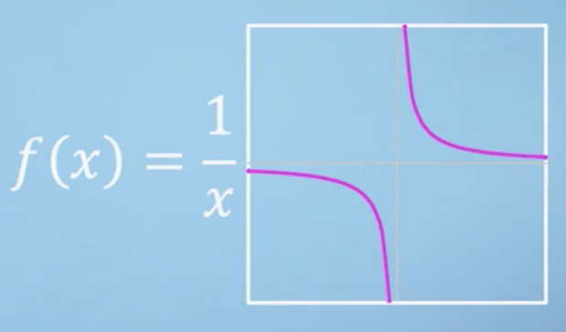

Take a minute to notice that the gradient of this function is negative everywhere, except at the point $x = 0$, where we can't see what it is. Something quite interesting must be happening at this point. On the negative side, the function drops down, presumably towards negative infinity, but then it somehow reemerges from above on the positive side. This sudden break in our otherwise smooth function is what we refer to as a [**discontinuity**](https://en.wikipedia.org/wiki/Classification_of_discontinuities#Essential_discontinuity). We've mentioned already that the operation divide by zero is undefined, which means that this function simply doesn't have a value at the point $x=0$. But, what about the gradient at this point? Well, let's sub our function into the differentiation expression to investigate.

$$f(x) = \frac{1}{x}$$

$$\Rightarrow f'(x) = \lim_{\Delta x \rightarrow 0} \Biggl(\frac{\frac{1}{x + \Delta x} - \frac{1}{x}}{\Delta x} \Biggl)$$

$$\Rightarrow f'(x) = \lim_{\Delta x \rightarrow 0} \Biggl(\frac{\frac{-\Delta x}{x(x + \Delta x)}}{\Delta x} \Biggl)$$

$$\Rightarrow f'(x) = \lim_{\Delta x \rightarrow 0} \Biggl(\frac{-1}{x^2 + x \Delta x} \Biggl)$$

$$\Rightarrow f'(x) = \frac{-1}{x^2}$$

So as we realized just by looking, this derivative function is negative everywhere and like our base function, the derivative is also undefined at $x = 0$

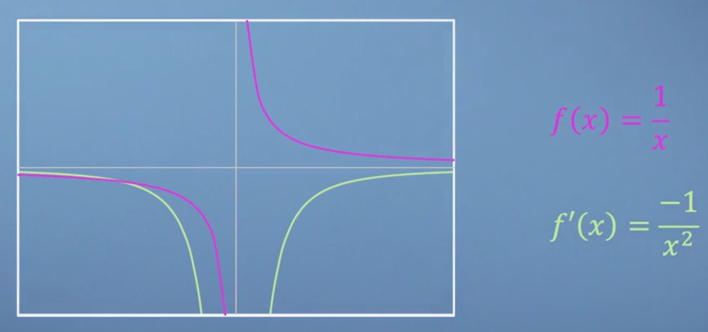

#### Special case 2: exponentials

For our second function, lets start by describing a few special properties of that function. The first property is that $f(x)$ is always equal to the value of its own gradient $f'(x)$. As it turns out, $f(x) = 0$ has this property, but it is not the function we are talking about. This means that our mystery function must always either be positive or negative, as if it ever tried to cross the horizontal axis, then both the function and the gradient would be zero, and we would be back to $f(x) = 0$. Another property of our mystery function is that it is always increasing or always decreasing, i.e. it can never return to the same value again. Plenty of functions could fit these criteria, and focusing on the positive case, they all look something like this

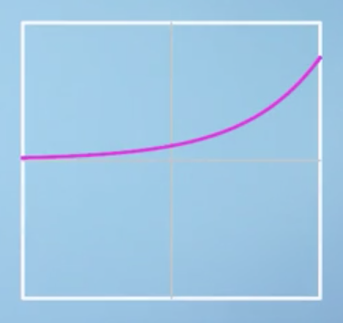

However, besides the zero function, there is only one function that will satisfy all our demands. This is the exponential function, $f(x) = e^x$, where $e$ is Euler's number, named after the 18th century Mathematician.

!!! note
    The number $e$, which is approximately $2.718$, is very important for the study of Calculus. But more than that, $e$ like $\pi$, turns up all over mathematics and seems to be written all over the fabric of the universe.

Differentiating $e^x$ gives us $e^x$ so, clearly, we can just keep differentiating this thing as many times as we'd like and nothing is going to change. This self similarity is going to come in very handy.

#### Special case 3: trigonometric functions

The last special case function that we're going to talk about are the trigonometric functions, [Sine](https://en.wikipedia.org/wiki/Sine) and [Cosine](https://en.wikipedia.org/wiki/Sine). You may recall that for a right angled triangle, $sin(x) \times r$ gives you the length of the opposite side to the angle

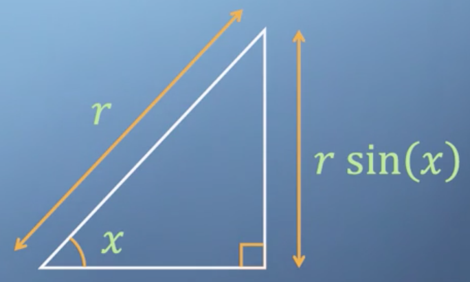

Let's take a look at the function $\sin(x)$ and see if we can work out what shape its derivative would be by eye. So, $\sin(x)$, starts with a positive gradient which gently decreases until at zero at the top of the bump, and then it starts being negative again until it gets to the bottom of the next bump, and so forth and so on

As it turns out, the derivative of $\sin(x)$ is actually just $\cos(x)$! Now what happens when we differentiate $\cos(x)$? Well actually, we get $-\sin(x)$. Differentiating a third time gives us $-\cos(x)$. And then amazingly differentiating changing a fourth time brings us all the way back to our original function, $\sin x$.

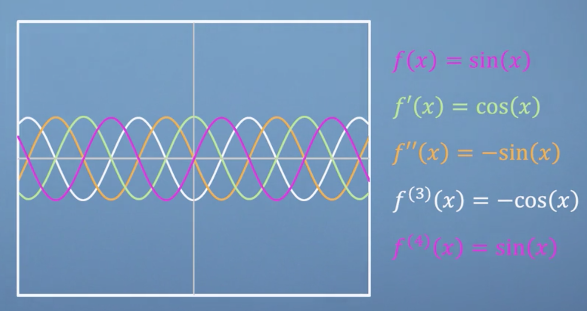

And then the pattern of course repeats. This self similarity may remind you of the exponential function we discussed above, and that is because these trigonometric functions are actually just exponentials in disguise, albeit quite a convincing disguise.

??? note
    Indeed, $\sin(x) = \frac{e^{ix} - e^{ix}}{2i}$.

#### Conclusions

Many of the details of the functions that we've talked about in this video were skimmed over rather quickly. But for the benefit of this particular course, all you need to understand is that differentiation is fundamentally quite a simple concept, even when you might not be able to battle through all the algebra, you're ultimately still just looking for the rise over run gradient at each point. This pragmatic approach to Calculus is going to come up again when we start talking about calculating gradients with computers. Sometimes we really can just find an equation for the gradient as we've been doing for all of our examples so far. However, if instead of a nice smooth function we just have discrete data points than it can seem as if there's nothing for us to differentiate. But as we shall see, rise of a run comes back once again to save the day.
