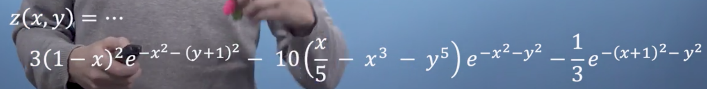
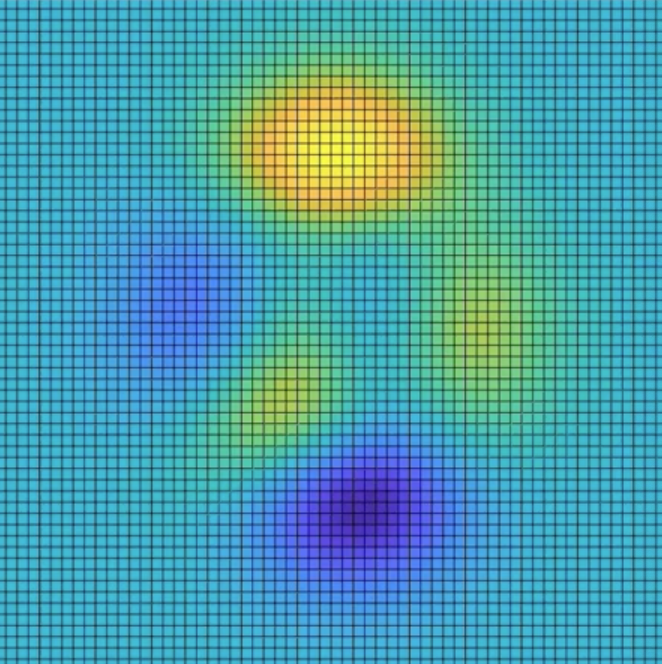
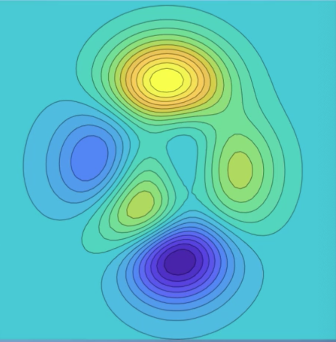
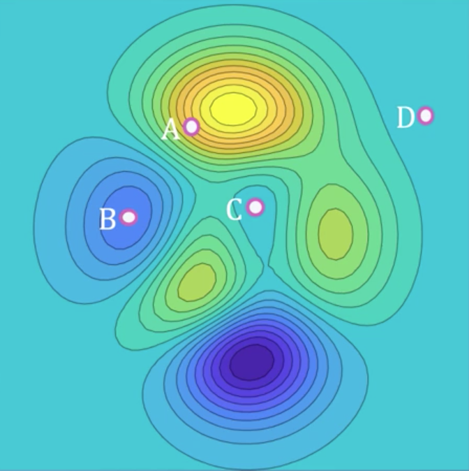
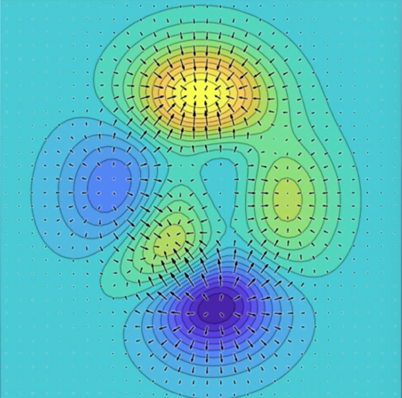
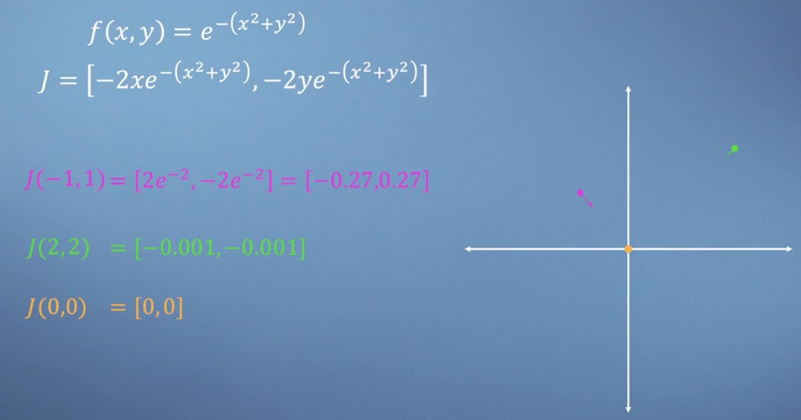
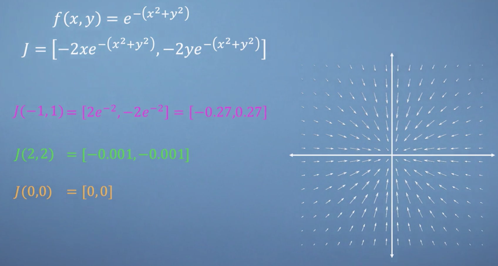
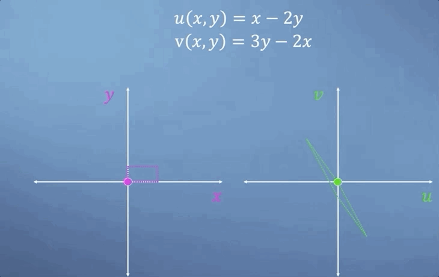
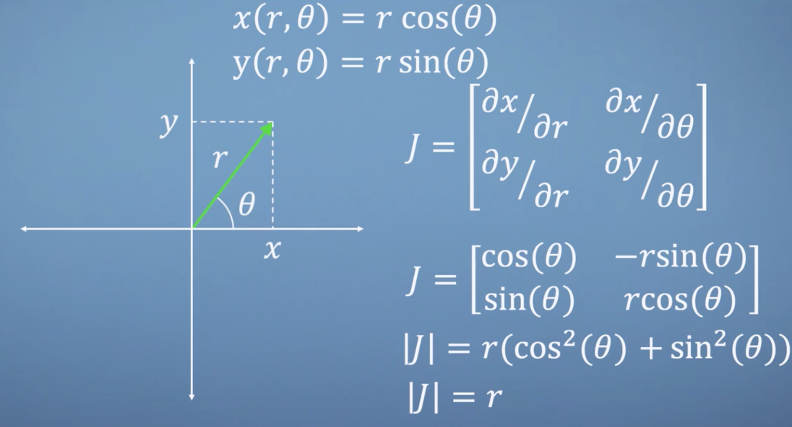

# Week 2: Multivariate calculus

Building on the foundations of the previous module, we can now generalize our calculus tools to handle multivariable systems. This means we can take a function with multiple inputs and determine the influence of each of them separately. It would not be unusual for a machine learning method to require the analysis of a function with thousands of inputs, so we will also introduce the linear algebra structures necessary for storing the results of our multivariate calculus analysis in an orderly fashion.

_Learning Objectives_

- Recognize that differentiation can be applied to multiple variables in an equation.
- Use multivariate calculus tools on example equations.
- Recognize the utility of vector/matrix structures in multivariate calculus.
- Examine two dimensional problems using the Jacobian.

## Moving to multivariate

Welcome to module two. If you're comfortable with the concept of differentiation, then in many ways, everything we add from here will just be extensions of this core idea, as well as some interesting applications.

The title of this course is _Multivariate_ Calculus, so you won't be surprised to hear that we are now going to generalize the concept of gradients to _multivariable_ systems. With more than one variable to play with, we will now be able to use calculus to help us navigate around high-dimensional spaces.

??? note
    The words multi**variable** and multi**variate** are typically used interchangeably. There is, however, a subtle difference between these two terms, which is related to whether there are multiple _input_ variables or multiple _output_ variables or _both_. Typically, we use multi**variate**: when multiple outcome variables exists (outputs); and multi**variable**: when multiple explanatory variables exist (inputs).

### Variables, constants & context

In the first module, we started by trying to develop a strong visual intuition relating derivatives to the gradient of a function at each point. We then followed this up by describing four handy rules to help speed up the process of finding derivatives ([sum rule](https://en.wikipedia.org/wiki/Sum_rule_in_differentiation), [power rule](https://en.wikipedia.org/wiki/Power_rule), [product rule](https://en.wikipedia.org/wiki/Product_rule), and [chain rule](https://en.wikipedia.org/wiki/Chain_rule)). However, all of the examples we looked at were for systems involving a _single_ variable. We are now going to have to see what happens when we apply the same idea to systems with many variables, known as **multivariate systems**. Before we do that, we need to talk about what a variable is in the first place.

Previously, we've shown examples of problems where one of the variables is a function of the other i.e., $y = f(x)$, but where it wouldn't necessarily make sense to say that $x = g(y)$.

!!! example
    A vehicles speed is clearly a function of time, as in each time the vehicle can only have one speed. However, we can not say that time was a function of the vehicles speed, as there might be multiple times at which the vehicle was traveling any given speed. This is why we typically refer to the speed as a _dependent_ variable, as it depends on time. Conversely, time can be thought of as an _independent_ variable in this particular context.

Typically, when you first learn calculus, you take functions containing variables and constants and then differentiate the [dependent variables](https://en.wikipedia.org/wiki/Dependent_and_independent_variables), such as speed, with respect to [independent variables](https://en.wikipedia.org/wiki/Dependent_and_independent_variables), like time. However, what gets labelled as a constant or a variable can be subtler than you might think and will require you to understand the context of the problem being described. Let's continue using the example of a car to see how this might come up.

Consider the following (highly simplified) expression,

$$F = ma + dv^2$$

Relating the force $F$ generated by a car's engine to its mass $m$, acceleration $a$, aerodynamic drive $d$, and velocity $v$. Which variables are constant, which variables are independent and which variables are dependent depends on context!

#### From the perspective of the driver

The cars speed and acceleration can be changed by pressing the accelerator pedal to adjust the force, but the mass and the drag are fixed features of the car's design. Therefore, in this context, we would call the force an _independent_ variable, but speed and acceleration _dependent_ variables as they are consequences of the applied force. Additionally, the mass and drag coefficients are clearly _constants_.

#### Car designer

If you are the cars designer looking to design each engine size in a new fleet, perhaps settle on a specific acceleration-speed target. In this context, while your force is still the _independent_ variable, speed and acceleration are _constants_. Additionally the mass and drag have become variables which you can adjust by redesigning your car.

We refer to these slightly confusing variable design constants as [parameters](https://en.wikipedia.org/wiki/Parameter). The key takeaway here is that you can, in principle, differentiate any term with respect to any other. So don't get caught off guard when things you thought were constants suddenly start to vary. Let's now look at a different example.

!!! note
    We often think of varying parameters as exploring a family of similar functions rather than describing them as variables in their own right.

Imagine that you wanted to manufacture a metal can. You need to understand the relationship between the various key design parameters. We can start by writing a reasonable approximation for the can's empty mass $m$ by breaking the area down into pieces.

The circles on top and bottom are $\pi r^2$ each. When we unroll the body we get a rectangle where the width must be the same as the circumference of the circle i.e. $2 \pi r$. Finally, call the height $h$. Taking these areas and multiplying them by a thickness $t$, we get the total volume of metal in the can.

$$v = 2 \pi r^2 t + 2 \pi r h t$$

Finally, multiplying this by the metal's density $\rho$, we get its mass

$$m = 2 \pi r^2 t \rho + 2 \pi r h t \rho$$

At this point, what should we label as a constant or a variable? Well, with the exception of $\pi$ (which is definitely a constant for this universe) it's not entirely clear. We could in principle change any of the radius, the height, the wall thickness, or even the material's density. Lets do that, by calculating the derivative of the cans mass with respect to any of these variables. To calculate these [partial derivatives](https://en.wikipedia.org/wiki/Partial_derivative) (as they are called) all we do is differentiate with respect to a certain variable and consider all of the others to behave as constants.

Starting with an easy one, let's try $h$

$$\frac{\partial m}{\partial h} = 2 \pi r \rho$$

As the first term did not contain the variable $h$ (and we're treating all the other terms as constants) the partial deriviative just gives us the contants of the second term multiplied by the derivative of $h$. As we can see from this expression, the partial derivative of $m$ with respect to $h$ no longer contains $h$, which is what we'd expect as the mass will vary linearly with the height when all else is kept constant. Notice that instead of using the normal $d$ that we saw in last module, we must use the curly partial symbol ($\partial$) which signifies that you've differentiated a function of more than one variable.

Let's now find the partial derivative with respect to the other variables, starting with $r$,

$$\frac{\partial m}{\partial r} = 4 \pi r t \rho + 2 \pi h t \rho$$

then $t$,

$$\frac{\partial m}{\partial t} = 2 \pi r^2 \rho + 2 \pi r h \rho$$

and finally, $\rho$

$$\frac{\partial m}{\partial \rho} = 2 \pi r^2 t + 2 \pi r h t$$

Although this is quite a straightforward example, that's basically it for partial differentiation. It's no more complicated than the univariate calculus we met last module. The only difference being that you have to be careful to keep track of what you are considering to be held constant when you take each derivative.

#### Conclusions

I hope this short introduction to multivariate calculus has helped you see that this concept is nothing to be intimidated by. Partial differentiation is essentially just taking a multi dimensional problem and pretending that it's just a standard 1D problem when we consider each variable separately. I look forward to showing you the pretty amazing things that we can use this concept for later in the module.

### Differentiate with respect to anything

We've already seen how to think about partial differentiation as just a simple extension of the single variable method that we derived in the last module. In this section, we're going to explore some slightly more complicated partial differential examples and we're also going to build something called the [**total derivative**](https://en.wikipedia.org/wiki/Total_derivative) of a function. Let's dive straight in.

Consider the function,

$$f(x,y,z) = sin(x) e^{yz^2}$$

Lets first find the derivatives with respect to each of these three variables,

$$\frac{\partial f}{\partial x} = \cos(x)e^{yz^2}$$

$$\frac{\partial f}{\partial y} = \sin(x)e^{yz^2}z^2$$

$$\frac{\partial f}{\partial z} = \sin(x)e^{yz^2}2yz$$

So, now that we have these three partial derivatives, we are going to introduce a new idea called the [total derivative](https://en.wikipedia.org/wiki/Total_derivative). Imagine that the variables $x$, $y$, and $z$ were actually themselves a function of a single other parameter, $t$, where $x = t-1$, $y = t^2$ and $z = \frac{1}{t}$. What we're looking for is the derivative of $x$ with respect to $t$. In this simple case, we could just substitute for all our three variables directly in terms of $t$, simplify a little bit and then differentiate directly with respect to $t$, which gives us, $\cos(t-1)e$. However, in a more complicated scenario with many variables, the expression we needed to differentiate might become unmanageably complex. The alternative approach is to once again use the logic of chain rule to solve this problem, where the derivative with respect to a new variable, $t$, is the sum of the chains of the other three variable. As shown in this expression,

$$\frac{df(x,y,z)}{dt} = \frac{\partial f}{\partial x}\frac{dx}{dt} + \frac{\partial f}{\partial y}\frac{dy}{dt} + \frac{\partial f}{\partial z}\frac{dz}{dt}$$

Since we've already got our three partial derivatives of $f$ with respect to $x$, $y$ and $z$, we just need to find the derivatives of the three variables with respect to $t$, and we'll have all the things we need to evaluate our expression.

$$\frac{dx}{dt} = 1$$

$$\frac{dx}{dy} = 2t$$

$$\frac{dx}{dz} = -t^{-2}$$

Nothing hugely complicated here. However, when we then sub into our total derivative expression, the expression is a bit of a monster,

$$\frac{df(x,y,z)}{dt} = (cos(x)e^{yz^2})(1) + (\sin(x)e^{yz^2}z^2)(2t) + (\sin(x)e^{yz^2}2yz)(-t^{-2})$$

However, after substituting for $x$, $y$ and $z$ all in terms of $t$ and then simplifying again, we can see that the second and third terms are the same, just with opposite sign, and so they will cancel each other out (left as an exercise!).  Then kind of amazingly, we arrive at the same result as we saw at the beginning of the lecture

$$\frac{df(x,y,z)}{dt} = \cos(t-1)e$$

#### Conclusions

Hopefully you are feeling reasonably comfortable with partial differentiation, and maybe you can even see why the total derivative function might be quite handy. We now have all the pieces that for us to the build our partial derivatives into something really useful.

## Jacobians - vectors of derivatives

Previously, we saw that we can differentiate functions of multiple variables and that it isn't much harder than the univariate calculus we met at the start of the course. In this section, we're going to introduce the [**Jacobian**](https://en.wikipedia.org/wiki/Jacobian_matrix_and_determinant), which brings in some of the ideas from linear algebra to build these partial derivatives into something particularly useful.

### The Jacobian

The concept of the **Jacobian** can be applied to a variety of different problems. But in the context of getting started with optimization and machine learning, there is a particular scenario that comes up a lot, which is the Jacobian of a _single function_ of _many variables_. In short, if you have a function of many variables i.e., $f(x1, x2, x3, ...)$ then the Jacobian is simply a vector where each entry is the partial derivative of $f$ with respect to each one of those variables in turn. By convention, we write this as a row vector rather than a column vector, for reasons that will become clear later in the course

$$J = [\frac{\partial f}{x_1}, \frac{\partial f}{x_2}, \frac{\partial f}{x_3}, ...]$$

Let's start by looking at a nice simple function

$$f(x, y, z) = x^2y + 3z$$

to build the Jacobian, we just find each of the partial derivatives of the function one by one

$$\frac{df}{dx} = 2xy$$

$$\frac{df}{dy} = x^2$$

$$\frac{df}{dz} = 3$$

Now bringing all of those together, we end up with a Jacobian $J$

$$J = [2xy, x^2, 3]$$

We now have an algebraic expression for a vector which when we give it a specific $x, y, z$ coordinate, will return a vector pointing in the direction of steepest slope of this function. For example, at the point $(0, 0, 0)$,

$$J(0, 0, 0) = [0, 0, 3]$$

so our Jacobian is a vector of length 3 pointing directly in the $z$ direction.

Some of the numerical methods that we will discuss later in this course require us to calculate Jacobians in hundreds of dimensions. However, even for the 3D example we just solved, graphical representation is already quite difficult. We are now going to drop down to 2 dimensions so that we can actually see what's going on here. To keep things interesting, we're going to look at a particularly complicated but rather attractive function

!!! note
    Even though it is a bit of a monster, I hope you would agree that with the tools we've seen so far, we really could calculate the partial derivatives of this thing. But you wouldn't really learn anything new from grinding through this. Instead, we will look at the results graphically.

Here is that same function, with the $x$ axis horizontal, the $y$ axis vertical and a color map indicating the value of $z$, with the bright region suggesting high values and the dark region suggesting low values

Although this plot is fairly clear, our intuition about the gradient is a bit lacking in this format. So let's briefly make things 3D, where the values of $z$ and now also represented by the height.

As we said at the start of the video, the Jacobian is simply a vector that we can calculate for each location on this plot which points in the direction of the _steepest uphill slope_. Furthermore, the _steeper the slope_, the _greater the magnitude of Jacobian at that point_. Hold the image of this 3D space in your mind as we now go back to 2D. Rather than showing all of the grid points I used to plot the graph, lets instead convert to a contour plot, where just like a map of actual mountains, we will draw lines along the regions of the same height (which for us means the same value of $z$).

This removes a lot of the clutter from the plot which is useful for the final step that I'd like to show you, which will be adding lots of Jacobian vectors on top of our contour plot. However, before I do that, let's take a look at these four points and see if your intuition is now in tune by guessing which one will have the Jacobian with the largest magnitude.

Overlaying the Jacobian vector field, we can see that they are clearly all pointing uphill, away from the low dark regions and towards the high bright regions

Also, we see that where the contour lines are tightly packed, this is where we find our largest Jacobian vectors such as at point A. Whereas the peaks of the mountains and in the bottom of the valleys or even out on a wide flat plains, our gradients, and therefore our Jacobians are small.

#### Conclusions

My hope is that this clear two-dimensional example will give you the confidence to trust the maths when we come up against much higher dimensional problems later in the course. See you then.

### Jacobian applied

In this section, we're going to extend the concept of the Jacobian, from vectors up to matrices, which will allow us to describe the rates of change of a vector valued function. However, before we do this, we are first going to recap by applying what we've learned so far about Jacobians, to another simple system.

If we consider the function

$$f(x,y) = e^{-(x^2 + y^2)}$$

then using our knowledge of partial differentiation, it's fairly straightforward to find its Jacobian vector

$$J = [-2xe^{-(x^2+y^2)}, -2ye^{-(x^2+y^2)}]$$

We're now going to do the reverse of our approach from the last section and start by looking at the vector field in the Jacobians, and then see if we can understand how the function must look. Let's start by finding the Jacobian at a few specific points.

Firstly, the point $(-1, 1)$ which we'll highlight on our axis in pink. Substituting these coordinates into our Jacobian expression and simplifying, we can see a vector pointing directly towards the origin. Next, if we move further out to the point $(2, 2)$ and find the Jacobian, we are now going to get a much smaller vector but pointing once again directly at the origin Lastly, before I reveal the whole vector field, let's look at what's going on at the origin itself. Subbing in the point $(0, 0)$ returns the zero vector, suggesting that the function is flat at this point, which must mean one of three things. Either, this point is a maximum, minimum, or something called a saddle, which we'll cover later in this module

However, if we now reveal the rest of the Jacobian vector field, it becomes clear that the origin must be the maximum of this system

Let's now move back to the colour map representation of this function, where the brighter regions represent high values of f. So, finally, we can remove the vector field and observe the function in 3D, which I hope matches up with your expectations.

Next, we're going to build a Jacobian matrix which describes functions that take a vector as an input, but unlike our previous examples, _also give a vector as the output_. If we consider the two functions,

$$u(x,y) = x - 2y$$

$$v(x,y) = 3y - 2x$$

we can think of these as two vector spaces, one containing vectors with coordinates in $u, v$ and the other with coordinates in $x, y$, i.e., each point in $x, y$ has a corresponding location in $u, v$. As we move around $x, y$ space, we would expect our corresponding path in $u, v$ space to be quite different,

We can of course, make separate row vector Jacobians for $u$ and $v$. However, as we are considering $u$ and $v$ to be components of a single vector, it makes more sense to extend our Jacobian by stacking these vectors as rows of a matrix like this

$$J_u = \begin{bmatrix} \frac{\partial u}{\partial x} & \frac{\partial u}{\partial y} \end{bmatrix}$$

$$J_v = \begin{bmatrix} \frac{\partial v}{\partial x} & \frac{\partial v}{\partial y} \end{bmatrix}$$

$$J = \begin{bmatrix} \frac{\partial u}{\partial x} & \frac{\partial u}{\partial y} \\ \frac{\partial v}{\partial x} & \frac{\partial v}{\partial y}\end{bmatrix}$$

Now that we have the structure and motivation for building a Jacobian matrix for vector valued functions, let's apply this to our example functions and see what we get. We have

$$u(x, y) = x - 2y$$

$$v(x,y) = 3y - 2x$$

We can build the Jacobian from these two, by simply saying well, the Jacobian is going to be,

$$J = \begin{bmatrix} \frac{\partial u}{\partial x} & \frac{\partial u}{\partial y} \\ \frac{\partial v}{\partial x} & \frac{\partial v}{\partial y}\end{bmatrix}$$

$$ = \begin{bmatrix} 1 & -2 \\ -2 & 3\end{bmatrix}$$

Our Jacobian matrix no longer even contains any variables, which is what we should expect when we consider that clearly, both $u$ and $v$ are linear functions of $x$ and $y$. So the gradient must be constant everywhere. Also, this matrix is just the linear transformation from $xy$ space to $uv$ space. So, if we were to apply the $xy$ vector two three, we'd get the following,

$$\begin{bmatrix} 1 & -2 \\ -2 & 3\end{bmatrix}\begin{bmatrix} 2 \\ 3\end{bmatrix} = \begin{bmatrix} -4 \\ 5\end{bmatrix}$$

Now, this is all well and good. But of course, many of the functions that you'll be confronted with, will be highly nonlinear, and generally much more complicated than the simple linear example we've just looked at here. However, often they may still be smooth, which means that if we zoom in close enough, we can consider each little region of space to be approximately linear and therefore, by adding up all the contributions from the Jacobian determinants at each point in space, we can still calculate the change in the size of a region after transformation.

A classic example of this occurs when transforming between cartesian and polar coordinate systems. If we have a vector expressed in terms of a radius $r$, and the angle up from the x-axis is theta, but we'd like them expressed in terms of $x$ and $y$ instead. We can write the following expressions just by thinking about trigonometry

Now, we can build the Jacobian matrix and take its determinant. The fact that the result is simply the radius $r$, and not the function $\theta$, tells us that as we move along $r$, away from the origin, small regions of space will scale as a function of $r$, which I hope will make a lot of sense to you when we look at our little animation here

#### Conclusions

That's all for this video. I hope you will now be able to build Jacobian vectors and matrices for yourself, with confidence in the exercises. And more importantly, that your intuition on the meaning of this concept, is starting to develop. See you next time.
