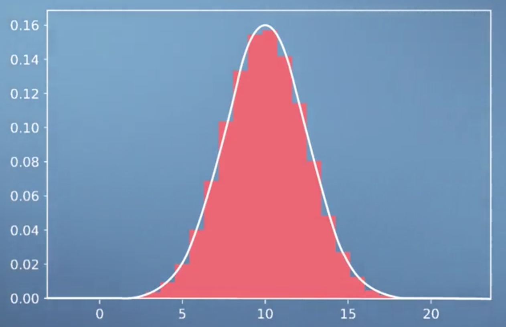
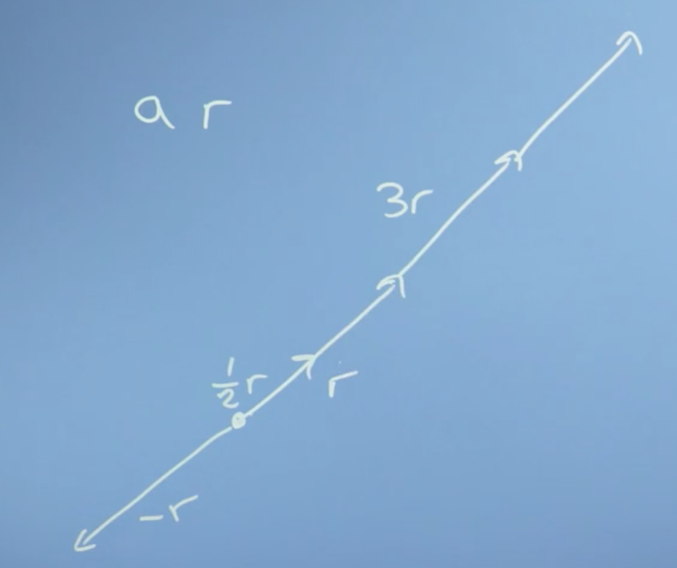

# Mathematics for Machine Learning

What I hope to accomplish with this set of notes is a complete crash course on the various areas of mathematics essential to understanding machine learning. To do this, I will use the [Mathematics for Machine Learning Specialization](https://www.coursera.org/learn/linear-algebra-machine-learning) on [Coursera](https://www.coursera.org) as my guide, but also pull from other resources, such as [Khan Academy](https://www.khanacademy.org/math/linear-algebra) and [3blue1brown](http://www.3blue1brown.com) various video playlists on Youtube.

The end goal will be to produce a single resource that someone (including myself) could use to quickly bring themselves up to speed on the fundamental mathematical concepts necessary for machine learning. The target audience are those who have at least some highschool math, but should really have taken introductory courses on Linear Algebra and Calculus in college.

I will do my best to include hyperlinks to Wikipedia for every concept/definition introduced, which should allow a reader quick access to more information should they need it.

Full credit to the team behind the [Mathematics for Machine Learning Specialization](https://www.coursera.org/learn/linear-algebra-machine-learning) course on [Coursera](https://www.coursera.org) for creating such an awesome resource. I highly encourage anyone who needs to brush up on their mathematics for machine learning to check that course out.

### Table of Contents

1. [Linear Algebra](#linear-algebra)
    1. [Course Resources](#course-resources-linear-algebra)
    2. [Week 1: Introduction to Linear Algebra and to Mathematics for Machine Learning](#week-1:-introduction-to-linear-algebra-and-to-mathematics-for-machine-learning)
2.

# Linear Algebra

## Course resources (Linear Algebra)

There are lots of useful web resources on **linear algebra**. Typically they go a bit slower or have a different emphasis or way of explaining things, but it can be handy to see how someone else explains something.

- **Khan Academy** is a great resource right up to 1st or 2nd year undergraduate material. For this course, there's a handy group of videos at https://www.khanacademy.org/math/linear-algebra
- **Grant Sanderson** has a great series of videos developing mathematical intuition on YouTube, which you can reach through his site http://www.3blue1brown.com
- **Wikipedia** gets better every year - and the linear algebra wikipedia pages are actually pretty good. https://en.wikipedia.org/wiki/Linear_algebra

## Week 1: Introduction to Linear Algebra and to Mathematics for Machine Learning

### The relationship between machine learning, linear algebra, and vectors and matrices

#### Motivations for linear algebra

 Lets look a bit more at the types of problems we might want to solve, and expose what **linear algebra** is and how it might help us to solve them.

 ##### Toy problem 1

The first problem we might think of is one of **price discovery**. Say we go shopping on two occasions, and the first time we buy two apples and three bananas and they cost eight Euros.

$$2a + 3b = 8$$

And the second time we buy say, ten apples and one banana, and the cost is 13 Euros.

$$10a + 1b = 13$$

The $a$s and $b$s here, are the price of a single apple and a single banana. What we're going to have to do is solve these [**simultaneous equations**](http://www.wikiwand.com/en/System_of_equations) in order to discover the price of _individual apples and bananas_. Now in the general case, with lots of different types of items and lots of shopping trips, finding out the prices might be _quite hard_.  

This is an example of a linear algebra problem. I have some constant linear coefficients here, these numbers 2, 10, 3, 1, that relate the **input variables**, $a$ and $b$, to the **outputs** 8 and 13. That is if, we think about a vector $[a,b]$ that describes the prices of apples and bananas, we can write this down as a matrix problem where the 2, 3 is my first trip, and the 10, 1 is my second trip,

$$\begin{pmatrix}2 & 3 \\\ 10 & 1\end{pmatrix} \begin{bmatrix}a \\\ b\end{bmatrix} = \begin{bmatrix} 8 \\\ 3\end{bmatrix}$$

What we're going to do over the course of modules one to three, is to look at these different types of mathematical objects [**vectors**](http://www.wikiwand.com/en/Vector_(mathematics_and_physics)) and [**matrices**](http://www.wikiwand.com/en/Matrix_(mathematics)), in order to understand what they are and how to work with them.

##### Toy problem 2

Another type of problem we might be interested in solving is _fitting an equation to some data_. In fact, with neural networks and machine learning, we want the computer to, in effect, not only fit the equation to the data but to figure out _what equation to use_.

Let's say, we have some data like this histogram here:

This looks like a **population** with an **average** and some **variation**. A common problem we  might want to solve is how to find the _optimal value of the parameters_ in the equation describing this line, i.e., the ones that fit the data in the histogram best.

That might be really handy, because with that fitted equation we'd have an easy "portable" description of the population we could carry around, without needing all the original data which would free us, for example, from privacy concerns.

### Conclusions

In this video, we've set up two problems that can be solved with linear algebra. First, the problem of apples and bananas, of solving **simultaneous equations**. And secondly, the **optimization problem** of fitting and equation with some parameters to data. These problems and other will motivate our work right through the course on linear algebra, and it's partner of multivariate calculus.

## Geometric and Numeric Interpretations

It is helpful to draw a distinction from the **numerical operations** we can perform using linear algebra, and the **geometric intuitions** underlying them (which are frequently not taught in may introductory courses).

Roughly speaking, the _geometric understanding or intuition_ is what lets us judge what tools to use to solve specific problems, feel why the work, and know how to interpret the results. The _numerical understanding_ is what lets us actually carry through the application of those tools.

If you learn linear algebra without getting a solid foundation in that geometric understanding, the problems can go unnoticed for a while, until you go deeper into whatever field you happen to pursue (e.g. computer science, engineering, statistics, economics, etc.), at which point you may feel disheartened by your lack of understanding of the fundamentals of linear algebra.

With linear algebra (much like trigonometry, for example), there are a handful of useful visual/geometric intuitions underlying much of the subject. When you digest these and really understand the relationship between the geometry and the numbers, the details of the subject as well as how it's used in practice start to feel a lot more reasonable.

> Full credit for this section goes to [3Blue1Brown](https://www.youtube.com/channel/UCYO_jab_esuFRV4b17AJtAw). Video [here](https://youtu.be/kjBOesZCoqc).

## Getting a handle on vectors

The first thing we need to do in this course on linear algebra is to get a handle on **vectors**, which will turn out to be really useful to us in solving the linear algebra problems we introduced earlier (along with others!). That is, problems described by equations which are _linear in their coefficients_, such as most fitting parameters.

We're going to first step back and look in some detail at the sort of things we're trying to do with data. And why those vectors you first learned about in high school were even relevant. This will hopefully make all the work with vectors a lot more intuitive.

Let's go back to that simpler problem from the last video, the histogram distribution of heights of people in the population:

Say we wanted to try fitting that distribution with an equation describing the variation of height in the population. Let's say that equation has just two parameters; one describing the center of the distribution (the **average**), which we'll call $\mu$, and one describing how wide it is (or the **variance**), which we'll call $\sigma$.

We could fit the data with some curve that had two parameters, $\mu$ and $\sigma$. This equation turns out to be the equation for the **normal** or [(**Gaussian**) **distribution**](http://www.wikiwand.com/en/Normal_distribution):

$$f(x) = \frac{1}{\sigma\sqrt{2\pi}} e^{\frac{-(x-\mu)^2}{2\sigma^2}}$$

So how do we arrive at the best possible values for $\mu$ and $\sigma$? Well, one way is [**gradient descent**](http://www.wikiwand.com/en/Gradient_descent). If we think of some __goodness__ value which measures how well our parameters fit our data (say, the [**mean squared error**](http://www.wikiwand.com/en/Mean_squared_error)) we could imagine plotting this goodness value as a function of our parameters, often called a **cost** or [**loss**](http://www.wikiwand.com/en/Loss_function) function.

The closer our loss function is to zero, the better our parameters fit our data. Gradient descent allows us to choose values for our parameters that minimize the **error**, as measured by our loss function, by taking small incremental steps towards the bottom of the parameter space defined by our loss function.

This process involves computing the partial derivative of our loss function $w.r.t$ to all possible parameters (also known as the [**gradient**](http://www.wikiwand.com/en/Gradient)). If our parameters are stored in a vector, $\begin{bmatrix}\mu&\sigma \end{bmatrix}$, we could subtract from this vector the vector of gradients, $\begin{bmatrix}\frac{\partial f}{\partial \mu} & \frac{\partial f}{\partial \sigma}\end{bmatrix}$ in order to complete the computation in (effectively) one step.

So vectors (and calculus) give us a computational means of navigating a parameter space, in this case by determining the set of parameters for a function $f(x)$ which best explain the data.

### Vectors as abstract lists of numbers

We can also think of vectors as simply _lists of numbers_. For example, we could describe a car in terms of its price, top speed, safety rating, emissions performance, etc and store these numbers in a single _vector_.

$$car = \begin{bmatrix}\text{price,} & \text{top speed,} & \text{safety rating, }& ...\end{bmatrix}$$

> Note that this is more of a 'computer science' perspective of vectors.

To summarize, a vector is, at the simplest level:

- lists of numbers
- something which moves in a space of parameters

## Operations with vectors

Lets now explore the **operations** we can do with vectors, how these mathematical operations define what vectors are in the first place, and the sort of spaces they can apply to.

We can think of a **vector** as an **object** that moves us about space. This could be a physical space, or a space of data (often called a [**vector space**](http://www.wikiwand.com/en/Vector_space)).

> At school, you probably thought of a vector as something that moved you around a physical space, but in computer and data science, we generalize that idea to think of a vector as maybe just a list of attributes of an objects.

Now, a vector is just something that obeys on two rules. Firstly, **addition**, and secondly, **multiplication** by a scalar number.

Intuitively, we can introduce **vector addition** as being the resulting vector of the two vectors we want to add ($s$ and $r$) being placed _head-to-tail_, $s + r$.

Multiplying a vector by a **scalar** is also easy to understand. In this case, we simply multiply all elements of our **vector** $r$ by the scalar, $a$ for example.

At this point, it's convenient to define a **coordinate system**, so, let's define space by two vectors. Imagine we had two dimensions defined by the vectors $\vec i = \begin{bmatrix}1 \\\ 0 \end{bmatrix}$ and $\vec j = \begin{bmatrix} 1 \\\ 0 \end{bmatrix}$. We could define any vector in this 2D space using the vectors $\vec i$ and $\vec j$. For example, the vector $\begin{bmatrix}3 \\\ 2 \end{bmatrix} = 3 \vec i + 2 \vec j$.

This also illustrates that vectors are **associative**, meaning, the sum of a series of vectors is the same regardless of the order we add them in.

### Conclusions

So, that's vectors. We've defined _two_ fundamental operations that vectors satisfy, that is **addition**, so like $r$ plus $s$, and **multiplication** by a _scalar_, so like $2r$ $-1s$. And we've explored the properties that those imply like **associativity** of addition and subtraction, what subtraction really means for vectors ($r$ plus minus $s$, being $r$ minus $s$). We've noticed that it can be useful to define a coordinate system in which to do our **addition** and **scaling**, so like $r = \begin{bmatrix} 3 \\\ 2 \end{bmatrix}$, using these fundamental **basis** vectors, $\vec i$ and $\vec j$, which define the coordinate system.

We've also seen that although, perhaps, it's _easiest_ to think of vector operations _geometrically_, we don't have to do it in a real space. We could do it with vectors that lists different types of things like the _attributes of a house_.

# Week 2: Vectors are objects that move around space

In this module, we look at operations we can do with vectors - finding the modulus or magnitude (size), angle between vectors (dot or inner product) and projections of one vector onto another. We can then examine how the entries describing a vector will depend on what vectors we use to define the axes - the basis. That will then let us determine whether a proposed set of basis vectors are what's called 'linearly independent.' This will complete our examination of vectors, allowing us to move on to matrices in module 3 and then start to solve linear algebra problems.

_Learning Objectives_

- Calculate basic operations (dot product, modulus, negation) on vectors
- Calculate a change of basis
- Recall linear independence
- Identify a linearly independent basis and relate this to the dimensionality of the space

## Modulus & inner product

Previously we looked at the two main vector operations of **addition** and **scaling** by a number (multiplication by a **scalar**). As it turns out, those are really all we need to be able to do to define a vector.

Now, we can move on to define two new ideas: the **length of a vector**, also called its _size_, and the **dot product** of a vector, also called its _inner_, _scalar_ or _projection_ product.

> The dot product is a huge and amazing concept in linear algebra with huge numbers of implications, and we'll only be able to touch on a few parts of it here, but enjoy. It's one of the most beautiful parts of linear algebra

### Length of a vector

Lets define a vector $\vec r$ using the basis vectors we introduced earlier, $\vec i$ and $\vec j$,

$$\vec r = a \vec i + b \vec j = \begin{bmatrix} a \\\ b\end{bmatrix}$$

To calculate the length of $\vec r$, also called the norm $||\vec r||$, we could imagine drawing a triangle, with our vector $\vec r$ as the hypotenuse:

> The length, magnitude, modulus and norm of a vector are all the same thing, and just represent a difference in terminology. If we are thinking of a vector as representing the line segment from the origin to a given point (i.e., the geometric interpretation), we may interpret the **norm** as the _length_ of this line segment. If we are thinking of a vector as representing a physical quantity like acceleration or velocity, we may interpret the norm as the **magnitude** of this quantity (how "_large_" it is, regardless of its direction).

By [**Pythagorus's Theorem**](http://www.wikiwand.com/en/Pythagorean_theorem), $||\vec r|| = \sqrt{a^2 + b^2}$

### Vector dot product

The [**dot product**](http://www.wikiwand.com/en/Dot_product) is one way of several of multiplying two vectors together, specifically, it is an _algebraic operation that takes two equal-length sequences of numbers (usually coordinate vectors) and returns a single number_.

The dot product has an **algebraic** and **geometric** interpretation. **Algebraically**, the dot product is the _sum of the products of the corresponding entries of the two sequences of numbers_. **Geometrically**, it is the _product of the Euclidean magnitudes of the two vectors and the cosine of the angle between them_.

#### Algebraic definition of the dot product

To illustrate the algebraic definition of the dot product, lets define two vectors $\vec r$ and $\vec s$:

$$\vec r = \begin{bmatrix} r_i \\\ r_j\end{bmatrix}$$
$$\vec s = \begin{bmatrix} s_i \\\ s_j\end{bmatrix}$$

The dot product is then:

$$\vec r \cdot \vec s = r_is_i + r_j s_j = (3)(-1) + (2)(2) = 1$$

More formally, the algebraic definition of the dot product is:

$$\vec r \cdot \vec s = \sum^n_{i=1}a_ib_i = a_1b_1 + a_2b_2 + ... + a_nb_n$$

> The definition of the dot product is a simple multiplication of each component from the both vectors added together.

#### Properties of the dot product

The dot product is,

- [**commutative**](http://www.wikiwand.com/en/Commutative_property), e.g., $\vec r \cdot \vec s = \vec s \cdot \vec r$
- [**distributive**](http://www.wikiwand.com/en/Distributive_property), e.g., $\vec r \cdot (\vec s + \vec t) = \vec r \cdot \vec s + \vec r \cdot \vec t$
- [**associative**](http://www.wikiwand.com/en/Associative_property) over scalr multiplication, e.g., $\vec r \cdot (a \vec s) = a ( \vec r \vec s)$

Lets prove the distributive property in the general case. Let:

$$\vec r = \begin{bmatrix} r_1 \\\ r_2 \\\ . \\\ . \\\ . \\\ r_n \end{bmatrix}, \vec s = \begin{bmatrix} s_1 \\\ s_2 \\\ . \\\ . \\\ . \\\ s_n \end{bmatrix}, \vec t = \begin{bmatrix} t_1 \\\ t_2 \\\ . \\\ . \\\ . \\\ t_n \end{bmatrix}$$

Then,

$$\vec r \cdot (\vec s + \vec t) = \vec r_1 (\vec s_1 + \vec t_1) + \vec r_2 (\vec s_2 + \vec t_2) + ... + \vec r_n (\vec s_n + \vec t_n)$$
$$ = \vec r_1\vec s_1 + \vec r_1\vec t_1 + \vec r_2\vec s_2 + \vec r_2\vec t_2 + ... + \vec r_n\vec s_n + \vec r_n\vec t_n$$
$$= \vec r \cdot \vec s + \vec r \cdot \vec t$$

> Proofs for the remaining properties are left to an exercise.

#### Link between the dot product and the size of the vector

If we take $\vec r$ and dot it with itself, we get:

$$r_i r_i + r_j r_j + ... + r_nr_n = r_i^2 + r_j^2 + ... + r_n^2 = ||r||^2$$

So, the size of the vector is just given by $\vec r$ dotted with itself and squared.

## Cosine & dot product

Lets take the time to derive the **geometric** definition of the dot product.

> Recall, **geometrically**, the dot product is the _product of the Euclidean magnitudes of the two vectors and the cosine of the angle between them_.

We start with the [**law of cosines**](http://www.wikiwand.com/en/Law_of_cosines) (also known as the **cosine formula** or **cosine rule**) from algebra, which you'll remember, probably vaguely, from school.

The law of cosines states that if we had a triangle with sides $a$, $b$, and $c$, then:

$$c^2 = a^2 + b^2 - 2ab \cos \theta$$

Now, we can translate this into our vector notation:

$$|r - s|^2 = |r|^2 + |s|^2 - 2|r||s|\cos \theta$$
**LHS**
$$\Rightarrow (r-s) \cdot (r-s) = r \cdot r - s \cdot r - s \cdot r - s \cdot s$$
$$= |r|^2 - 2 s \cdot r + |s|^2$$
**LHS = RHS**
$$\Rightarrow |r|^2 - 2 s \cdot r + |s|^2 = |r|^2 + |s|^2 - 2|r||s|\cos \theta$$
$$\Rightarrow r \cdot s = |r||s| \cos \theta$$

So what we notice is that the dot product does something quite _profound_. It takes the size of the two vectors ($||\vec r||, ||\vec s||$) and multiplies them by $\cos$ of the angle between them. It tells us _something_ about the extent to which the two vectors go in the same direction.

- If $\theta$ is zero, then $\cos \theta$ is one and $r \cdot s$ would just be the size of the two vectors multiplied together.
- If $\theta$ is $90$ degrees (_i.e._ $\vec r$ and $\vec s$ are orthogonal), then $\cos 90$, is $0$ and $r \cdot s$ is $0$.

More generally,

- if $0 \lt \theta \lt 180$ the $\vec r \cdot \vec s$ is positive,
- if $180 \lt \theta \lt 360$ the $\vec r \cdot \vec s$ is negative

In this way, the dot product captures whether the two vectors are pointing in similar directions (positive) or opposite directions (negative).

> Intuitive interpretation of the dot product [here](http://blog.christianperone.com/2013/09/machine-learning-cosine-similarity-for-vector-space-models-part-iii/).

## Projection

The **vector projection** of a vector $\vec s$ on (or onto) a nonzero vector $\vec r$ (also known as the **vector component** or **vector resolution** of $\vec s$ in the direction of $\vec r$) is the orthogonal projection of $\vec s$ onto a straight line parallel to $\vec r$.

For the following triangle,

Recall the geometric definition of the dot product:

$$r \cdot s = |r| |s| \cos \theta$$

Notice that $|s| \cos \theta$ is the _length_ of the **adjacent** side (adjacent to the angle shown). This term is the projection of the vector $\vec s$ into (or onto) the vector $\vec r$. And that's why the dot product _is also called_ the **projection product**, because it takes the projection of one vector ($\vec s$) onto another ($\vec r$) times the magnitude or length of the other ($||\vec r||$).

> Note again that if $\vec s$ was orthogonal to $\vec r$ then $|s| \cos \theta = |s| \cos 90 = 0 = r \cdot s$. This provides a convenient way to check for orthogonality.

Rearranging, we can compute the [**scalar projection**](http://www.wikiwand.com/en/Scalar_projection) of $\vec s$ on $\vec r$:

$$\frac{\vec r \cdot \vec s}{||\vec r||} = ||\vec s|| \cos \theta$$

The scalar projection is a _scalar_, equal to the length of the orthogonal projection of $\vec s$ on $\vec r$, with a negative sign if the projection has an opposite direction with respect to $\vec r$.

We can also define the [**vector projection**](http://www.wikiwand.com/en/Vector_projection)

$$||\vec r||\frac{\vec r \cdot \vec s}{||\vec r||||\vec r||} = ||\vec s|| \cos \theta$$

I didn't get this ... might have to re-watch.

### Conclusions

This was really the core video for this week, we've done some real work here. We found the **size** of a vector and we defined the **dot product**. We've then found out some mathematical operations we can do with the dot product (multiplication by a scalar and the dot product). We also proved that mathematical operations with vectors obey the following properties:

- commutative
- distributive over vector addition
- associative with scalar multiplication

We then found that it captures the _angle_ between two vectors, the extent to which they go in the same direction, and also finds the _projection_ of one vector onto another.

## Changing basis

So far we haven't really talked about the **coordinate system** of our vector space, the coordinates in which all of our vectors exist. But it turns out in doing this thing of projecting, of taking the dot product, we are projecting our vector onto one which we might use as part of a new definition of the coordinate system. So in this video we'll look at what we mean by coordinate systems and we'll do a few cases of changing from one coordinate system to another.

Remember that a vector, e.g. $\vec r$ is just an object that takes us from the _origin_ to _some point in space_. This could be some _physical_ space or it could be some _data_ space, like the attributes of a house (bedrooms, price, etc.).

 We could use a coordinate system defined itself by vectors, such as the vectors $\hat i$ and $\hat j$ that we defined before. Lets give them names $\hat e_1$ and $\hat e_2$ instead. We will define them to be of unit lengths, meaning they're of length 1.

> The little hat denotes unit length.

So,

$$\hat e_1 = \begin{bmatrix} 1 \\\ 0 \end{bmatrix}, \hat e_2 = \begin{bmatrix} 0 \\\ 1 \end{bmatrix}$$

> if we had more dimension in our space, we could just use more one-hot encoded vectors ($\hat e_n$) of dimension equal to the dimensions in our space.

We can then define any other vector in our space in terms of $\hat e_1$ and $\hat e_2$. For example,

$$\vec r = 3\hat e_1 + 3 \hat e_2 = \begin{bmatrix} 3 \\\ 4 \end{bmatrix}$$

 Here the instruction then is that $\vec r$ is going to be equal to doing a vector sum of $3 \hat e_1$ and $4 \hat e_2$.

If you think about it, my choice of $\hat e_1$ and $\hat e_2$ is kind of arbitrary. There's no reason I couldn't have set up some coordinate system at some angle to that, or you can use vectors define the axis that weren't even at 90 degrees to each other or were of different lengths. In any case, I could still have described $\vec r$ as being some sum of some vectors I used to define the space.

We call the vectors we use to define our vector space (e.g. $\hat e_1$ and $\hat e_2$) **[basis](http://www.wikiwand.com/en/Basis_(linear_algebra)) vectors**.

What we realize here, is that our vector $\vec r$ exists _independently_ of the coordinate system we use. The vector still takes us from the origin to some point in space, even when we change the coordinate system, more specifically, even when we change the basis vectors used to describe our vector space.

It turns out, we can actually change the basis of the vector $\vec r$ (call this $\vec r_e$) to a new set of basis vectors, i.e. $\hat b_1$ and $\hat b_2$, which we will denote $\vec r_b$. Furtheromore, we can do this using the dot product so long as

1. The new basis vectors are orthoganol to each other, i.e. $\hat b_1 \cdot \hat b_2 = 0$
2. We know the position of $\hat b_1$ and $\hat b_2$ in the space defined by $\hat e_1$ and $\hat e_2$.

> We can still change basis even when the new basis vectors are not orthogonal to one another, but for this we will need matrices.

Lets define $\hat b_1$ and $\hat b_2$ in the space defined by $\hat e_1$ and $\hat e_2$:

$$\hat b_1 = \begin{bmatrix} -2 \\\ 4 \end{bmatrix}, \hat b_2 = \begin{bmatrix} 2 \\\ 1 \end{bmatrix}$$

In order to determine $\vec r_b$, i.e. the vector $\vec r$ defined in terms of the basis vectors $\hat b_1$ and $\hat b_2$, we need to take _sum_ the **vector projection** of $\vec r_e$ onto $\hat b_1$ and the **vector projection** of $\vec r_e$ onto $\hat b_2$

So, lets do it:

**Vector projection of $\vec r_e$ onto $\hat b_1$**

$$\hat b_1\frac{\vec r_e \cdot \hat b_1}{||\hat b_1||^2} = \frac{3 \times 2 + 4 \times 1}{2^2 + 1^2} = \frac{10}{5} = 2||\hat b_1|| = 2 \begin{bmatrix} 2 \\\ 1\end{bmatrix} = \begin{bmatrix} 4 \\\ 2\end{bmatrix}$$

**Vector projection of $\vec r_e$ onto $\hat b_2$**

$$\hat b_2\frac{\vec r_e \cdot \hat b_2}{||\hat b_2||^2} = \frac{3 \times -2 + 4 \times 4}{-2^2 + 4^2} = \frac{10}{20} = \frac{1}{2}||\hat b_2|| = \frac{1}{2} \begin{bmatrix} -2 \\\ 4\end{bmatrix} = \begin{bmatrix} -1 \\\ 2\end{bmatrix}$$

**Thus**,

$$\vec r_b =||\hat b_1||\frac{\vec r_e \cdot \hat b_1}{||\hat b_1||^2} + ||\hat b_2||\frac{\vec r_e \cdot \hat b_2}{||\hat b_2||^2} = 2 \hat b_1 + \frac{1}{2} \hat b_2$$

Finally, notice that

$$\vec r_b = 2 \hat b_1 + \frac{1}{2} \hat b_2 = 2 \begin{bmatrix} 2 \\\ 1\end{bmatrix} + \frac{1}{2} \begin{bmatrix} -2 \\\ 4\end{bmatrix} = \begin{bmatrix} 3 \\\ 4\end{bmatrix} = \vec r_e$$

### Conclusions

We've seen that our vector describing our data _isn't tied to the axis that we originally used to describe it_. We can redescribe it using _some other axis_, _some other basis vectors_.

It turns out that choosing basis vectors we use to describe the space of data carefully to help us solve our problem will be a very important thing in linear algebra, and in general. We can move the numbers in the vector we used to describe a data item from one basis to another. We can do that change just by taking the _dot_ or _projection product_ so long as the new basis factors are orthogonal to each other.

## Basis, vector space, and linear independence

Previously we've seen that our basis vectors _do not have to be_ the so called [**standard (or natural) basis**](http://www.wikiwand.com/en/Standard_basis). We can actually choose any basis vectors we want, which redefine how we we move about space.

**Standard Basis**

The set of unit vectors pointing in the direction of the axes of a Cartesian coordinate system.

$$\hat e_x = \begin{bmatrix} 1 \\\ 0 \\\ 0 \end{bmatrix}, \hat e_y = \begin{bmatrix} 0 \\\ 1 \\\ 0 \end{bmatrix}, \hat e_z = \begin{bmatrix} 0 \\\ 0 \\\ 1 \end{bmatrix}$$

 Lets formally define what we mean by a **basis** (vector space), and define **linear independence**, which is going to let us understand how many dimensions our vector space actually has.

 ### Basis

 The **basis** is a set of $n$ vectors that:

 1. are not linear combinations of each other (linear independent)
 2. span the space that they describe

If this two qualities are fulfilled, then the space defined by the basis is $n$-dimensional.

### Linear independence

A set of vectors is said to be [**linearly dependent**](http://www.wikiwand.com/en/Linear_independence) if one of the vectors in the set can be defined as a linear combination of the others; if no vector in the set can be written in this way, then the vectors are said to be **linearly independent**.

For example, imagine we had some candidate vector $\vec b_3$. If we could write $\vec b_3$ as a linear combination of, say, $\vec b_1$ and $\vec b_2$:

$$\vec b_3 = c_1 \vec b_1 + c_2 \vec b_2$$

where $c_1$ and $c_2$ were constants, then we would say that $\vec b_3$ is _linearly dependent_ on $\vec b_1$ and $\vec b_2$.

To drive the point home, we note that the following are true if $\vec b_3$ is linearly dependent to the vectors $\vec b_1$ and $\vec b_2$:

- $\vec b_3$ does __not__ lie in the plane spanned by $\vec b_1$ and $\vec b_2$
- $\vec b_3 \ne c_1 \vec b_1 + c_2 \vec b_2$ for any $c_1$, $c_2 \in \mathbb R$

These concepts are central to the definition of **dimension**. As stated previously, if we have a set of $n$ basis vectors, then these vectors describe an $n$-dimensional space, as we can express any $n$-dimensional vector as a linear combination of our $n$ basis vectors.

Now, notice what my basis vectors $\vec b_n$ don't have to be. They _don't_ have to be unit vectors, by which we mean vectors of length 1 and they _don't_ have to be _orthogonal_ (or _normal_) to each other. But, as it turns out, everything is going to be much easier if they are. So if at all possible, you want to construct what's called an **orthonormal basic vector set**, where all vectors of the set are at $90$ degrees to each other and are all of unit length.

Now, let's think about what happens when we map from one basis to another. The number line of the axes of the original grid then projects down onto the new grid, like here. And potentially has different values on that grid, but the projection keeps the grid being evenly spaced. Therefore, any mapping that we do from one set of basis vectors, one coordinate system to another set of basis vectors, another coordinate system, keeps the vector space being a regularly spaced grid, where our original rules of vector addition and multiplication by a scaler still work. It doesn't warp or fold space, which is what the linear bit in linear algebra means geometrically. Things might be stretched or rotated or inverted, but everything remains evenly spaced and linear combinations still work. Now, when the new basis vectors aren't orthogonal, then to do the change from one base to another, we won't just be able to use the dot product anymore. We'll have to use matrices instead, which we'll meet in the next module.

> This was a little unclear to me but 33blue1brown touches on it, so use his videos to explain it.

### Conclusions

 So in this video we've talked about the dimensionality of a vector space in terms of the number of independent basis factors that it has. We found a test for independence that the set of vectors are independent if one of them is not a linear combination of the others. We've talked more importantly about what that means in terms of mapping from one space to another and how that is going to be useful in data science and machine learning.

## Applications of changing basis

Say we have a bunch of 2D data points which all more or less lie on a straight line (i.e., there is a clear _linear_ correlation).

I can imagine re-describing that data by "mapping" them onto that line, such that I can say _how far along_ the line and _how far from the line_ a given data point is. Notice that _how far from the line_ the data points are, collectively, is a measure of _noise_ or _variance_.

> Note that there is a lively debate in the statistics community as to how exactly we calculate _how far from the line_ a data point is (i.e., in a straight line perpendicular to linear model, or straight up from the linear model).

Thought of in another way, _how far from the line_ the data points are tells us something about how well our line fits the data.

I don't really understand the rest of this. Maybe watch again and fill in!
