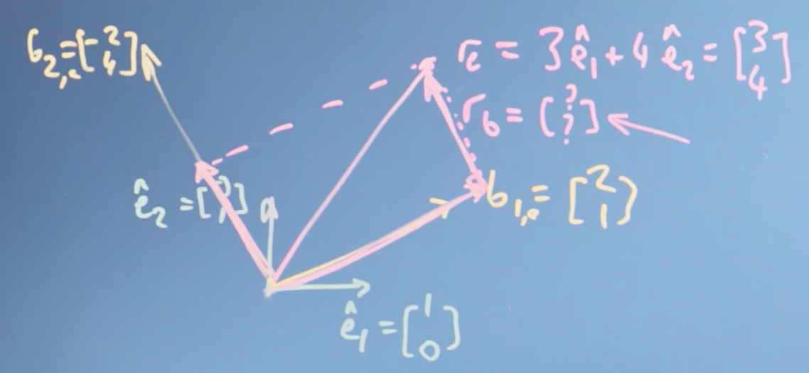
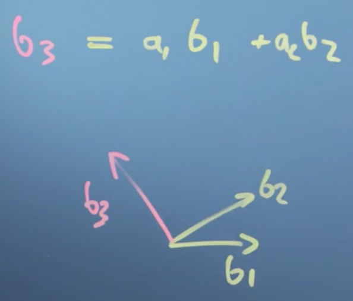
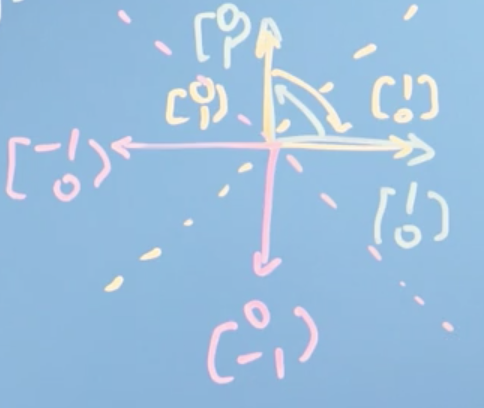
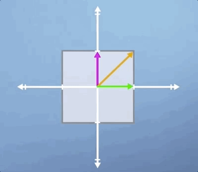
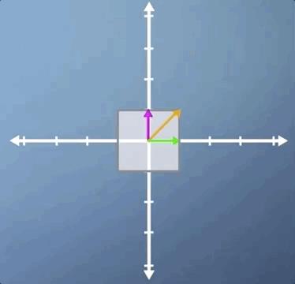
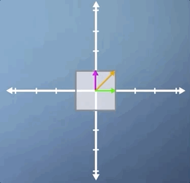

# Mathematics for Machine Learning

What I hope to accomplish with this set of notes is a complete crash course on the various areas of mathematics essential to understanding machine learning. To do this, I will use the [Mathematics for Machine Learning Specialization](https://www.coursera.org/learn/linear-algebra-machine-learning) on [Coursera](https://www.coursera.org) as my guide, but also pull from other resources, such as [Khan Academy](https://www.khanacademy.org/math/linear-algebra) and the [3Blue1Brown](http://www.3Blue1Brown.com) video playlists on Youtube.

The end goal will be to produce a [single resource](https://johngiorgi.github.io/mathematics-for-machine-learning/) (in the form of a simple website built with Github Pages) that someone (including myself) could use to quickly bring themselves up to speed on the fundamental mathematical concepts necessary for machine learning. The target audience are those who have at least _some_ highschool math, but who should really have taken introductory courses on Linear Algebra and Calculus in college.

I will do my best to include links to Wikipedia for every concept/definition introduced, which should allow a reader quick access to more information should they need it.

Full credit to the team behind the [Mathematics for Machine Learning Specialization](https://www.coursera.org/learn/linear-algebra-machine-learning) course on [Coursera](https://www.coursera.org) for creating such an awesome resource. I highly encourage anyone who needs to brush up on their mathematics for machine learning to check that course out.

## Notebooks

[Notebooks](notebooks) contains [Jupyter](https://github.com/jupyterlab/jupyterlab) notebooks for each course in the specialization, which each contain `python` implementations for many of the discussed concepts.

## Attribution

Just like the [Mathematics for Machine Learning Specialization](https://www.coursera.org/learn/linear-algebra-machine-learning), This work is licensed under a [Creative Commons Attribution-NonCommercial-ShareAlike 4.0 International License](http://creativecommons.org/licenses/by-nc-sa/4.0/).

## Table of Contents

1. [Linear Algebra](#linear-algebra)
    1. [Course Resources](#course-resources-linear-algebra)
    2. [Week 1: Introduction to Linear Algebra and to Mathematics for Machine Learning](#week-1-introduction-to-linear-algebra)
    3. [Week 2: Vectors are Objects that Move Around Space](#week-2-vectors-are-objects-that-move-around-space)
    4. [Week 3: Matrices as Objects that Operate on Vectors](#week-3-matrices-as-objects-that-operate-on-vectors)
    5. [Week 4: Matrices Make Linear Mappings](#week-4-matrices-make-linear-mappings)
    6. [Week 5: Eigenvalues and Eigenvectors](#week-5-eigenvalues-and-eigenvectors)
2. [Multivariate Calculus](#multivariate-calculus)

# Linear Algebra

## Course resources (Linear Algebra)

There are lots of useful web resources on **linear algebra**. Typically they go a bit slower or have a different emphasis or way of explaining things, but it can be handy to see how someone else explains something.

- **Khan Academy** is a great resource right up to 1st or 2nd year undergraduate material. For this course, there's a handy group of videos at https://www.khanacademy.org/math/linear-algebra.
- **Grant Sanderson** has a great series of videos developing mathematical intuition on YouTube, which you can reach through his site http://www.3Blue1Brown.com.
- **Wikipedia** gets better every year - and the linear algebra wikipedia pages are actually pretty good. https://en.wikipedia.org/wiki/Linear_algebra

# Week 1: Introduction to Linear Algebra

In this first module we look at how linear algebra is relevant to machine learning and data science. Then we'll wind up the module with an initial introduction to vectors. Throughout, we're focussing on developing your mathematical intuition, not of crunching through algebra or doing long pen-and-paper examples. For many of these operations, there are callable functions in Python that can do the adding up - the point is to appreciate what they do and how they work so that, when things go wrong or there are special cases, you can understand why and what to do.

_Learning Objectives_

- Recall how machine learning and vectors and matrices are related
- Interpret how changes in the model parameters affect the quality of the fit to the training data
- Recognize that variations in the model parameters are vectors on the response surface - that vectors are a generic concept not limited to a physical real space
- Use substitution / elimination to solve a fairly easy linear algebra problem
- Understand how to add vectors and multiply by a scalar number

## The relationship between machine learning, linear algebra, vectors and matrices

### Motivations for linear algebra

 Lets take a look at the types of problems we might want to solve, in order to expose what **linear algebra** is and how it might help us to solve them.

__Toy problem 1__

The first problem we might think of is [**price discovery**](http://www.wikiwand.com/en/Price_discovery). We can illustrate this problem with a toy example.

Say we go shopping on two occasions, and the first time we buy two apples and three bananas and they cost eight Euros

\\[2a + 3b = 8\\]

and the second time we buy ten apples and one banana, for a cost of 13 Euros.

\\[10a + 1b = 13\\]

The \\(a\\)'s and \\(b\\)'s here, are the price of a single apple and a single banana. What we're going to have to do is solve these [**simultaneous equations**](http://www.wikiwand.com/en/System_of_equations) in order to discover the price of _individual apples and bananas_. Now in the general case, with lots of different types of items and lots of shopping trips, finding out the prices might be _quite hard_.  

This is an example of a linear algebra problem. I have some constant linear coefficients here (2, 10, 3, 1), that relate the **input variables**, \\(a\\) and \\(b\\), to the **outputs** 8 and 13. That is if, we think about a vector \\([a,b]\\) that describes the prices of apples and bananas, we can write this down as a matrix problem where the 2, 3 is my first trip, and the 10, 1 is my second trip,

\\[\begin{pmatrix}2 & 3 \\\ 10 & 1\end{pmatrix} \begin{bmatrix}a \\\ b\end{bmatrix} = \begin{bmatrix} 8 \\\ 3\end{bmatrix}\\]

What we're going to do over the course of weeks one to three, is to look at these mathematical objects, [**vectors**](http://www.wikiwand.com/en/Vector_(mathematics_and_physics)) and [**matrices**](http://www.wikiwand.com/en/Matrix_(mathematics)), in order to understand what they are and how to work with them.

__Toy problem 2__

Another type of problem we might be interested in solving is _fitting an equation to some data_. In fact, with neural networks and machine learning, we want the computer to, in effect, not only fit the equation to the data but to figure out _what equation to use_.

Let's say, we have some data like this histogram here:

This looks like a **population** with an **average** and some **variation**. A common problem we  might want to solve is how to find the _optimal value of the parameters_ in the equation describing this line, i.e., the ones that fit the data in the histogram best.

That might be really handy, because with that fitted equation we'd have an easy "portable" description of the population we could carry around, without needing all the original data which would free us, for example, from privacy concerns.

#### Conclusions

In this video, we've set up two problems that can be solved with linear algebra. First, the problem of solving **simultaneous equations**. And secondly, the **optimization problem** of fitting and equation with some parameters to data. These problems and others will motivate our work right through the course on linear algebra, and it's partner course on [multivariate calculus](#multivariate-calculus).

### Geometric and Numeric Interpretations

It is helpful to draw a distinction from the **numerical operations** we can perform using linear algebra, and the **geometric intuitions** underlying them (which are frequently not taught in may introductory courses).

Roughly speaking, the _geometric understanding or intuition_ is what lets us judge what tools to use to solve specific problems, feel why they work, and know how to interpret the results. The _numerical understanding_ is what lets us actually carry through the application of those tools.

If you learn linear algebra without getting a solid foundation in that geometric understanding, the problems can go unnoticed for a while, until you go deeper into whatever field you happen to pursue (e.g. computer science, engineering, statistics, economics, etc.), at which point you may feel disheartened by your lack of understanding of the fundamentals of linear algebra.

With linear algebra (much like trigonometry, for example), there are a handful of useful visual/geometric intuitions underlying much of the subject. When you digest these and really understand the relationship between the geometry and the numbers, the details of the subject as well as how it's used in practice start to feel a lot more reasonable.

> Full credit for this section goes to [3Blue1Brown](https://www.youtube.com/channel/UCYO_jab_esuFRV4b17AJtAw). Video [here](https://youtu.be/kjBOesZCoqc).

## Vectors

The first thing we need to do in this course on linear algebra is to get a handle on **vectors**, which will turn out to be really useful to us in solving the linear algebra problems we introduced earlier (along with many more!). That is, problems described by equations which are _linear in their coefficients_, such as most fitting parameters.

> This section maps most closely the the set of Khan Academy courses [here](https://www.khanacademy.org/math/linear-algebra/vectors-and-spaces/vectors/v/vector-introduction-linear-algebra). Take these for more practice.

### Getting a handle on vectors

We're going to first step back and look in some detail at the sort of things we're trying to do with data. And why those vectors you first learned about in high school were even relevant. This will hopefully make all the work with vectors later on in the course a lot more intuitive.

> Note: this actually is not a great introduction to vectors (IMO). I recommend you first watch [this](https://youtu.be/fNk_zzaMoSs) video, then come back and read this section.

Let's go back to that simpler problem from the last video, the histogram distribution of heights of people in the population:

Say we wanted to try fitting that distribution with an equation describing the variation of height in the population. It turns our that such an equation has just two parameters; one describing the center of the distribution (the [**average**](http://www.wikiwand.com/en/Arithmetic_mean)), which we'll call \\(\mu\\), and one describing how wide it is (or the [**variance**](http://www.wikiwand.com/en/Variance)), which we'll call \\(\sigma\\) .

This equation turns out to be the equation for the **normal** or [(**Gaussian**) **distribution**](http://www.wikiwand.com/en/Normal_distribution):

\\[f(x) = \frac{1}{\sigma\sqrt{2\pi}} e^{\frac{-(x-\mu)^2}{2\sigma^2}}\\]

So how do we arrive at the best possible values for \\(\mu\\) and \\(\sigma\\)? Well, one way is [**gradient descent**](http://www.wikiwand.com/en/Gradient_descent). If we think of some __goodness__ value which measures how well our parameters fit our data (say, the [**mean squared error**](http://www.wikiwand.com/en/Mean_squared_error)) we could imagine plotting this goodness value as a function of our parameters, often called a **cost** or [**loss**](http://www.wikiwand.com/en/Loss_function) function.

The closer our loss function is to zero, the better our parameters fit our data. Gradient descent allows us to choose values for our parameters that minimize the **error**, as measured by our loss function, by taking small incremental steps towards the bottom of the parameter space defined by our loss function.

> Gradient descent on a 3D surface.

This process involves computing the partial derivative of our loss function \\(w.r.t\\) to all possible parameters (also known as the [**gradient**](http://www.wikiwand.com/en/Gradient)). If our parameters are stored in a vector, \\(\begin{bmatrix}\mu&\sigma \end{bmatrix}\\), we could subtract from this vector the vector of gradients, \\(\begin{bmatrix}\frac{\partial f}{\partial \mu} & \frac{\partial f}{\partial \sigma}\end{bmatrix}\\) in order to complete the computation in (effectively) one step.

So vectors (and calculus) give us a computational means of navigating a parameter space, in this case by determining the set of parameters for a function \\(f(x)\\) which best explain the data.

__Vectors as abstract lists of numbers__

We can also think of vectors as simply _lists of numbers_. For example, we could describe a car in terms of its price, top speed, safety rating, emissions performance, etc. and store these numbers in a single _vector_.

\\[car = \begin{bmatrix}\text{price,} & \text{top speed,} & \text{safety rating, }& ...\end{bmatrix}\\]

> Note that this is more of a 'computer science' perspective of vectors.

To summarize, a vector is, at the simplest level:

- lists of numbers
- something which moves in a space of parameters

### Operations with vectors

Lets now explore the **operations** we can do with vectors, how these mathematical operations define what vectors are in the first place, and the sort of spaces they can apply to.

We can think of a **vector** as an **object** that moves us about space. This could be a physical space, or a space of data (often called a [**vector space**](http://www.wikiwand.com/en/Vector_space)).

> At school, you probably thought of a vector as something that moved you around a physical space, but in computer and data science, we generalize that idea to think of a vector as just a list of attributes of an objects.

More formally, mathematics generalizes the definition of a vector to be an object for which the following to operations are _defined_:

1. **addition**
2. **multiplication** by a scalar

> This is really important, make sure you understand it. If a mathematical object can be added to another object of the same type, and it can be scaled (i.e. multiplied by a scaler), then its a vector!

__Vector addition__

Intuitively, we can introduce **vector addition** as being the resulting vector of the two vectors we want to add (\\(s\\) and \\(r\\)) being placed _head-to-tail_, \\(s + r\\) .

__Multiplication by a scalar__

Multiplying a vector by a **scalar** is also easy to understand. In this case, we simply multiply all elements of our **vector** \\(r\\) by the scalar, \\(a\\) for example.

__Coordinate systems__

At this point, it's convenient to define a **coordinate system**. Imagine we had two dimensions defined by the vectors:

\\[\hat i = \begin{bmatrix}1 \\\ 0 \end{bmatrix} \; \hat j = \begin{bmatrix} 1 \\\ 0 \end{bmatrix}\\]

> These are known as **basis vectors**, and they define the [**basis**](http://www.wikiwand.com/en/Basis_(linear_algebra)).

We could define any vector in this 2D space using the vectors \\(\hat i\\) and \\(\hat j\\) . For example, the vector

\\[\begin{bmatrix}3 \\\ 2 \end{bmatrix} = 3 \hat i + 2 \hat j\\]

> This is also a extremely important point. A vector space is itself _defined by vectors_. We will explore this further later in the course.

This also nicely illustrates that vectors are **associative**, meaning, the sum of a series of vectors is the same regardless of the order we add them in, e.g.,

\\[\begin{bmatrix} 3 \\\ 2 \end{bmatrix} = 3 \hat i + 2 \hat{j} = 2 \hat{j} + 3 \hat i\\]

__Conclusions__

We've defined _two_ fundamental operations that vectors satisfy: **addition**, (e.g. \\(r + s\\)), and **multiplication** by a _scalar_, (e.g. \\(2r\\)). We've noted that it can be useful to define a coordinate system in which to do our **addition** and **scaling**, e.g.,

\\[  r = \begin{bmatrix}3 \\\ 2 \end{bmatrix} = 3 \hat i + 2 \hat{j}\\]

using these fundamental **basis** vectors, \\(\hat i\\) and \\(\hat{j}\\), and explored the properties that this implies, like **associativity** of addition and subtraction.

We've also seen that although, perhaps, it's _easiest_ to think of vector operations _geometrically_, we don't have to do it in a real (number) space. We can also define vector operations on vectors that list different types of objects, like the _attributes of a house_.

# Week 2: Vectors are Objects that Move Around Space

In this module, we will look at the types operations we can do with vectors - finding the modulus or magnitude (size), finding the angle between vectors (dot or inner product) and projecting one vector onto another. We can then examine how the entries describing a vector will depend on what vectors we use to define the axes - the basis. That will then let us determine whether a proposed set of basis vectors are what's called [**linearly independent**](http://www.wikiwand.com/en/Linear_independence). This will complete our examination of vectors, allowing us to move on to matrices and then start to solve linear algebra problems.

_Learning Objectives_

- Calculate basic operations (dot product, modulus, negation) on vectors
- Calculate a change of basis
- Recall linear independence
- Identify a linearly independent basis and relate this to the dimensionality of the space

## Finding the size of a vector, its angle, and projection

> It is probably worth it to watch [this](https://youtu.be/LyGKycYT2v0) 3Blue1Brown video first before reading through this section. However be warned, its the most confusing one in the series. If you want even more practice, check out [this](https://www.khanacademy.org/math/linear-algebra/vectors-and-spaces/dot-cross-products/v/vector-dot-product-and-vector-length) Khan Academy track.

### Modulus & inner product

Previously we looked at the two main vector operations of **addition** and **scaling** by a number (multiplication by a **scalar**). As it turns out, those are really the only operations we need to be able to do in order define something as a vector.

Now, we can move on to define two new ideas: the **length of a vector**, also called its _size_, and the [**dot product**](http://www.wikiwand.com/en/Dot_product) of a vector, also called its _inner_, _scalar_ or _projection_ product.

> The dot product is a huge and amazing concept in linear algebra with a huge number of implications, and we'll only be able to touch on a few parts of it here, but enjoy. It's one of the most beautiful parts of linear algebra

__Length of a vector__

Lets define a vector \\(r\\) using the basis vectors we introduced earlier, \\(i\\) and \\(j\\),

\\[  r = a   i + b   j = \begin{bmatrix} a \\\ b \end{bmatrix}\\]

To calculate the length of \\(r\\), also called the [**norm**](http://www.wikiwand.com/en/Norm_(mathematics)) \\(\vert r\vert\\) (or \\(\Vert r\Vert\\)), we could imagine drawing a triangle, with our vector \\(r\\) as the hypotenuse:

> The length, magnitude, modulus and norm of a vector are all the same thing, and just represent a difference in terminology. If we are thinking of a vector as representing the line segment from the origin to a given point (i.e., the geometric interpretation), we may interpret the **norm** as the _length_ of this line segment. If we are thinking of a vector as representing a physical quantity like acceleration or velocity, we may interpret the norm as the **magnitude** of this quantity (how "_large_" it is, regardless of its direction).

By [**Pythagorus's Theorem**](http://www.wikiwand.com/en/Pythagorean_theorem), \\(\vert r \vert = \sqrt{a^2 + b^2}\\)

__Vector dot product__

The [**dot product**](http://www.wikiwand.com/en/Dot_product) is one of several ways of multiplying two vectors together, specifically, it is an _algebraic operation that takes two equal-length sequences of numbers (usually coordinate vectors) and returns a single number_.

The dot product has an **algebraic** and **geometric** interpretation. **Algebraically**, the dot product is the _sum of the products of the corresponding entries of the two sequences of numbers_. **Geometrically**, it is the _product of the Euclidean magnitudes of the two vectors and the cosine of the angle between them_.

__Algebraic definition of the dot product__

To illustrate the algebraic definition of the dot product, lets define two vectors \\(r\\) and \\(s\\):

\\[  r = \begin{bmatrix} r_i \\\ r_j\end{bmatrix}\\]
\\[s = \begin{bmatrix} s_i \\\ s_j\end{bmatrix}\\]

The dot product is then:

\\[  r \cdot s = r_is_i + r_j s_j = (3)(-1) + (2)(2) = 1\\]

More formally, the algebraic definition of the dot product is:

\\[  r \cdot s = \sum^n_{i=1}a_ib_i = a_1b_1 + a_2b_2 + ... + a_nb_n\\]

> The definition of the dot product is a simple multiplication of each component from the both vectors added together.

__Properties of the dot product__

The dot product is,

- [**commutative**](http://www.wikiwand.com/en/Commutative_property), e.g., \\(r \cdot s = s \cdot r\\)
- [**distributive**](http://www.wikiwand.com/en/Distributive_property), e.g., \\(r \cdot (s +  {t}) =   r \cdot s +   r \cdot  {t}\\)
- [**associative**](http://www.wikiwand.com/en/Associative_property) over scalar multiplication, e.g., \\(r \cdot (a s) = a (   r \cdot s)\\)

Lets prove the **distributive** property in the general case. Let:

\\[  r = \begin{bmatrix} r_1 \\\ r_2 \\\ . \\\ . \\\ . \\\ r_n \end{bmatrix}, \; s = \begin{bmatrix} s_1 \\\ s_2 \\\ . \\\ . \\\ . \\\ s_n \end{bmatrix}, \;  {t} = \begin{bmatrix} t_1 \\\ t_2 \\\ . \\\ . \\\ . \\\ t_n \end{bmatrix}\\]

Then,

\\[r \cdot (s +  {t}) = r_1 (s_1 + t_1) + r_2 (s_2 + t_2) + ... + r_n (s_n + t_n)\\]
\\[= r_1 s_1 + r_1t_1 + r_2s_2 + r_2t_2 + ... + r_ns_n + r_nt_n\\]
\\[=   r \cdot s +   r \cdot  {t}\\]

> Proofs for the remaining properties are left to an exercise.

__Link between the dot product and the size of the vector__

If we take \\(r\\) and dot it with itself, we get:

\\[r_i r_i + r_j r_j + ... + r_nr_n = r_i^2 + r_j^2 + ... + r_n^2 = \vert r \vert^2\\]

So, the size of the vector is just given by \\(r\\) dotted with itself and squared.

### Cosine & dot product

Lets take the time to derive the **geometric** definition of the dot product.

> Recall, **geometrically**, the dot product is the _product of the Euclidean magnitudes of the two vectors and the cosine of the angle between them_.

We start with the [**law of cosines**](http://www.wikiwand.com/en/Law_of_cosines) (also known as the **cosine formula** or **cosine rule**) from algebra, which you'll remember, probably vaguely, from school.

The law of cosines states that if we had a triangle with sides \\(a\\), \\(b\\), and \\(c\\), then:

\\[c^2 = a^2 + b^2 - 2ab \cos \theta\\]

Now, we can translate this into our vector notation:

\\[\vert r - s\vert ^2 = \vert r\vert ^2 + \vert s\vert ^2 - 2\vert r\vert \vert s\vert \cos \theta\\]

**LHS**

\\[\Rightarrow (r-s) \cdot (r-s) = r \cdot r - s \cdot r - s \cdot r - s \cdot s\\]
\\[= \vert r\vert ^2 - 2 s \cdot r + \vert \vert s\vert ^2\\]

> \\(\vert r - s\vert ^2 = (r-s) \cdot (r-s)\\) comes straight from the definition of the dot product.

**LHS = RHS**

\\[\Rightarrow \vert r\vert ^2 - 2 s \cdot r + \vert s\vert ^2 = \vert r\vert ^2 + \vert s\vert ^2 - 2\vert r\vert \vert s\vert \cos \theta\\]
\\[\Rightarrow   r \cdot s = \vert r\vert \vert s\vert  \cos \theta\\]

So what we notice is that the dot product does something quite _profound_. It takes the size of the two vectors (\\(\vert r\vert , \vert s \vert\\)) and multiplies them by \\(\cos\\) of the angle between them. It tells us _something_ about the extent to which the two vectors go in the same direction.

- If \\(\theta\\) is zero, then \\(\cos \theta\\) is one and \\(r \cdot s\\) would just be the size of the two vectors multiplied together.
- If \\(\theta\\) is \\(90\\) degrees (_i.e._ \\(r\\) and \\(s\\) are orthogonal), then \\(\cos 90\\), is \\(0\\) and \\(r \cdot s\\) is \\(0\\) .

More generally,

> Ignore the word "score" here, this image was taken from a [blog post](http://blog.christianperone.com/2013/09/machine-learning-cosine-similarity-for-vector-space-models-part-iii/) about machine learning. The blog post is worth checking out though. Full credit to [Christian S. Perone](http://blog.christianperone.com) for the image.

In this way, the dot product captures whether the two vectors are pointing in similar directions (positive) or opposite directions (negative).

### Projection

> Understanding projection can be a little tricky. If you want even more practice, check out [this](https://www.khanacademy.org/math/linear-algebra/alternate-bases#orthogonal-projections) Khan Academy series.

The **vector projection** of a vector \\(s\\) on (or onto) a nonzero vector \\(r\\) (also known as the **vector component** or **vector resolution** of \\(s\\) in the direction of \\(r\\)) is the orthogonal projection of \\(s\\) onto a straight line parallel to \\(r\\) .

For the following triangle,

Recall the geometric definition of the dot product:

\\[  r \cdot s = \vert r\vert  \vert s\vert  \cos \theta\\]

Notice that \\(\vert s\vert  \cos \theta\\) is the _length_ of the **adjacent** side (adjacent to the angle shown). This term is the projection of the vector \\(s\\) into (or onto) the vector \\(r\\) . This is why the dot product _is also called_ the **projection product**, because it takes the projection of one vector (\\(s\\)) onto another (\\(r\\)) times the magnitude or length of the other (\\(\vert r \vert\\)).

> Note again that if \\(s\\) was orthogonal to \\(r\\) then \\(\vert s\vert  \cos \theta = \vert s\vert  \cos 90 = 0 = r \cdot s\\) . This provides a convenient way to check for orthogonality.

Rearranging, we can compute the [**scalar projection**](http://www.wikiwand.com/en/Scalar_projection) of \\(s\\) on \\(r\\):

\\[r \cdot s = \vert r\vert\vert s\vert  \cos \theta\\]
\\[\Rightarrow \frac{  r \cdot s}{\vert r\vert } = \vert s\vert  \cos \theta\\]

The scalar projection is a _scalar_, equal to the length of the orthogonal projection of \\(s\\) on \\(r\\), with a negative sign if the projection has an opposite direction with respect to \\(r\\) .

We can also define the [**vector projection**](http://www.wikiwand.com/en/Vector_projection)

\\[r \cdot s = \vert r\vert\vert s\vert  \cos \theta\\]
\\[\Rightarrow \frac{  r \cdot s}{\vert r\vert } = \vert s\vert  \cos \theta\\]
\\[\Rightarrow \frac{r}{\vert r \vert} \cdot \frac{r \cdot s}{\vert r\vert } = \vert s\vert  \cos \theta \cdot \frac{r}{\vert r \vert}\\]

which is the orthogonal projection of \\(s\\) onto a straight line parallel to \\(r\\). Notice that this formula is intuitive, we take the __scaler projection__ of \\(s\\) onto \\(r\\) (the length of the orthogonal projection of \\(s\\) on \\(r\\)) and multiply it by a unit vector in the direction of \\(r\\), \\(\frac{r}{\vert r \vert}\\).

__Conclusions__

This was really the core video for this week. We found the **size** of a vector and we defined the **dot product**. We've then found out some mathematical operations we can do with the dot product (multiplication by a scalar and the dot product). We also proved that mathematical operations with vectors obey the following properties:

- commutative
- distributive over vector addition
- associative with scalar multiplication

We then found that the dot product actually captures the _angle_ between two vectors, the extent to which they go in the same direction, and also finds the _projection_ of one vector onto another.

## Changing the reference frame

> It is best to watch [this](https://youtu.be/P2LTAUO1TdA) video first, then return to and read through this section. If you want even more exposure to these ideas, try the first three sections of the Khan Academy course [here](https://www.khanacademy.org/math/linear-algebra/alternate-bases).

### Changing basis

So far we haven't really talked about the [**coordinate system**](http://www.wikiwand.com/en/Coordinate_system) of our [**vector space**](http://www.wikiwand.com/en/Vector_space), the coordinates in which all of our vectors exist. In this section we'll look at what we mean by coordinate systems, and walk through a few examples of changing from one coordinate system to another.

Remember that a vector (e.g. \\(r\\)) is just an object that takes us from the _origin_ to _some point in space_. This could be some _physical_ space or it could be some _data_ space, like the attributes of a house (bedrooms, price, etc.).

 We could use a coordinate system defined itself by vectors, such as the vectors \\(\hat{i}\\) and \\(\hat{j}\\) that we defined before. Lets give them names \\(\hat{e_1}\\) and \\(\hat{e_2}\\) instead. We will define them to be of unit lengths, meaning they're of length 1.

> The little hat denotes unit length.

So,

\\[\hat{e_1} = \begin{bmatrix} 1 \\\ 0 \end{bmatrix}, \; \hat{e_2} = \begin{bmatrix} 0 \\\ 1 \end{bmatrix}\\]

> if we had more dimension in our space, we could just use more one-hot encoded vectors (\\(\hat{e_n}\\)) of dimension equal to the dimensions in our space.

We can then define any other vector in our space in terms of \\(\hat{e_1}\\) and \\(\hat{e_2}\\) . For example,

\\[r_e = 3\hat{e_1} + 3 \hat{e_2} = \begin{bmatrix} 3 \\\ 4 \end{bmatrix}\\]

Here, the instruction is that \\(r_e\\) is going to be equal to doing a vector sum of \\(3 \hat{e_1}\\) and \\(4 \hat{e_2}\\).

If you think about it, our choice of \\(\hat{e_1}\\) and \\(\hat{e_2}\\) is kind of arbitrary. There's no reason we couldn't have used different vectors to define our coordinate system

> Indeed, these vectors don't even need to be at 90 degrees to each other or of the same length

In any case, I could still have described \\(r\\) as being some sum of some vectors I used to define the space. We call the vectors we use to define our vector space (e.g. \\(\hat{e_1}\\) and \\(\hat{e_2}\\)) **[basis](http://www.wikiwand.com/en/Basis_(linear_algebra)) vectors**.

What we realize here, is that our vector \\(r\\) exists _independently_ of the coordinate system we use. The vector still takes us from the origin to some point in space, even when we change the coordinate system, more specifically, even when we change the **basis vectors** used to describe our [**vector space**](http://www.wikiwand.com/en/Vector_space).

It turns out, we can actually change the basis of the vector \\(r\\) (call this \\(r_e\\)) to a new set of basis vectors, i.e. \\(\hat{b_1}\\) and \\(\hat{b_2}\\), which we will denote \\(r_b\\) . Furthermore, we can do this using the dot product so long as

1. The new basis vectors are orthogonal to each other, i.e. \\(\hat{b_1} \cdot \hat{b_2} = 0\\)
2. We know the position of \\(\hat{b_1}\\) and \\(\hat{b_2}\\) in the space defined by \\(\hat{e_1}\\) and \\(\hat{e_2}\\).

> We can still change basis even when the new basis vectors are not orthogonal to one another, but for this we will need matrices. See later parts of the course.

Lets define \\(\hat{b_1}\\) and \\(\hat{b_2}\\) in the space defined by \\(\hat{e_1}\\) and \\(\hat{e_2}\\):

\\[\hat{b_1} = \begin{bmatrix} -2 \\\ 4 \end{bmatrix}, \; \hat{b_2} = \begin{bmatrix} 2 \\\ 1 \end{bmatrix}\\]

In order to determine \\(r_b\\), i.e. the vector \\(r\\) defined in terms of the basis vectors \\(\hat{b_1}\\) and \\(\hat{b_2}\\), we need to take _sum_ the **vector projection** of \\(r_e\\) onto \\(\hat{b_1}\\) and the **vector projection** of \\(r_e\\) onto \\(\hat{b_2}\\)

So, lets do it:

**Vector projection of \\(r_e\\) onto \\(\hat{b_1}\\)**

\\[\hat{b_1}\frac{r_e \cdot \hat{b_1}}{\vert \hat{b_1}\vert ^2} = \frac{3 \times 2 + 4 \times 1}{2^2 + 1^2} = \frac{10}{5} = 2 \hat{b_1}  = 2 \begin{bmatrix} 2 \\\ 1\end{bmatrix} = \begin{bmatrix} 4 \\\ 2\end{bmatrix}\\]

**Vector projection of \\(r_e\\) onto \\(\hat{b_2}\\)**

\\[\hat{b_2}\frac{r_e \cdot \hat{b_2}}{\vert \hat{b_2}\vert ^2} = \frac{3 \times -2 + 4 \times 4}{-2^2 + 4^2} = \frac{10}{20} = \frac{1}{2} \hat{b_2}  = \frac{1}{2} \begin{bmatrix} -2 \\\ 4\end{bmatrix} = \begin{bmatrix} -1 \\\ 2\end{bmatrix}\\]

Thus,

\\[ r_b = \hat{b_1} \frac{r_e \cdot \hat{b_1}}{\vert \hat{b_1}\vert ^2} + \hat{b_2} \frac{r_e \cdot \hat{b_2}}{\vert \hat{b_2}\vert ^2} = 2 \hat{b_1} + \frac{1}{2} \hat{b_2} = \begin{bmatrix}2 \\\ \frac{1}{2}\end{bmatrix}\\]

Finally, notice that

\\[ r_b = 2 \hat{b_1} + \frac{1}{2} \hat{b_2} = 2 \begin{bmatrix} 2 \\\ 1\end{bmatrix} + \frac{1}{2} \begin{bmatrix} -2 \\\ 4\end{bmatrix} = \begin{bmatrix} 3 \\\ 4\end{bmatrix} =  r_e\\]

#### Conclusions

We've seen that our vector describing our data _isn't tied to the axis that we originally used to describe it_. We can redescribe it using _some other axis_, _some other basis vectors_.

It turns out that choosing basis vectors we use to describe the space of data carefully to help us solve our problem will be a very important thing in linear algebra, and in general. We can move the numbers in the vector we used to describe a data item from one basis to another. We can do that change just by taking the _dot_ or _projection product_ so long as the new basis factors are orthogonal to each other.

### Basis, vector space, and linear independence

> Linear independence is really only brushed on here. To go deeper, check out [this](https://www.khanacademy.org/math/linear-algebra/alternate-bases/change-of-basis/v/linear-algebra-coordinates-with-respect-to-a-basis) Khan Academy series.

Previously we've seen that our basis vectors _do not have to be_ the so called [**standard (or natural) basis**](http://www.wikiwand.com/en/Standard_basis). We can actually choose any basis vectors we want, which redefine how we we move about space.

**Standard Basis**

The set of unit vectors pointing in the direction of the axes of a Cartesian coordinate system.

\\[\hat{e_x} = \begin{bmatrix} 1 \\\ 0 \\\ 0 \end{bmatrix}, \; \hat{e_y} = \begin{bmatrix} 0 \\\ 1 \\\ 0 \end{bmatrix}, \; \hat{e_z} = \begin{bmatrix} 0 \\\ 0 \\\ 1 \end{bmatrix}\\]

> Also known as the [orthonormal basis](http://www.wikiwand.com/en/Orthonormal_basis)

 Lets formally define what we mean by a **basis** (vector space), and define **linear independence**, which is going to let us understand how many dimensions our vector space actually has.

 __Basis__

 The **basis** is a set of \\(n\\) vectors that:

 1. are not linear combinations of each other (linear independent)
 2. span the space that they describe

If these two qualities are fulfilled, then the space defined by the basis is \\(n\\)-dimensional.

__Linear independence__

A set of vectors is said to be [**linearly dependent**](http://www.wikiwand.com/en/Linear_independence) if one of the vectors in the set can be defined as a linear combination of the others; if no vector in the set can be written in this way, then the vectors are said to be **linearly independent**.

For example, imagine we had some candidate vector \\({b_3}\\) . If we could write \\({b_3}\\) as a linear combination of, say, \\({b_1}\\) and \\({b_2}\\):

\\[ {b_3} = c_1  {b_1} + c_2  {b_2}\\]

where \\(c_1\\) and \\(c_2\\) were constants, then we would say that \\({b_3}\\) is _linearly dependent_ on \\({b_1}\\) and \\({b_2}\\) .

To drive the point home, we note that the following are true if \\({b_3}\\) is linearly dependent to the vectors \\({b_1}\\) and \\({b_2}\\):

- \\({b_3}\\) does __not__ lie in the plane spanned by \\({b_1}\\) and \\({b_2}\\)
- \\({b_3} \ne c_1  {b_1} + c_2  {b_2}\\) for any \\(c_1\\), \\(c_2 \in \mathbb R\\) OR, equivalently,
- \\(0 = c_1  {b_1} + c_2 {b_2} + c_3 {b_3}\\) implies that \\(c_1 = c_2 = c_3 = 0\\)

These concepts are central to the definition of **dimension**. As stated previously, if we have a set of \\(n\\) basis vectors, then these vectors describe an \\(n\\)-dimensional space, as we can express any \\(n\\)-dimensional vector as a linear combination of our \\(n\\) basis vectors.

Now, notice what our basis vectors \\({b_n}\\) _don't_ have to be.

- they _don't_ have to be unit vectors, by which we mean vectors of length 1 and
- they _don't_ have to be _orthogonal_ (or _normal_) to each other

But, as it turns out, everything is going to be much easier if they are. So if at all possible, you want to construct what's called an **orthonormal basic vector set**, where all vectors of the set are at \\(90\\) degrees to each other and are all of unit length.

Now, let's think about what happens when we map from one basis to another. The axes of the _original grid_ are projected onto the _new grid_; and potentially have different values on that new grid, but _crucially_, the projection keeps the grid being evenly spaced.

Therefore, any mapping that we do from one set of basis vectors, (one coordinate system) to another set of basis vectors (another coordinate system), keeps the vector space being a _regularly spaced grid_, where our original rules of vector addition and multiplication by a scaler still work.

> Basically, it doesn't warp or fold space, which is what the linear bit in linear algebra means geometrically. Things might be stretched or rotated or inverted, but everything remains evenly spaced and linear combinations still work.

Now, when the new basis vectors aren't orthogonal, then we won't be able to use the dot product (really, the projection) to map from one basis to another. We'll have to use matrices instead, which we'll meet in the next module.

> Honestly, this part is tricky. It might be worth it to watch the first three videos of the [Essence of Linear Algebra](https://www.youtube.com/playlist?list=PLZHQObOWTQDPD3MizzM2xVFitgF8hE_ab) series. For the lazy, jumpy straight to this [video](https://youtu.be/kYB8IZa5AuE).

#### Conclusions

So in this video we've talked about the dimensionality of a vector space in terms of the number of independent basis factors that it has. We found a test for independence that the set of vectors are independent if one of them is not a linear combination of the others. We've talked more importantly about what that means in terms of mapping from one space to another and how that is going to be useful in data science and machine learning.

### Applications of changing basis

Say we have a bunch of 2D data points which all more or less lie on a straight line (i.e., there is a clear _linear_ correlation).

I can imagine re-describing that data by "mapping" them onto that line, such that I can say _how far along_ the line and _how far from the line_ a given data point is. Notice that _how far from the line_ the data points are, collectively, is a measure of _noise_ or _variance_.

> Note that there is a lively debate in the statistics community as to how exactly we calculate _how far from the line_ a data point is (i.e., in a straight line perpendicular to linear model, or straight up from the linear model).

Thought of in another way, _how far from the line_ the data points are tells us something about how well our line fits the data.

> If the best fit line was not a vey good fit, we would get a much bigger number for the noisiness. And if the best fit line was as good as possible, I get the minimum possible number for the noisiness.

The way that we have described these two directions (_along the line_ and _away from the line_), they are orthogonal to each other. So I can use the dot product to do the projection to map the data from the X-Y space onto the space of the line.

> I don't really get the point of this video.

### Summary of week 2

We've looked at vectors as being objects that describe where we are in space which could be a physical space, a space of data, or a parameter space of the parameters of a function. It doesn't really matter. It's just some space.

Then we've defined vector addition and scaling a vector by a number, making it bigger or reversing its direction. Then we've gone on to find the magnitude or modulus of a vector, and the dot scalar and vector projection product. We've defined the basis of a vector space, its dimension, and the ideas of linear independence and linear combinations. We've used projections to look at one case of changes from one basis to another, for the case where the new basis is orthogonal.

## Week 3: Matrices as Objects that Operate on Vectors

Lets now turn our attention from vectors to [**matrices**](http://www.wikiwand.com/en/Matrix_(mathematics)). First we will look at how to use matrices as tools to solve linear algebra problems, before introducing them as objects that _transform_ vectors. We will then explain how to solve systems of linear equations using matrices, which will take introduce the concept of inverse matrices and determinants. Finally, we'll look at cases of special matrices: when the determinant is zero, and where the matrix isn't invertible. Because many algorithms require invert a matrix as one of their steps, this special case is important.

**Learning Objectives**

- Understand what a matrix is and how it corresponds to a transformation
- Explain and calculate inverse and determinant of matrices
- Identify and explain how to find inverses computationally
- Explore what it means for a matrix to be inertible

## Matrices

### Introduction to matrices

At the start of the course, we encountered the "apples and bananas" problem: how to find the price of things when we only have the total bill. Now we're going to look at matrices, which can be thought of as objects that rotate and stretch vectors, and how they can be used to solve these sorts of problems.

Let's go back to that apples and bananas problem. Say we walk into a shop and we buy two apples, and three bananas and that costs us 8 euros:

\\[2a + 3b = 8\\]

On another day and we buy 10 apples and 1 banana, and that costs me 13 euros:

\\[10a + 1b = 13\\]

> Now you might say this is silly. What shop doesn't have sticker prices after all? But actually, businesses with complicated products and service agreements often use [**price discovery**](http://www.wikiwand.com/en/Price_discovery).

Now these are just **simultaneous equations** _but_, I can write them down with matrices as follows:

\\[\begin{pmatrix}2 & 3 \\\ 10 & 1\end{pmatrix} \begin{bmatrix}a \\\ b\end{bmatrix} = \begin{bmatrix}8 \\\ 13\end{bmatrix}\\]

We can say that the **matrix** \\(\begin{pmatrix}2 & 3 \\\ 10 & 1\end{pmatrix}\\) _operates_ on the **vector** \\(\begin{bmatrix}a \\\ b\end{bmatrix}\\) to give the other **vector** \\(\begin{bmatrix}8 \\\ 13\end{bmatrix}\\). Our question, our problem to solve, is what vector \\(\begin{bmatrix}a \\\ b\end{bmatrix}\\) _transforms_ to give us \\(\begin{bmatrix}8 \\\ 13\end{bmatrix}\\)?

Now, what if we use our matrix \\(\begin{pmatrix}2 & 3 \\\ 10 & 1\end{pmatrix}\\) to transform our basis vectors \\(\hat e_1\\) and  \\(\hat e_2\\)

\\[\begin{pmatrix}2 & 3 \\\ 10 & 1\end{pmatrix} \hat e_1 = \begin{pmatrix}2 & 3 \\\ 10 & 1\end{pmatrix} \begin{pmatrix}1 \\\ 0 \end{pmatrix} = \begin{pmatrix}2 \\\ 10 \end{pmatrix}\\]

\\[\begin{pmatrix}2 & 3 \\\ 10 & 1\end{pmatrix} \hat e_2 = \begin{pmatrix}2 & 3 \\\ 10 & 1\end{pmatrix} \begin{pmatrix}0 \\\ 1 \end{pmatrix} = \begin{pmatrix}3 \\\ 1 \end{pmatrix}\\]

It becomes clear that what this matrix is doing is actually _transforming_ the basis vectors \\(\hat e_1\\) and  \\(\hat e_2\\) to give us the vectors \\(\begin{pmatrix}2 \\\ 10 \end{pmatrix}\\) and \\(\begin{pmatrix}3 \\\ 1 \end{pmatrix}\\).

Generally speaking, we can think of the matrix \\(\begin{pmatrix}2 & 3 \\\ 10 & 1\end{pmatrix}\\) as a _function_ that operates on _input_ vectors in order to give us _output_ vectors. A set of simultaneous equations, like the ones we have here, is asking, in effect, what _input_ vector I need in order to get a transformed product (the _output vector_) at position \\(\begin{bmatrix}8 \\\ 13\end{bmatrix}\\).

#### Conclusions

Hopefully, it is a little more clear now what we mean now by the term _linear_ algebra. Linear algebra is _linear_, because it just takes input values, our \\(a\\) and \\(b\\) for example, and multiplies them by _constants_. _Everything is linear_. Finally, it's algebra simply because it is a notation describing mathematical objects and a system of manipulating those notations.

So linear algebra is a _mathematical_ system for _manipulating vectors_ in the spaces _described by vectors_.

> This is important! We are noticing some kind of deep connection between simultaneous equations, these things called matrices, and the vectors we were talking about last week. It turns that the key to solving simultaneous equation problems is appreciating how vectors are transformed by matrices, which is the heart of linear algebra.

## Matrices as objects that operate on vectors

### How matrices transform space

> Watch [this](https://youtu.be/kYB8IZa5AuE) video before reading through this section.

So far, we have introduced the idea of a matrix and related it to the problem of solving **simultaneous equations**. We showed that the **columns** of a matrix can be thought of as the transformations applied to **unit basis vector** along each axis. This is a pretty profound idea, so lets flesh it out.

We know that we can make any (2D) vector out of a vector _sum_ of the _scaled_ versions of \\(\hat e_1\\) and \\(\hat e_2\\) (our basis vectors).

This means that the result of any _linear_ transformation is just going to be some sum of the transformed basis vectors, (\\(\hat e_1\\) and \\(\hat e_2\\) here). This is a bit hard to see but what it means is that the grid lines of our space stay _parallel_ and _evenly spaced_. They might be stretched or sheared, but the origin stays where it is and there isn't any curviness to the space, it doesn't get warped --- a consequence of our scalar addition and multiplication rules for vectors.

> If you find this confusing see the [3Blue1Brown](https://youtu.be/kYB8IZa5AuE) video for help.

 If we write down the matrix \\(A\\) and the vector it is transforming as \\(r\\), we can represent our apples and bananas problem introduced earlier as:

\\[\begin{pmatrix}2 & 3 \\\ 10 & 1\end{pmatrix} \begin{bmatrix}a \\\ b\end{bmatrix} = \begin{bmatrix}8 \\\ 13\end{bmatrix}\\]
\\[A   r =    r' \\]

Where \\(r'\\) is our _transformed_ vector. We can generalize further, and add a scalar, \\(n\\):

\\[A (n  r) =  n  r' \\]

We notice that:

\\[A (r +   s) =  A   r + A   s \\]

Putting it together, we can represent any vector in 2D space as:

\\[A (n \hat e_1 + m \hat e_2) =  n A \hat e_1 + m A \hat e_2 \\]
\\[\;\;\;\;\;\;\;\;\;\;\;\;\;\;\;\;\;\;\;= n \hat e_1' + m \hat e_2' \\]

Now let's try an example. Let,

\\[A = \begin{pmatrix}2 & 3 \\\ 10 & 1\end{pmatrix}\\]
\\[  r = \begin{bmatrix}3 \\\ 2\end{bmatrix}\\]

Then,

\\[A   r =    r' \\]
\\[\Rightarrow \begin{pmatrix}2 & 3 \\\ 10 & 1\end{pmatrix} \begin{bmatrix}3 \\\ 2\end{bmatrix} = \begin{bmatrix}12 \\\ 32\end{bmatrix}\\]

Which is no different than how we might have multiplied matrices and vectors in school. But, we can think of this another way:

\\[A (n \hat e_1 + m \hat e_2) =   r'\\]
\\[\Rightarrow \begin{pmatrix}2 & 3 \\\ 10 & 1\end{pmatrix} \Biggl (3 \begin{bmatrix}1 \\\ 0\end{bmatrix} + 2 \begin{bmatrix}0 \\\ 1\end{bmatrix} \Biggl) = 3 \begin{pmatrix}2 & 3 \\\ 10 & 1\end{pmatrix} \begin{bmatrix}1 \\\ 0\end{bmatrix} + 2 \begin{pmatrix}2 & 3 \\\ 10 & 1\end{pmatrix} \begin{bmatrix}0 \\\ 1\end{bmatrix} =  \\]
\\[= 3 \begin{bmatrix}2 \\\ 10\end{bmatrix} + 2 \begin{bmatrix}3 \\\ 1\end{bmatrix} = \begin{bmatrix}12 \\\ 32\end{bmatrix}\\]

The take home idea here is that the matrix \\(A\\) just _tells us where the basis vectors go_. That's the _transformation_ it does.

### Types of matrix transformation

Lets illustrate the type of transformations we can perform with matrices with a number of examples.

> Remember, in linear algebra, linear transformations can be represented by matrices

We are only going to scratch the surface here and to continue to build up our intuition of viewing matrices as _functions_ that apply _transformations_ to some _input vector_.

__Identity matrix__

First, let's think about a matrix that doesn't change anything. Such a matrix is just composed of the **basis vectors** of the space,

\\[\begin{bmatrix} 1 & 0  \\\ 0 & 1\end{bmatrix} \begin{bmatrix} x  \\\ y\end{bmatrix} = \begin{bmatrix} x  \\\ y\end{bmatrix}\\]

this is known as the [**identity matrix**](http://www.wikiwand.com/en/Identity_matrix). It's the matrix that does nothing and leaves everything preserved, typically denoted \\(I_m\\) where \\(m\\) is the number of dimensions in our vector space.

__Scaling__

When our matrix contains values other than \\(0\\) in the diagnonal, we get a __scaling__:

\\[\begin{bmatrix} m & 0  \\\ 0 & n\end{bmatrix} \begin{bmatrix} x  \\\ y\end{bmatrix} = \begin{bmatrix} mx  \\\ ny\end{bmatrix}\\]

If \\(m = 3\\) and \\(n=2\\), visually this looks like:

This transformation simply _scales_ each dimension of the space by the value at the corresponding diagonal of the matrix.

> Note that when \\(m \gt 1\\) and/or \\(n \gt 1\\), our space is actually _compressed_.

__Reflections__

When one or more of our diagonal values is negative, we get a __reflection__:

\\[\begin{bmatrix} -1 & 0  \\\ 0 & k\end{bmatrix} \begin{bmatrix} x  \\\ y\end{bmatrix} = \begin{bmatrix} -x  \\\ ky\end{bmatrix}\\]

In this case, our coordinate system is flipped across the _vertical_ axis. When \\(k = 2\\), visually this looks like:

In another example,

\\[\begin{bmatrix} -1 & 0  \\\ 0 & -1\end{bmatrix} \begin{bmatrix} x  \\\ y\end{bmatrix} = \begin{bmatrix} -x  \\\ -y\end{bmatrix}\\]

This transformation inverts _all_ axes, and is known as an __inversion__.

We can also produce mirror reflections over a straight line that crosses through the origin:

\\[\begin{bmatrix} 0 & 1  \\\ 1 & 0\end{bmatrix} \begin{bmatrix} x  \\\ y\end{bmatrix} = \begin{bmatrix} y  \\\ x\end{bmatrix}\\]

or,

\\[\begin{bmatrix} 0 & -1  \\\ -1 & 0\end{bmatrix} \begin{bmatrix} x  \\\ y\end{bmatrix} = \begin{bmatrix} -y  \\\ -x\end{bmatrix}\\]

> Of course, we can also produce mirror transformations over the \\(x\\) or \\(y\\) axis as well, by making one of the diagonals \\(1\\) and the other \\(-1\\).

__Shears__

[**Shears**](http://www.wikiwand.com/en/Shear_mapping) are visually similar to _slanting_. There are two possibilities:

A shear parallel to the \\(x\\) axis looks like:

\\[\begin{bmatrix} 1 & k \\\ 0 & 1\end{bmatrix} \begin{bmatrix} x  \\\ y\end{bmatrix} = \begin{bmatrix} x + ky  \\\ y\end{bmatrix}\\]

If \\(k=1\\), then visually this looks like:

Or a shear parallel to the \\(y\\) axis:

\\[\begin{bmatrix} 1 & 0 \\\ k & 1\end{bmatrix} \begin{bmatrix} x  \\\ y\end{bmatrix} = \begin{bmatrix} x  \\\ kx + y\end{bmatrix}\\]

__Rotations__

Finally, we can rotate the space about the orign. For example,

\\[\begin{bmatrix} 0 & -1 \\\ 1 & 0\end{bmatrix} \begin{bmatrix} x  \\\ y\end{bmatrix} = \begin{bmatrix} y  \\\ -x\end{bmatrix}\\]

would rotate the entire space \\(90^0\\) counterclockwise.

More generally, for a rotation by a angle \\(\theta\\) **clockwise** about the orgin:

\\[\begin{bmatrix} \cos \theta & \sin \theta \\\ - \sin \theta & \cos \theta \end{bmatrix} \begin{bmatrix} x \\\ y\end{bmatrix} = \begin{bmatrix} x \cos \theta + y \sin \theta  \\\  - x \sin \theta + y \cos \theta\end{bmatrix}\\]

and for a rotation by a angle \\(\theta\\) **counterclockwise** about the orgin

\\[\begin{bmatrix} \cos \theta & - \sin \theta \\\ \sin \theta & \cos \theta \end{bmatrix} \begin{bmatrix} x \\\ y\end{bmatrix} = \begin{bmatrix} x \cos \theta - y \sin \theta  \\\  x \sin \theta + y \cos \theta\end{bmatrix}\\]

#### Conclusions

In this section, we described the major transformations that a matrix can perform on a vector. Next, we will look at how we can combine these transformations (known as __composition__) to produce more complex matrix transformations

### Composition or combination of matrix transformations

> Watch [this](https://youtu.be/XkY2DOUCWMU) video before reading through this section.

So what is the point of introducing these different geometric transformations in this class? Well, if you want to do any kind of _shape_ alteration, say of all the pixels in an image, or a face, then you can always make that shape change out of some combination of _rotations_, _shears_, _stretches_, and _inverses_.

> One example where these geometric transformations may be useful is in [**facial recognition**](http://www.wikiwand.com/en/Facial_recognition_system), where we may preprocess every image by transforming it so that the person(s) face(s) are directly facing the camera.

Lets illustrate this _composition_ of matrix transformations with an example. Here, we will first apply a \\(90^o\\) rotation clockwise about the \\(x\\)-axis, and then a shear parallel to the \\(x\\)-axis. Let the first transformation matrix be \\(A_1\\):

\\[\begin{bmatrix} 0 & 1  \\\ -1 & 0\end{bmatrix} \begin{bmatrix} x  \\\ y\end{bmatrix} = \begin{bmatrix} y  \\\ -x\end{bmatrix}\\]

And our second transformation matrix \\(A_2\\):

\\[\begin{bmatrix} 1 & 1  \\\ 0 & 1\end{bmatrix} \begin{bmatrix} x  \\\ y\end{bmatrix} = \begin{bmatrix} x + y  \\\ y\end{bmatrix}\\]

Applying \\(A_1\\) to our basis vectors \\(\hat e_1\\) and \\(\hat e_2\\) gives us \\(\hat e_1'\\) and \\(\hat e_1'\\):

\\[\hat e_1' = A_1 \cdot \hat e_1 = \begin{bmatrix} 0  \\\ -1\end{bmatrix}\\]
\\[\hat e_2' = A_1 \cdot \hat e_2 = \begin{bmatrix} 1  \\\ 0\end{bmatrix}\\]

Applying \\(A_2\\) to our new transformed vectors \\(\hat e_1'\\) and \\(\hat e_2'\\) gives us \\(\hat e_1''\\) and \\(\hat e_1''\\):

\\[\hat e_1'' = A_2 \cdot \hat e_1' = \begin{bmatrix}-1 \\\ -1\end{bmatrix}\\]
\\[\hat e_2'' = A_2 \cdot \hat e_2' = \begin{bmatrix} 1  \\\ 0\end{bmatrix}\\]

Notice that if we stack our final transformed vectors \\(\hat e_1''\\) and \\(\hat e_1''\\) as columns we get the matrix:

\\[\begin{bmatrix} -1 & 1  \\\ -1 & 0\end{bmatrix}\\]

Which is equal to \\(A_2 \cdot A_1\\). Geometrically, this looks like:

__Conclusions__

The take home message here is that the transformation \\(A_2 \cdot (A_1 \cdot r)\\) for some transformation matrices \\(A_1\\) and \\(A_2\\) and some vector \\(r\\), is equivalent to the transformation \\((A_2A_1) \cdot r\\)

> Note that \\(A_2 \cdot (A_1 \cdot r) \ne A_1 \cdot (A_2 \cdot r)\\), that is, the order in which we apply our transformations _matters_.

As it turns out, the key to solving simultaneous equation problems is appreciating how vectors are _transformed_ by matrices, which is at the the heart of linear algebra.

## Matrix inverses

In this section, we are finally going to present a way to solve the _apples and bananas_ problem with matrices. Along the way, we're going to find out about a thing called the [**inverse**](http://www.wikiwand.com/en/Invertible_matrix) of a matrix and a method for finding it.

> Watch [this](https://youtu.be/uQhTuRlWMxw) video before reading this section. For more practice with matrix inverses, see Khan Academy sections [here](https://www.khanacademy.org/math/linear-algebra/matrix-transformations/inverse-transformations/v/linear-algebra-introduction-to-the-inverse-of-a-function) and [here](https://www.khanacademy.org/math/linear-algebra/matrix-transformations/inverse-of-matrices/v/linear-algebra-deriving-a-method-for-determining-inverses).

### Gaussian elimination: Solving the apples and bananas problem

First, recall our apples and bananas problem in matrix form:

\\[\begin{pmatrix}2 & 3 \\\ 10 & 1\end{pmatrix} \begin{bmatrix}a \\\ b\end{bmatrix} = \begin{bmatrix} 8 \\\ 3\end{bmatrix}\\]

Where we want to find the price of individual apples (\\(a\\)) and bananas (\\(b\\)). Simplifying, lets say that:

\\[A\cdot r =   s\\]

> This, in effect is saying: "\\(A\\) _operates_ on vector \\(r\\) to give us \\(s\\)".

To solve for \\(r\\), we need to move \\(A\\) to the other side of the equation. _But how?_. Well, to "undo" a division (and isolate \\(x\\)), you multiply by the reciprocal:

\\[\frac{1}{2}x = 4\\]
\\[\Rightarrow x = 8\\]

Likewise, to undo a multiplication, we divide by the reciprocal:

\\[2x = 4\\]
\\[\Rightarrow x = 2\\]

How do we _undo_ the transformation performed by \\(A\\)? The answer is to find the matrix \\(A^{-1}\\) (known as the __inverse__ of \\(A\\)) such that:

\\(A^{-1}A = I\\)

where \\(I\\) is the [identity matrix](http://www.wikiwand.com/en/Identity_matrix). We call \\(A^{-1}\\) the __inverse__ of \\(A\\) because is it _reverses whatever transformation_ \\(A\\) does, giving us back \\(I\\). We note that:

\\[A^{-1}A\cdot r = A^{-1}   s\\]
\\[\Rightarrow\ I \cdot r = A^{-1}   s\\]
\\[\Rightarrow\   r = A^{-1}   s\\]

So, if we could find the inverse of \\(A\\) (i.e. find \\(A^{-1}\\)), we can solve our problem (i.e. find \\(a\\) and \\(b\\)). We can solve for \\(A^{-1}\\) with a series of _row operations_ or _substitutions_ (known as [**Gaussian elimination**](http://www.wikiwand.com/en/Gaussian_elimination)).

Let's look at a slightly more complicated problem to see how this is done:

\\[\begin{pmatrix}1 & 1 & 3 \\\ 1 & 2 & 4 \\\ 1 & 1 & 2\end{pmatrix} \begin{bmatrix}a \\\ b \\\ c\end{bmatrix} = \begin{bmatrix} 15 \\\ 21 \\\ 13\end{bmatrix}\\]

We start by subtracting row 1 from rows 2 and 3, which gives us a matrix in [**row echelon form**](http://www.wikiwand.com/en/Row_echelon_form) (technically, [reduced row echelon form](http://www.wikiwand.com/en/Row_echelon_form#/Reduced_row_echelon_form)):

\\[\begin{pmatrix}1 & 1 & 3 \\\ 0 & 1 & 1 \\\ 0 & 0 & 1\end{pmatrix} \begin{bmatrix}a \\\ b \\\ c\end{bmatrix} = \begin{bmatrix} 15 \\\ 6 \\\ 2\end{bmatrix}\\]

We then perform two steps of [**back substitution**](http://www.wikiwand.com/en/Triangular_matrix#/Forward_and_back_substitution) to get the identify matrix:

\\[\begin{pmatrix}1 & 1 & 0 \\\ 0 & 1 & 0 \\\ 0 & 0 & 1\end{pmatrix} \begin{bmatrix}a \\\ b \\\ c\end{bmatrix} = \begin{bmatrix} 9 \\\ 4 \\\ 2\end{bmatrix}\\]

\\[\begin{pmatrix}1 & 0 & 0 \\\ 0 & 1 & 0 \\\ 0 & 0 & 1\end{pmatrix} \begin{bmatrix}a \\\ b \\\ c\end{bmatrix} = \begin{bmatrix} 5 \\\ 4 \\\ 2\end{bmatrix}\\]

We can then read the solution right from the matrices \\(a = 5\\), \\(b = 4\\), \\(c = 2\\).

> If you are still feeling uneasy about using Gaussian elimination to solve a system of linear equations, see [here](https://youtu.be/2j5Ic2V7wq4) for an example walked through step-by-step example. Full credit to [PatrickJMT](http://patrickjmt.com).

__Conclusions__

As it turns out, we don't have to compute the inverse at all to solve a system of linear equations. Although we showed the process of Gaussian elimination for some vectors \\(r\\) and \\(s\\), we can use it in the general case to solve for any linear equation of the form \\(A\cdot r =   s\\). This actually one of the most computationally efficient ways to solve this problem, and it's going to work every time.

### From Gaussian elimination to finding the inverse matrix

Now, let's think about how we can apply this idea of _elimination_ to find the inverse matrix, which solves the more general problem no matter what vectors I write down on the right hand side.

Say I have a 3 \\(\times\\) 3 matrix \\(A\\) and its inverse \\(B\\) (\\(B = A^{-1})\\). By the definition of the [**inverse**](http://www.wikiwand.com/en/Invertible_matrix),

\\[AB = BA = I_n\\]

If we use our matrix \\(A\\) from the last section:

\\[\begin{pmatrix}1 & 1 & 3 \\\ 1 & 2 & 4 \\\ 1 & 1 & 2\end{pmatrix} \begin{pmatrix}b_{11} & b_{12} & b_{13} \\\ b_{21} & b_{22} & b_{23} \\\ b_{31} & b_{32} & b_{33}\end{pmatrix} = I\\]

> Where \\(b_{ij}\\) is the element at the \\(i^{th}\\) row and \\(j^{th}\\) column of matrix \\(B\\).

we notice that the first column of \\(B\\) is just a vector. It's a vector that describes what the \\(B\\) matrix, the inverse of \\(A\\), does to space.

> Actually, it's the transformation that that vector does to the x-axis.

This means that:

\\[\begin{pmatrix}1 & 1 & 3 \\\ 1 & 2 & 4 \\\ 1 & 1 & 2\end{pmatrix} \begin{pmatrix}b_{11} \\\ b_{21} \\\ b_{31}\end{pmatrix} = \begin{pmatrix} 1 \\\ 0 \\\ 0\end{pmatrix}\\]

Now, we could solve this by the elimination method and back substitution in just the way we did before. Then, we could do it again for the second column of \\(B\\), and finally the third. In this way, we would have solved for \\(B\\), in other words, we would have found \\(A^{-1}\\).

It turns out, we can actually solve for \\(B\\) all at once. So lets do that:

\\[\begin{pmatrix}1 & 1 & 3 \\\ 1 & 2 & 4 \\\ 1 & 1 & 2\end{pmatrix} \begin{pmatrix}b_{11} & b_{12} & b_{13} \\\ b_{21} & b_{22} & b_{23} \\\ b_{31} & b_{32} & b_{33}\end{pmatrix} = I\\]

Subtract row 1 from row 2 and 3:

\\[\Rightarrow \begin{pmatrix}1 & 1 & 3 \\\ 0 & 1 & 1 \\\ 0 & 0 & -1\end{pmatrix} \begin{pmatrix}b_{11} & b_{12} & b_{13} \\\ b_{21} & b_{22} & b_{23} \\\ b_{31} & b_{32} & b_{33}\end{pmatrix} = \begin{pmatrix}1 & 0 & 0 \\\ -1 & 1 & 0 \\\ -1 & 0 & 1\end{pmatrix}\\]

Multiply row 3 by \\(-1\\):

\\[\Rightarrow \begin{pmatrix}1 & 1 & 3 \\\ 0 & 1 & 1 \\\ 0 & 0 & 1\end{pmatrix} \begin{pmatrix}b_{11} & b_{12} & b_{13} \\\ b_{21} & b_{22} & b_{23} \\\ b_{31} & b_{32} & b_{33}\end{pmatrix} = \begin{pmatrix}1 & 0 & 0 \\\ -1 & 1 & 0 \\\ 1 & 0 & -1\end{pmatrix}\\]

Now that row 3 is in [row echelon form](http://www.wikiwand.com/en/Row_echelon_form), we can substitute it back into row 2 and row 1:

\\[\Rightarrow \begin{pmatrix}1 & 1 & 0 \\\ 0 & 1 & 0 \\\ 0 & 0 & 1\end{pmatrix} \begin{pmatrix}b_{11} & b_{12} & b_{13} \\\ b_{21} & b_{22} & b_{23} \\\ b_{31} & b_{32} & b_{33}\end{pmatrix} = \begin{pmatrix} -2 & 0 & 3 \\\ -2 & 1 & 1 \\\ 1 & 0 & -1\end{pmatrix}\\]

And finally, back substitute row 2 into row 1:

\\[\Rightarrow \begin{pmatrix}1 & 0 & 0 \\\ 0 & 1 & 0 \\\ 0 & 0 & 1\end{pmatrix} \begin{pmatrix}b_{11} & b_{12} & b_{13} \\\ b_{21} & b_{22} & b_{23} \\\ b_{31} & b_{32} & b_{33}\end{pmatrix} = \begin{pmatrix} 0 & -1 & 2 \\\ -2 & 1 & 1 \\\ 1 & 0 & -1\end{pmatrix}\\]

Because any matrix times its identity is that matrix itself:

\\[\begin{pmatrix}1 & 0 & 0 \\\ 0 & 1 & 0 \\\ 0 & 0 & 1\end{pmatrix} \begin{pmatrix}b_{11} & b_{12} & b_{13} \\\ b_{21} & b_{22} & b_{23} \\\ b_{31} & b_{32} & b_{33}\end{pmatrix} = \begin{pmatrix} 0 & -1 & 2 \\\ -2 & 1 & 1 \\\ 1 & 0 & -1\end{pmatrix}\\]

\\[\Rightarrow \begin{pmatrix}b_{11} & b_{12} & b_{13} \\\ b_{21} & b_{22} & b_{23} \\\ b_{31} & b_{32} & b_{33}\end{pmatrix} = \begin{pmatrix} 0 & -1 & 2 \\\ -2 & 1 & 1 \\\ 1 & 0 & -1\end{pmatrix}\\]

> You can actually prove to yourself that we got the right answer by checking that \\(A \cdot B = I\\).

So that's our answer. We've found the identity matrix, \\(B = A^{-1}\\) for \\(A\\), and we did this by transforming \\(A\\) into it's identity matrix via elimination and back substitution. Moreover, because \\(B\\) could be any matrix, we have solved this in the general case. The solution is the same regardless of the number of dimensions, and this leads to a computationally efficient way to invert a matrix.

> There are computationally faster methods of computing the inverse, one such method is known as  a **decomposition process**. In practice, you will simply call the solver of your problem or function, something like `inv(A)`, and it will pick the best method by inspecting the matrix you give it and return the answer.

__Conclusions__

We have figured out how to solve sets of linear equations in the general case, by a procedure we can implement in a computer really easily (known as [**Gaussian elimination**](http://www.wikiwand.com/en/Gaussian_elimination)), and we've generalized this method to the to find the **inverse** of a matrix, regardless of what is on the right hand side of our system of equations.

## Special matrices

In the final section of this week, we're going to look at a property of a matrix called the [**determinant**](http://www.wikiwand.com/en/Determinant).

> The **determinant** is a value that can be computed from the elements of a [**square matrix**](http://www.wikiwand.com/en/Square_matrix#Square_matrices). The determinant of a matrix \\(A\\) is denoted \\(det(A)\\), \\(det A\\), or \\(\vert A \vert\\). Geometrically, it can be viewed as the scaling factor of the [**linear transformation**](http://www.wikiwand.com/en/Linear_map) described by the matrix.

We'll also look at what happens when a matrix _doesn't_ have linearly independent basis vectors.  

> Watch [this](https://youtu.be/Ip3X9LOh2dk) video before reading this section. For more practice with matrix inverses, see Khan Academy sections [here](https://www.khanacademy.org/math/linear-algebra/matrix-transformations/inverse-of-matrices/v/linear-algebra-deriving-a-method-for-determining-inverses) and [here](https://www.khanacademy.org/math/linear-algebra/matrix-transformations/determinant-depth/v/linear-algebra-determinant-when-row-multiplied-by-scalar).

### The determinant

Let's start by looking at the simple matrix:

\\[\begin{pmatrix} a & 0 \\\ 0 & d\end{pmatrix}\\]

If we multiply this matrix by our basis vectors \\(\hat e_1\\) and  \\(\hat e_2\\), we get

\\[\hat e_1' = \begin{bmatrix} a \\\ 0 \end{bmatrix}\\]
\\[\hat e_2' = \begin{bmatrix} 0 \\\ d \end{bmatrix}\\]

So, in plain english, we have stretched our \\(x\\)-axis by a factor of \\(a\\) and our \\(y\\)-axis by a factor of \\(d\\) and, therefore, scaled the area of the grid cells of the vector space by a factor of \\(ad\\).

> This is a property of the fact that any linear transformation keeps grid lines parallel and evenly spaced.

We call this number, \\(ad\\) the **determinant**.

Now, if I instead have a matrix:

\\[\begin{pmatrix} a & b \\\ 0 & d\end{pmatrix}\\]

then this is still going to stretch \\(\hat e_1\\) out by a factor of \\(a\\), _but_ on the other axis, I am going to move \\(\hat e_2\\) hat to:

\\[\hat e_2 = \begin{pmatrix} b \\\ d\end{pmatrix}\\]

What we have done is taken the original grid and stretched it along the \\(x\\)-axis by \\(a\\) and, along the \\(y\\)-axis by \\(d\\) and sheared it (parallel to the \\(x\\)-axis) by \\(b\\).

> We've still changed the size, the scale of the space (which is what the determinant really is) by a factor of \\(ad\\).

Notice that the area defined by our transformed vectors \\(\hat e_1'\\) and \\(\hat e_2'\\) is _still_ just the base times the perpendicular height, \\(ad\\) (the determinant).

Lets flesh this out in the _general_ case. Say we have the matrix:

\\[A = \begin{pmatrix} a & b \\\ c & d\end{pmatrix}\\]

Multiplying this matrix by our basis vectors yields a parallelogram (stretched by \\(a\\) and \\(d\\) and sheared by \\(b\\) and \\(c\\)). We can actual compute the area of this parallelogram as follows:

> We find the area of this parallelogram by finding the area of the whole box the encloses it, and subtracting off combined area of the the little bits around it.

The exact method for solving the area is not important (although it is pretty trivial). What is important, is that the **determinant** of \\(A\\) can be computed as \\(\vert A \vert =  ad - bc\\), and that this computation has a _geometric interpretation_.

> This is the formula for the determinant of a square \\(2 \times 2\\) matrix. See [here](http://www.wikiwand.com/en/Determinant#/3__3_matrices) for the formula for higher dimensional matrices.

Now, in school when you looked at matrices, you probably saw that you could find the inverse in the following way. For a matrix:

\\[A = \begin{pmatrix} a & b \\\ c & d\end{pmatrix}\\]

1. Exchange \\(a\\) and the \\(d\\), and switch the sign on the \\(b\\) and the \\(c\\)
2. Multiply \\(A\\) by this matrix
3. Scale the transformation by \\(\frac{1}{ad - bc}\\)

In the general case, this looks like:

\\[\frac{1}{ad - bc} \begin{pmatrix} a & b \\\ c & d\end{pmatrix} \begin{pmatrix} d & -b \\\ -c & a\end{pmatrix} = \frac{1}{ad - bc} \begin{pmatrix} ad - bc & 0 \\\ 0 & ad - bc\end{pmatrix} = I\\]

This demonstrates that

\\[\frac{1}{ad - bc} \begin{pmatrix} d & -b \\\ -c & a\end{pmatrix}\\]

is in fact the inverse of the matrix \\(A\\).

This helps capture what the determinant really is. It's the _amount_ by which the original matrix _scaled_ vector space. In the above example, dividing by the determinant normalizes the space back to its _original_ size.

> We could spend a lot of time talking about how to solve for the derivative. However, knowing how to do the operations isn't really a useful skill. Many programming libraries (e.g. `python`) have linear algebra libraries (e.g. `Numpy`) which makes computing the derivative as easy, for example, as calling `det(A)`. If you really want to know how to compute determinants by hand, then look up a [**QR decomposition**](http://www.wikiwand.com/en/QR_decomposition) online.

#### A determinant of zero

Now, let's think about the matrix

\\[A = \begin{pmatrix} 1 & 2 \\\ 1 & 2\end{pmatrix}\\]

If we multiply this matrix by our basis vectors \\(\hat e_1\\) and  \\(\hat e_2\\), we get

\\[\hat e_1' = \begin{bmatrix} 1 \\\ 1 \end{bmatrix}\\]
\\[\hat e_2' = \begin{bmatrix} 2 \\\ 2 \end{bmatrix}\\]

So this matrix, when applied to our vector space, actually _collapses it onto a line_. All our \\(y\\)'s are mapped to the vector \\(\begin{bmatrix}2 \\\ 2 \end{bmatrix}\\) and our \\(x\\)'s to \\(\begin{bmatrix}1 \\\ 1 \end{bmatrix}\\). Correspondingly, we notice that \\(\vert A \vert = 0\\). Therefore, the area enclosed by the new basis vectors is _zero_.

#### A negative determinant

A negative determinant simply means that the transformation has _flipped_ the orientation of our vector space. This is much easier to _see_ than to _explain_; check out [this](https://youtu.be/Ip3X9LOh2dk) video which presents some awesome visualizations of the determinant.

#### What the determinant means numerically

To drive home the numerical interpretation of the determinant, lets start with this set of simultaneous equations:

\\[\begin{pmatrix} 1 & 1 & 3 \\\ 1 & 2 & 4 \\\ 2 & 3 & 7\end{pmatrix} \begin{pmatrix} a \\\ b \\\ c\end{pmatrix} = \begin{pmatrix} 12 \\\ 17 \\\ 29\end{pmatrix}\\]

You'll notice that both the _rows_ and the _columns_ are _linearly dependent_. Thinking about the columns of this matrix as the basis vectors of some 3-dimensional space, we note that this transformation collapses our vector space from being 3D to 2D (by collapsing every point in space onto a plane). Let's see what this means numerically by trying to reduce our matrix to row-echelon form:

\\[\begin{pmatrix} 1 & 1 & 3 \\\ 1 & 2 & 4 \\\ 2 & 3 & 7\end{pmatrix} \begin{pmatrix} a \\\ b \\\ c\end{pmatrix} = \begin{pmatrix} 12 \\\ 17 \\\ 29\end{pmatrix}\\]

Subtract row 1 from row 2,

\\[\Rightarrow \begin{pmatrix} 1 & 1 & 3 \\\ 0 & 1 & 1 \\\ 2 & 3 & 7\end{pmatrix} \begin{pmatrix} a \\\ b \\\ c\end{pmatrix} = \begin{pmatrix} 12 \\\ 5 \\\ 29\end{pmatrix}\\]

Subtract row 1 plus row 2 from row 3,

\\[\Rightarrow \begin{pmatrix} 1 & 1 & 3 \\\ 0 & 1 & 1 \\\ 0 & 0 & 0\end{pmatrix} \begin{pmatrix} a \\\ b \\\ c\end{pmatrix} = \begin{pmatrix} 12 \\\ 5 \\\ 0\end{pmatrix}\\]

while the matrix is now is row-echelon form, _we don't have a final entry of the matrix_ (\\(0\cdot c = 0\\)). Because we don't have a solution for \\(c\\) we can't back substitute, and we can't solve our system of equations.

> The reason we can't solve this system is because we don't have enough information. In keeping with our apples and bananas problem, imagine that when we went in to buy apples and bananas and carrots the third time, we ordered just a the _sum_ of first two orders. Therefore, we didn't get any _new_ information and thus don't have enough data to find out the solution for how much apples and bananas and carrots cost. This third order wasn't _linearly independent_ from our first two, in the language of matrices and vectors.

So, when the basis vectors describing a matrix aren't linearly independent, then the **determinant** is _zero_, and we can't solve the system. The loss of information when we map from \\(n\\)-dimensional to \\((n-x)\\)-dimensional space (where \\(x \ge 1\\)) means we cannot possibly know what the inverse matrix is (as it is impossible to map a lower dimensional space back to the original, higher dimensional space). When a matrix has no inverse, we say that it is **singular**.

> There are situations where we might want to do a transformation that collapses the number of dimensions in a space, but it means that we cannot possibly reverse the mapping, meaning the matrix has no inverse. This also means we cannot solve a system of linear equations defined by a singular matrix using Gaussian elimination and back substitution.

### Summary

In the last section of this week, we took a look at the determinant, which is how much a given transformation _scales_ our space. In 2-dimensions, this can be thought as the scalar multiple appleid to any _area_ of our space, and in 3-dimensions any _volume_ of our space. We also looked at the special case where the determinant is zero and found that this means that the basis vectors aren't linearly independent, which in turn means that the inverse doesn't exist.

To summarize [Week 3](#week-3-matrices-as-objects-that-operate-on-vectors), we

- introduced matrices as objects that transforms space.
- looked at different archetypes of matrices, like **rotations**, **inverses**, **stretches**, and **shears**,
- how to combine matrices by doing successive transformations, known as m**atrix multiplication** or **composition**
- how to solve systems of linear equations by elimination and how to find **inverses**
- and finally, we introduced **determinants** and showed how that relates to the concept of **linear independence**.

## Week 4: Matrices Make Linear Mappings

In Module 4, we continue our discussion of matrices; first we think about how to code up matrix multiplication and matrix operations using the Einstein Summation Convention, which is a widely used notation in more advanced linear algebra courses. Then, we look at how matrices can transform a description of a vector from one basis (set of axes) to another. This will allow us to, for example, figure out how to apply a reflection to an image and manipulate images. We'll also look at how to construct a convenient basis vector set in order to do such transformations. Then, we'll write some code to do these transformations and apply this work computationally.

**Learning Objectives**

- Identify matrices as operators
- Relate the transformation matrix to a set of new basis vectors
- Formulate code for mappings based on these transformation matrices
- Write code to find an orthonormal basis set computationally

## Matrices as objects that map one vector onto another

### Introduction to Einstein summation convention and the symmetry of the dot product

There's is an different, important way to write matrix transformations down that we have not yet discussed. It's called the [**Einstein's Summation Convention**](http://www.wikiwand.com/en/Einstein_notation). In this convention, we write down the actual operations on the elements of a matrix, which is useful when you're coding or programming. It also lets us see something neat about the dot product, and it lets us deal with _non-square_ matrices.

When we started, we said that multiplying a matrix by a vector or with another matrix is a process of taking every element in each row in turn, multiplied with corresponding element in each column in the other matrix, and adding them all up and putting them in place. In Einstein's Summation Convention, we represent the matrix product \\(C = AB\\):

\\[\begin{pmatrix} a_{11} & a_{12} & . & . & . & a_{1n} \\\ a_{21} & a_{22} &  &  &  & . &\\\ . & & & & & .  \\\ . & & & & & .  \\\ . & & & & & . \\\ a_{n1} & . & . & . & . & a_{nm}\end{pmatrix} \begin{pmatrix} b_{11} & b_{12} & . & . & . & b_{1m} \\\ b_{21} & b_{22} &  &  &  & . &\\\ . & & & & & .  \\\ . & & & & & .  \\\ . & & & & & . \\\ b_{m1} & . & . & . & . & b_{mp}\end{pmatrix} = AB\\]

As,

\\[c_{ij} = a_{i1}b_{1j} + ... + a_{im}b_{mj} =  \sum_{k=1}^m a_{ik}b_{kj}\\]

For \\(i = 1, ..., n\\) and \\(j = 1, ..., p\\), where \\(A\\) is a \\(n \times m\\) matrix, \\(B\\) is a \\(m \times p\\) matrix, and \\(C\\) is a \\(n \times p\\) matrix.

This is useful when we are implementing matrix multiplication in code. Trivially, we can run three loops over \\(i\\), \\(j\\) and \\(k\\), and then use an accumulator on the \\(k\\)'s to find the elements of the product matrix \\(AB\\).  

> Now, we haven't talked about this so far but now we can see it clearly. There's no reason, so long as the matrices have the same number of entries in \\(k\\), that we need to multiply matrices of the same shape.

Let's revisit the **dot product** in light of the Einstein Summation Convention. If we've got two vectors, let's call them \\(u\\) and \\(v\\), where \\(u\\) is a column vector having elements \\(u_i\\) and \\(v\\) is another column vector having elements \\(v_i\\).

\\[\begin{pmatrix}u_i \\\ \vdots \\\ u_{n}\end{pmatrix} \cdot \begin{pmatrix}v_i \\\ \vdots \\\ v_n \end{pmatrix}\\]

When we dot them together, we are computing the following:

\\[  u \cdot v = \sum^n_{i=1}u_iv_i = u_1v_1 + u_2v_2 + ... + u_nv_n\\]

> Go over what _exactly_ Einstein's Summation Convention is. There was an in-video quiz question which asked us to write the above in ESC, and this: \\(\sum^n_{i=1}u_iv_i\\) was wrong by \\(u_iv_i\\) was correct?

Notice that,

\\[\begin{pmatrix}u_i \\\ \vdots \\\ u_{n}\end{pmatrix} \cdot \begin{pmatrix}v_i \\\ \vdots \\\ v_n \end{pmatrix} = \begin{pmatrix}u_i & \cdots & u_{n}\end{pmatrix} \cdot \begin{pmatrix}v_i \\\ \vdots \\\ v_n \end{pmatrix}\\]

and so we notice that there's some equivalence between a **matrix transformation** (or _multiplication_) and the **dot product**. Lets explore this in more detail.

__Symmetry of the dot product__

Say we have the vector \\(\hat u_1\\), with components \\(u_1\\) and \\(u_2\\). Let's imagine what happens if we dot \\(\hat u_1\\) with the basis vector \\(\hat e_1\\). We know from previous sections that this gives us the length of the projection of \\(\hat u_1\\) and \\(\hat e_1\\). But what if we do the reverse? What if we dot \\(\hat e_1\\) with \\(\hat u_1\\)? We already know that numerically, the result will be the same, as the dot product is [**commutative**](http://www.wikiwand.com/en/Commutative_property). So geometrically, we can imagine drawing a line of symmetry between the point where the two projections cross:

So, previously we stated (without proof, although the numerical proof is trivial) that the dot product is commutative, and now, we have shown geometrically why that is true.

__Conclusions__

In this section, we introduced [**Einstein's Summation Convention**](http://www.wikiwand.com/en/Einstein_notation), which is a compact and computationally useful (but not very visually intuitive) way to write down matrix operations. This led to a discussion on the similarities between the dot product and matrix multiplication, where we noticed a connection between **matrix multiplication**, and the **dot product**, which itself has a geometric understanding as the concept of **projection**, i.e. projecting one vector onto another. This allows us to think about matrix multiplication _with a vector_ as being the projection of that vector _onto the vectors composing the matrix_ (i.e. the columns of the matrix).

## Matrices transform into the new basis vector set

### Matrices changing basis

We have said before that the _columns_ of a transformation matrix are the _axes_ of the new basis vectors of the mapping in my coordinate system. We're now going to spend a little while looking at how to transform a vector _from one set of basis vectors to another_.

Let's say we have two sets of basis vectors, which define a first coordinate system (\\(\text{CS}_1)\\) and a second coordinate system (\\(\text{CS}_2)\\). Let the basis vectors of \\(\text{CS}_2\\), from the perspective of \\(\text{CS}_1\\) be:

\\[\text{CS}_{21} = \begin{bmatrix}3 & 1 \\\ 1 & 1\end{bmatrix}\\]

Think of these as the basis vectors in \\(\text{CS}_2\\) as they would appear in \\(\text{CS}_1\\). If we wanted to change the basis of any vectors in \\(\text{CS}_2\\) to \\(\text{CS}_1\\), we simply do:

\\[\text{CS}_{21}^{} \cdot \text{vector in CS}_2 = \text{vector in CS}_1\\]

 E.g.,

\\[\begin{bmatrix}3 & 1 \\\ 1 & 1\end{bmatrix} \begin{bmatrix}\frac{3}{2}  \\ \frac{1}{2}\end{bmatrix} = \begin{bmatrix}5  \\\ 2\end{bmatrix}\\]

The components of the resulting vector would define its position in \\(\text{CS}_1\\). Now, how do we do the reverse? How do we _translate_ a vector in \\(\text{vector in CS}_1\\) to a vector in \text{vector in CS}_1?

All we need to do to change basis in the reverse case is to multiply a vector in one coordinate system by the inverse of the matrix containing the basis vectors of another.

\\[\text{vector in CS}_{2} = \text{CS}_{21}^{-1} \cdot \text{vector in CS}_{1}\\]

E.g.,

\\[\text{CS}_{21}^{-1} = \frac{1}{2}\begin{bmatrix}1 & -1 \\\ -1 & 3\end{bmatrix}\begin{bmatrix}5  \\\ 2\end{bmatrix} = \begin{bmatrix}\frac{3}{2}  \\ \frac{1}{2}\end{bmatrix}\\]

Notice that this process gave us the coordinates of the vector \\(\begin{bmatrix}5  \\\ 2\end{bmatrix}\\) in \\(\text{CS}_2\\), which is equal to the vector that we started with

__Orthonormal basis set__

When we discussed vectors and projections, we said that if the new basis vectors were orthogonal then we could use projection to easily change basis.

> see [Changing basis](#changing-basis) for a fleshed out example.

__Summary__

Not orthogonal, use matrix multiplication. Orthogonal, use projection product.

> Watch 3Blue1Brown video on changing basis and improve these notes.

> Closest corresponding 3Blue1Brown video for this section is [here](https://youtu.be/P2LTAUO1TdA).

### Doing a transformation in a changed basis

Lets discuss the process of applying a transformation in a changed basis. Say again that the basis vectors of coordinate system \\(\text{CS}_2\\) from the perspective of coordinate system \\(\text{CS}_1\\) are:

\\[\text{CS}_{21} = \begin{bmatrix}3 & 1 \\\ 1 & 1\end{bmatrix}\\]

Lets say we have a vector in \\(\text{CS}_2\\) that we want to transform:

\\[ {c_2} = \begin{bmatrix}x \\\ y\end{bmatrix}\\]

And the tranformation we want to apply is:

\\[R = \frac{1}{\sqrt{2}}\begin{bmatrix}1 & -1 \\\ 1 & 1\end{bmatrix}\\]

> This rotates the vector space \\(45^0\\) counter-clockwise.

Say that we want to apply the tranformation \\(R\\) relative to \\(\text{CS}_1\\). So how do we apply this transformation?

The first thing to do is take the vector \\({c_2}\\) and multiply it by \\(\text{CS}_{21}\\), that is, change the basis of the vector \\({c_2}\\) from \\(\text{CS}_2\\) to \\(\text{CS}_1\\):

\\[ {c_1} = \begin{bmatrix}3 & 1 \\\ 1 & 1\end{bmatrix} \begin{bmatrix}x \\\ y\end{bmatrix}\\]

Then, we can apply the transformation:

\\[ {c_1}' = R \cdot \text{CS}_{21} \cdot  {c_2}\\]
\\[ {c_1}' = \frac{1}{\sqrt{2}}\begin{bmatrix}1 & -1 \\\ 1 & 1\end{bmatrix} \begin{bmatrix}3 & 1 \\\ 1 & 1\end{bmatrix} \begin{bmatrix}x \\\ y\end{bmatrix}\\]
\\[= \frac{1}{\sqrt{2}}\begin{bmatrix}2 & 0 \\\ 4 & 2\end{bmatrix} \begin{bmatrix}x \\\ y\end{bmatrix}\\]

So, this operation could be used to first change the basis of a vector in \\(\text{CS}_2\\) to \\(\text{CS}_1\\) and then apply some transformation to that vector to give us an output vector. What if, once we obtained this output vector, we wanted to change its basis _back_ to \\(\text{CS}_2\\)?

\\[{c_2}' = \text{CS}_{21}^{-1} \cdot R \cdot \text{CS}_{21} \cdot {c_2}\\]

\\[{c_2}' = \frac{1}{2} \begin{bmatrix}1 & -1 \\\ -1 & 3\end{bmatrix} \frac{1}{\sqrt{2}}\begin{bmatrix}1 & -1 \\\ 1 & 1\end{bmatrix} \begin{bmatrix}3 & 1 \\\ 1 & 1\end{bmatrix} \begin{bmatrix}x \\\ y\end{bmatrix}\\]

\\[= \frac{1}{2} \begin{bmatrix}1 & -1 \\\ -1 & 3\end{bmatrix}\frac{1}{\sqrt{2}}\begin{bmatrix}2 & 0 \\\ 4 & 2\end{bmatrix} \begin{bmatrix}x \\\ y\end{bmatrix}\\]

\\[= \frac{1}{\sqrt{2}}\begin{bmatrix}-1 & -1 \\\ 5 & 3\end{bmatrix} \begin{bmatrix}x \\\ y\end{bmatrix}\\]

This operation essentially builds on the previous operation to return the transformed output vector, \\({c_1}'\\) to \\(\text{CS}_2\\), that is it returns \\({c_2}'\\), where \\({c_2}'\\).

## Making multiple mapping, deciding if these are reversible

### Orthogonal matrices

It is very useful to compose a transformation matrix whose column and row vectors make up a _new basis_, with the additional constraint of making all of these component vectors orthogonal. Such a square matrix of  orthonormal columns and rows is known as an [**orthogonal matrix**](http://www.wikiwand.com/en/Orthogonal_matrix).

 In this section we are going to look at _how_ to construct such a matrix, and why it's useful.

__(Aside) Transpose__

First, we need to define a new matrix operation called the [**transpose**](http://www.wikiwand.com/en/Transpose). The transpose of a matrix is an _operator_ which flips a matrix _over its diagonal_, that is it switches the row and column indices of the matrix by producing another matrix denoted as \\(A^T\\). It is achieved by any one of the following equivalent actions:

- reflect \\(A\\) over its main diagonal (which runs from top-left to bottom-right) to obtain \\(A^T\\),
- write the rows of \\(A\\) as the columns of \\(A^T\\),
- write the columns of \\(A\\) as the rows of \\(A^T\\).

Formally, the _i_-th row, _j_-th column element of \\(A^T\\) is the _j_-th row, _i_-th column element of \\(A\\):

\\[[A^T]_{ij} = [A^T]_{ji}\\]

Now let's imagine I have a \\(n \times n\\) matrix \\(A\\), with a series of column vectors which are going to be the basis vectors of the some new transformed vector space:

\\[A = \begin{pmatrix} \begin{pmatrix}\vdots \\\ \hat a_1 \\\ \vdots\end{pmatrix} & \begin{pmatrix} \vdots \\\ \hat a_2\\\ \vdots \end{pmatrix} & \dots \begin{pmatrix} \vdots \\\ \hat a_n\\\ \vdots \end{pmatrix} \end{pmatrix}\\]

Lets place two more constaints on this matrix \\(A\\):

- First, the column vectors \\(a_i\\) have unit length
- Second, the column vectors \\(a_i\\) are orthogonal to each other.

> That is, \\(\hat a_i \cdot \hat a_j = 0\\) for \\(\forall i \ne j\\) and \\(\hat a_i \cdot \hat a_i = 1\\).

Lets think about what happens when we multiply \\(A\\) by its transpose, \\(A^T\\):

\\[A^TA =  \begin{pmatrix} \begin{pmatrix}\dots & \hat a_1 & \dots\end{pmatrix} \\\ \begin{pmatrix} \dots & \hat a_2 & \dots \end{pmatrix} \\\ \vdots \\\ \begin{pmatrix} \dots & \hat a_n & \dots \end{pmatrix} \end{pmatrix}  \begin{pmatrix} \begin{pmatrix}\vdots \\\ \hat a_1 \\\ \vdots\end{pmatrix} & \begin{pmatrix} \vdots \\\ \hat a_2\\\ \vdots \end{pmatrix} & \dots \begin{pmatrix} \vdots \\\ \hat a_n\\\ \vdots \end{pmatrix} \end{pmatrix} = I_n\\]

So what we notice is that in the case where \\(A\\) is composed of vectors that are _normal_ to each other and have _unit length_, (i.e. when they're **orthonormal**), then \\(A^TA = I\\). Stated another way, \\(A^T\\) in this sitation is actuall the _inverse_ of \\(A\\)! This special case is known as an **orthogonal matrix**.

Another thing to note is that because all the basis vectors are of unit length, it must scale space by a _factor of one_. Stated another way, the determinant of an orthogonal matrix must be either plus or minus one.

\\[|A| = \pm 1\\]

Where the minus one arises if the new basis vector set _flip space around_ (from right-handed to left-handed or vice versa). Notice that if \\(A^T\\), the inverse of \\(A\\), then by the definition of the inverse:

\\[A^TA = AA^T = I_n\\]

So, we could pre- or post- multiply and still get the identity. This means that the rows of the orthogonal matrix are also orthonormal to each other! So, the transpose matrix of an orthogonal basis set, is itself another orthogonal basis set.

Now, remember that in the last module on vectors, we said that transforming a vector onto a new coordinate system, was just taking the projection or dot product of that vector onto each of the new bases vectors, _as long as they were orthogonal to each other_. So, if we have a vector \\(r\\) and we want to project \\(r\\) into a new set of axes, let's call them \\(\hat e_1\\) and  \\(\hat e_2\\), as long as these vectors are orthogonal to each other, then we  can project into the new vector space just by taking the dot product of \\(r\\) with \\(\hat e_2\\), and the dot product of \\(r\\) with \\(\hat e_1\\), and then we'd have its components in the new set of axis.

> Add link back up to the fleshed out example of this.

__Conclusions__

In this section, introduced the most convenient basis vector set of all, the **orthonormal bases vector set** which together can be represented as an orthogonal matrix, whose inverse is its transpose.

 So, wherever possible we want to use an orthonormal basis vector set represented as a orthogonal matrix \\(A\\), when we transform our data. This set of vectors has the following properties and consequences that make it easy to work with:

 - the transpose of such a matrix will be the inverse, which makes the inverse incredibly easy to compute,
 - the transformation will be reversible because space doesn't get collapse by any dimensions,
 - the projections (i.e. the result of computed the projection of a vector onto the matrix \\(A\\)) are just the dot products.

One final note. If we arrange the bases vectors in the correct order, then the _determinant will be one_.

\\[|A| = 1\\]

An easy way to check if they aren't in the right order, is to check if the determinant is minus one. This means we've transformed our space from right to left handed orientation. All we have to do to remedy this is to exchange a pair of vectors in \\(A\\) such that \\(|A| = 1\\).

## Recognizing mapping matrices and applying these to data

### The GramSchmidt process

In the last section, we motivated the idea that life is much easier if we can construct an orthonormal basis vector set, but we haven't talked about how to do it. In this section, we will explore just that.

We'll start from the assumption that we already have some linearly independent vectors that span the space we're interested in. Say we have some such vectors \\(V = \{v_1, v_2, ..., v_n\}\\),

> If you want to check linear independence you can write down the columns in a matrix and check that the determinant isn't zero.

but they aren't orthogonal to each other or of unit length. Our life would probably be easier if we could construct some orthonormal basis. As it turns out, there's a process for doing just that which is called the [**Gram-Schmidt process**](http://www.wikiwand.com/en/GramSchmidt_process).

 Let's take arbitrarily, the first vector in the set \\(v_1\\). In this first step, we're just going to normalize \\(v_1\\). So we define our eventual first basis vector \\(e_1\\), which is going to be equal to \\(v1\\), but normalized to be of unit length.

\\[e_1 = \frac{v_1}{|v_1|} \\]

Now, we can think of \\(v_2\\) as being composed of two things. One is a component that is in the direction of \\(e_1\\) plus a component that's perpendicular to \\(e_1\\). The component that's in the direction of \\(e_1\\) we can find by taking the vector projection \\(v_2\\) onto \\(e_1\\):

\\[v_2 = (v_2 \cdot e_1) \frac{e_1}{|e_1|} \\]

> \\(|e_1|\\) is 1 so we can actually omit it.

Now, if we subtract this vector projection from \\(v_2\\) we get \\(u_2\\), a vector which is orthogonal to \\(e_1\\):

\\[u_2 = v_2 - (v_2 \cdot e_1) e_1\\]

Finally, dividing \\(u_2\\) by its length gives us \\(e_2\\), the unit vector orthogonal to \\(e_1\\):

\\[e_2 = \frac{u_2}{|u_2|} \\]

Now my third vector v3 isn't a linear combination of v1 and v2, so v3 isn't in the plane defined by v1 and v2. So it's not in the plane of e1 and e2 either. So I can project v3 down, let's say something like that, onto the plane of e2 and e1, and that projection will be some vector in the plane composed of e2s and e1s. So I can then write down that v3 minus  v3 dotted with e1, e1's.

\\[u_3 = v_3 - (v_3 \cdot e_1)e_1 - (v_3 \cdot e_2)e_2\\]

That's going to be the component v3 that's made up of e1's, minus v3 dotted with e2, e2's. That's the component of v3 that's made up of e2's. And then all that's going to be left is going to be this perpendicular guy there, so that's going to be a perpendicular vector which we'll call u3, which is perpendicular to the plane. This is some funny 3D space so the diagram gets quite messy. And then if I normalize u3, divide by the length of u3, then I'll have a unit vector which is normal the plane, normal to the other two. So now I've got an orthonormal basis for e1, e2, e3, and I can keep on going through all the vn's until I've got enough orthonormal basis vectors to complete the set and span, the space that I originally had. But I've gone from a bunch of awkward, non-orthogonal, non-unit vectors to a bunch of nice orthogonal unit vectors, an orthonormal basis set. So that's how I construct an orthonormal basis set, I make my life easy so that my transformation vectors are nice, my transformation matrices are nice, sorry. And so that I can do the transposes, the inverse, and all those lovely things. So I can use dot product projections for the transformations, all those nice things that are going to make my life very very much nicer whenever I'm doing any transformations, or rotations, or whatever it is I want to do with my vectors. So that's going to be really nice. This is a really nice process. And what we'll do next is we'll apply this, we'll try this for an example and see how it rolls and then apply that to doing a transformation.

## Week 5: Eigenvalues and Eigenvectors

Eigenvectors are particular vectors that are unrotated by a transformation matrix, and eigenvalues are the amount by which the eigenvectors are stretched. These special 'eigen-things' are very useful in linear algebra and will let us examine Google's famous PageRank algorithm for presenting web search results. Then we'll apply this in code, which will wrap up the course.

### Learning Objectives

- Identify geometrically what an eigenvector/value is
- Apply mathematical formulation in simple cases
- Build an intuition of larger dimensional eigensystems
- Write code to solve a large dimensional eigen problem

## What are eigen-things?

### What are eigenvalues and eigenvectors?

The word, "eigen" is perhaps most usefully translated from the German as meaning _characteristic_. So when we talk about an _eigenproblem_, we're talking about finding the _characteristic properties of something_. But characteristic of what? This module, like the previous weeks, will try and explain this concept of _"eigen-ness"_ primarily through a geometric interpretation, which allows us to discuss images rather than immediately getting tangled up in the maths.

> This topic is often considered by students to be quite tricky. But once you know how to sketch these problems, the rest is just algebra.

As you've seen from previous weeks, it's possible to express the concept of **linear transformations** using **matrices**. These operations can include **scalings**, **rotations**, and **shears**.

Often, when applying these transformations, we are thinking about what they might do to a _specific vector_. However, it can also be useful to think about what it might look like when they are applied to every vector in this space. This can be most easily visualized by drawing a square centered at the origin, and then seeing how your shape is distorted when you apply the transformation. So if we apply a scaling of 2 in the vertical direction, the square would now become a rectangle. Whereas, if we applied a horizontal shear to this space, it might look something like this.

Now, here's the key concept, we are using our little square to help us visualize what is happening to many vectors. But notice that some vectors end up lying on the same line that they started on whereas, others do not. To highlight this, I'm going to draw three specific vectors onto our initial square. Now, let's consider our vertical scaling again, and think about what will happen to these three vectors. As you can see, the horizontal green vector is unchanged pointing in the same direction and having the same length. The vertical pink vector is also still pointing in the same direction as before but its length is doubled. Lastly, the diagonal orange vector used to be exactly 45 degrees to the axis, it's angle has now increased as has its length.

I hope you can see that actually besides the horizontal and vertical vectors, any other vectors' direction would have been changed by this vertical scaling. So in some sense, the horizontal and vertical vectors are special, they are characteristic of this particular transform, which is why we refer to them as [**eigenvectors**](). Furthermore, because the horizontal vectors' length was unchanged, we say that it has a corresponding [**eigenvalue**]() of one whereas, the vertical eigenvector doubled in length, so we say it has an eigenvalue of two. So, from a conceptual perspective, that's about it, for 2D eigen-problems, we simply take a transform and we look for the vectors who are still laying on the same span as before, and then we measure how much their length has changed. This is basically what eigenvectors and their corresponding eigenvalues are.

Let's look at two more classic examples to make sure that we can generalize what we've learned. First, let look look at pure **shear**, where pure means that we aren't performing any scaling or rotation in addition, so the area is unchanged. As I hope you've spotted, it's only the green horizontal line that is still laying along its original span, and all the other vectors will be shifted:

Finally, let's look at **rotation**. Clearly, this thing has got no **eigenvectors** at all, as all of the vectors have been rotated off their original span:

__Conclusions__

In this lecture, we've already covered almost all of what you need to know about eigenvectors and eigenvalues. Although we've only been working in two dimensions so far, the concept is exactly the same in three or more dimensions. In the rest of the module, we'll be having a look at some special cases, as well as discussing how to describe what we've observed in more mathematical terms.

## Getting into the detail of eigenproblems

### Special eigen-cases

As we saw previously, **eigenvectors** are those which lie along the same span both _before and after_ applying a linear transform to a space. **Eigenvalues** are simply the amount that each of those vectors has been _stretched_ in the process. In this section, we're going to look at **three** special cases to make sure the intuition we've built so far is robust, and then we're going to try and extend this concept into three dimensions.

The first example we're going to consider is that of a _uniform_ scaling, which is where we scale by the same amount in each direction. As you will hopefully have spotted, not only are all three of the vectors that I've highlighted eigenvectors, but in fact, for a uniform scaling, any vector would be an eigenvector.

In this second example, we're going to look at rotation. In the previous section, we applied a small rotation, and we found that it had no eigenvectors. However, there is one case of non-zero pure rotation which does have at least some eigenvectors, and that is 180 degrees. As you can see, the three eigenvectors are still laying on the same spans as before, but just pointing in the opposite direction. This means that once again, all vectors for this transform are eigenvectors, and they all have eigenvalues of -1, which means that although the eigenvectors haven't changed length, they are all now pointing in the opposite direction.

This third case, we're going to look at a combination of a horizontal shear and a vertical scaling, and it's slightly less obvious than some of the previous examples. Just like the pure shear case we saw previously, the green horizontal vector is an eigenvector and its eigenvalue is still one. However, despite the fact that neither of the other two vectors shown are eigen, this transformation does have two eigenvectors.

Let's now apply the inverse transform and watch our parallelogram go back to its original square. But this time, with our eigenvector visible. Hopefully, you're at least convinced that it is indeed an eigenvector as it stays on its own span.

This shows us that while the concept of eigenvectors is fairly straightforward, eigenvectors aren't always easy to spot.This problem is even tougher in three or more dimensions, and many of the uses of eigen theory in machine learning frame the system as being composed of hundreds of dimensions or more. So, clearly, we're going to need a more robust mathematical description of this concept to allow us to proceed.

Before we do, let's just take a look at one quick example in 3D. Clearly, scaling and shear are all going to operate in much the same in 3D as they do in 2D. However, rotation does take on a neat new meaning. As you can see from the image, although both the pink and green vectors have changed direction, the orange vector has not moved. This means that the orange vector is an eigenvector, but it also tells us, as a physical interpretation, that if we find the eigenvector of a 3D rotation, it means we've also found the axis of rotation.

In this video, we've covered a range of special cases, which I hope have prompted the questions in your mind about how we're going to go about writing a formal definition of an eigen-problem. And this is exactly what we're going to be discussing next time. See you then.

### Calculating eigenvectors

At this point, we should now have a reasonable feeling for what an eigen-problem looks like, at least geometrically. In this section, we're going to formalize this concept into an algebraic expression, which will allow us to calculate eigenvalues and eigenvectors whenever they exist. Once you've understood this method, we'll be in a good position to see why you should be glad that computers can do this for you.

If we consider a transformation \\(A\\), what we have seen is that if it has eigenvectors at all, then these are simply the vectors which stay on the same span following a transformation. They can change length and even point in an opposite direction entirely, but if they remain in the same span, they are **eigenvectors**. If we call our eigenvector \\(x\\), then we can say the following expression.

\\[Ax = \lambda x\\]

Where, on the left hand side, we're applying the transformation matrix \\(A\\) to a vector \\(x\\), and on the right-hand side, we are simply stretching a factor \\(x\\) by some scalar factor \\(\lambda\\). So \\(\lambda\\) is just some number. We're trying to find values of \\(x\\) that make the two sides equal. Another way of saying this is that for our eigenvectors, having \\(A\\) apply to them just scales their length.

> Or does nothing at all, which is the same as scaling the length by a factor of 1.

So in this equation, \\(A\\) is an \\(n\\)-dimensional transform, meaning it must be an \\(n \times n\\) square matrix. The eigenvector \\(x\\) must therefore be an \\(n\\)-dimensional vector. To help us find the solutions to this expression, we can rewrite it by putting all the terms on one side and then factorizing.

\\[(A - \lambda I) x = 0\\]

> If you're wondering where the \\(I\\) term came from, it's just an \\(n \times n\\) identity matrix. We didn't need this in the first expression we wrote, as multiplying vectors by scalars is defined. However, subtracting scalars from matrices is _not defined_, so the \\(I\\) just tidies up the math, without changing the meaning.

Now that we have this expression, we can see that for the left-hand side to equal 0, either the contents of the brackets must be 0 or the vector \\(x\\) is 0. So we're actually not interested in the case where the vector \\(x\\) is 0. That's when it has no length or direction and is what we call a _trivial solution_. Instead, we are interested in the case where the term in brackets is 0.

Referring back to the material in the previous parts of the course, we can test if a matrix operation will result in a 0 output by calculating its determinant. So,

\\[det (A - \lambda I) = 0\\]

Calculating the determinants manually is a lot of work for high dimensional matrices. So let's just try applying this to an arbitrary two by two transformation. Let's say,

\\[A =  \begin{pmatrix}a & b \\\ c & d\end{pmatrix}\\]

Substituting this into our eigen-finding expression gives the following:

\\[det \Biggl( \begin{pmatrix}a & b \\\ c & d\end{pmatrix}- \begin{pmatrix}\lambda & 0 \\\ 0 & \lambda\end{pmatrix} \Biggl ) = 0\\]

Evaluating this determinant, we get what is referred to as the [**characteristic polynomial**](http://www.wikiwand.com/en/Characteristic_polynomial), which looks like this.

\\[\lambda^2 - (a + d) \lambda + ad - bc = 0 \\]

Our eigenvalues are simply the _solutions of this equation_, and we can then plug these eigenvalues back into the original expression to calculate our eigenvectors. Rather than continuing with our generalized form, this is a good moment to apply this to a simple transformation, for which we already know the eigensolution.

Let's take the case of a vertical scaling by a factor of two, which is represented by the transformation matrix

\\[A = \begin{pmatrix} 1 &  0 \\\ 0 & 2\end{pmatrix} \\]

We can then apply the method that we just described and take the determinant of \\(A - \lambda I\\) and then set it to zero and solve:

\\[det \begin{pmatrix} 1 - \lambda & 0 \\\ 0 & 2- \lambda \end{pmatrix} = (1 - \lambda)(2-\lambda) = 0\\]

This means that our equation must have solutions at \\(\lambda = 1\\) and \\(\lambda = 2\\). Thinking back to our original eigen-finding formula, \\((A - \lambda I)x = 0\\), we can now sub these two solutions back in. So thinking about the case where \\(\lambda = 1\\),

\\[@\lambda = 1: \begin{pmatrix} 1 - 1 & 0 \\\ 0 & 2 - 1 \end{pmatrix}\begin{pmatrix} x_1 \\\ x_2\end{pmatrix}  = \begin{pmatrix} 0 & 0 \\\ 0 & 1 \end{pmatrix}\begin{pmatrix} x_1 \\\ x_2\end{pmatrix} = \begin{pmatrix} 0 \\\ x_2\end{pmatrix} = 0\\]

 Now, thinking about the case where \\(\lambda = 2\\),

 \\[@\lambda = 2: \begin{pmatrix} 1 - 2 & 0 \\\ 0 & 2 - 2 \end{pmatrix}\begin{pmatrix} x_1 \\\ x_2\end{pmatrix}  = \begin{pmatrix} -1 & 0 \\\ 0 & 0 \end{pmatrix}\begin{pmatrix} x_1 \\\ x_2\end{pmatrix} = \begin{pmatrix} -x_1 \\\ 0 \end{pmatrix} = 0\\]

 So what do these two expressions tell us? Well, in the case where our eigenvalue \\(\lambda = 1\\), we've got an eigenvector where the \\(x_2\\) term must be zero. But we don't really know anything about the \\(x_1\\) term. Well, this is because, of course any vector that points along the horizontal axis could be an eigenvector of this system. So we write that by saying

\\[@\lambda = 1: \begin{pmatrix} t  \\\ 0 \end{pmatrix}\\]

using an arbitrary parameter \\(t\\). Similarly for the \\(\lambda = 2\\) case, we can say that our eigenvector must equal

\\[@\lambda = 2: \begin{pmatrix} 0  \\\ t \end{pmatrix}\\]

because as long as it doesn't move at all in the horizontal direction, any vector that's purely vertical would therefore also be an eigenvector of this system, as they all would lie along the same span. So now we have two eigenvalues, and their two corresponding eigenvectors.

Let's now try the case of a rotation by 90-degrees anti-clockwise, to ensure that we get the result that we expect which, if you remember, is no eigenvectors at all. The transformation matrix corresponding to a 90-degree rotation is as follows:

\\[A = \begin{pmatrix} 0 & -1 \\\ 1 &  0 \end{pmatrix}\\]

So applying the formula once again we get

\\[det \begin{pmatrix}-\lambda & -1 \\\ 1 & -\lambda \end{pmatrix} = \lambda^2 + 1 = 0\\]

which doesn't have any real numbered solutions at all, hence, no real eigenvectors. We can still calculate some complex eigenvectors using imaginary numbers, but this is beyond what we need for this particular course.

__Conclusions__

Despite all the fun that we've just been having, the truth is that you will almost certainly never have to perform this calculation by hand. Furthermore, we saw that our approach required finding the roots of a polynomial of order \\(n\\), i.e., the dimension of your matrix. Which means that the problem will very quickly stop being possible by analytical methods alone. So when a computer finds the eigensolutions of a 100 dimensional problem it's forced to employ iterative numerical methods. However, I can assure you that developing a strong conceptual understanding of eigen problems will be much more useful than being really good at calculating them by hand.

In this sections, we translated our geometrical understanding of eigenvectors into a robust mathematical expression, and validated it on a few test cases. But I hope that I've also convinced you that working through lots of eigen-problems, as is often done in engineering undergraduate degrees, is not a good investment of your time if you already understand the underlying concepts. This is what computers are for. Next video, we'll be referring back to the concept of basis change to see what magic happens when you use eigenvectors as your basis. See you then.

## When changing to the eigenbasis is really useful

### Changing to the eigenbasis

So now that we know what eigenvectors are and how to calculate them, we can combine this idea with a concept of changing basis which was covered earlier in the course. What emerges from this synthesis is a particularly powerful tool for performing efficient matrix operations called [**diagonalisation**](http://www.wikiwand.com/en/Matrix_diagonalization). Sometimes, we need to apply the same matrix multiplication many times.

For example, imagine a transformation matrix \\(T\\) represents the change in location of a particle after a single time step. So we can write that our initial position, described by vector \\(v_0\\), multiplied by the transformation \\(T\\) gives us our new location, \\(v_1\\).

To work out where our particle will be after two time steps, we can find \\(v_2\\) by simply multiplying \\(v_1\\) by \\(T\\), which is of course the same thing as multiplying \\(v_0\\) by \\(T\\) two times. So \\(v_2 = T^2 v_0\\).

Now imagine that we expect the same linear transformation to occur every time step for \\(n\\) time steps. We can write this transformation as

\\[v_n = T^n v_0\\]

You've already seen how much work it takes to apply a single 3D matrix multiplication. So if we were to imagine that \\(T\\) tells us what happens in one second, but we'd like to know where our particle is in two weeks from now, then \\(n\\) is going to be around 1.2 million, i.e., we'd need to multiply \\(T\\) by itself more than a million times, which may take quite a while.

If all the terms in the matrix are zero except for those along the leading diagonal, we refer to it as a [**diagonal matrix**](http://www.wikiwand.com/en/Diagonal_matrix). When raising matrices to powers, diagonal matrices make things a lot easier. All you need to do is put each of the terms on the diagonal to the power of \\(n\\) and you've got the answer. So in this case,

\\[T^n = \begin{pmatrix} a^n & 0 & 0 \\\ 0 & b^n & 0 \\\ 0 & 0 & c^n\end{pmatrix}\\]

It's simple enough, but what if \\(T\\) is not a diagonal matrix? Well, as you may have guessed, the answer comes from eigen-analysis. Essentially, what we're going to do is simply change to a basis where our transformation \\(T\\) _becomes_ diagonal, which is what we call an eigen-basis. We can then easily apply our power of \\(n\\) to the diagonalized form, and finally transform the resulting matrix back again, giving us \\(T^n\\), but avoiding much of the work. As we saw in the section on changing basis, each column of our transform matrix simply represents the new location of the transformed unit vectors. So, to build our eigen-basis conversion matrix, we just plug in each of our eigenvectors as columns:

\\[C = \begin{pmatrix}x_1 & x_2 & x_3 \\\ \vdots & \vdots & \vdots\end{pmatrix}\\]

> However, don't forget that some of these maybe complex, so not easy to spot using the purely geometrical approach, but they are appear in the math just like the others.

Applying this transform, we find ourselves in a world where multiplying by \\(T\\) is effectively just a pure scaling, which is another way of saying that it can now be represented by a diagonal matrix. Crucially, this diagonal matrix, \\(D\\), contains the corresponding eigenvalues of the matrix \\(T\\). So,

\\[D = \begin{pmatrix} \lambda_1 & 0 & 0 \\\ 0 & \lambda_2 & 0 \\\ 0 & 0 & \lambda_3\end{pmatrix}\\]

 We're so close now to unleashing the power of eigen. The final link that we need to see is the following. Bringing together everything we've just said, it should now be clear that applying the transformation \\(T\\) is just the same as converting to our eigenbasis, applying the diagonalized matrix, and then converting back again. So

 \\[T = CDC^{-1}\\]

 which suggests that

 \\[T^2 = CDC^{-1}CDC^{-1} = CDDC^{-1} = CD^2C^{-1}\\]

So hopefully you've spotted that in the middle of our expression on the right-hand side, you've got \\(C\\) multiplied by C inverse. But multiplying a matrix and then by its inverse is just the same as doing nothing at all. So we can simply remove this operation. And then we can finish this expression by saying, well this must be \\(CD^2C^{-1}\\). We can of course then generalize this to any power of \\(T\\) we'd like. So finally we can say that,

\\[T^n = CD^nC^{-1}\\]

We now have a method which lets us apply a transformation matrix as many times as we'd like without paying a large computational cost.

__Conclusions__

This result brings together many of the ideas that we've encountered so far in this course. Check out [this](https://www.coursera.org/learn/linear-algebra-machine-learning/lecture/zYzjM/eigenbasis-example) video, where we'll work through a short example just to ensure that this approach lines up with our expectations when applied to a simple case.

## Making the PageRank algorithm

### PageRank

The final topic of this module on Eigenproblems, as well as the final topic of this course as a whole, will focus on an algorithm called [**PageRank**](http://www.wikiwand.com/en/PageRank). This algorithm was famously published by and named after Google founder Larry Page and colleagues in 1998. And was used by Google to help them decide which order to display their websites when they returned from search. The central assumption underpinning page rank is that the importance of a website is related to its links to and from other websites, and somehow Eigen theory comes up.

This bubble diagram represents a model mini Internet, where each bubble is a webpage and each arrow from A, B, C, and D represents a link on that webpage which takes you to one of the others. We're trying to build an expression that tells us, based on this network structure, which of these webpages is most relevant to the person who made the search. As such, we're going to use the concept of _Procrastinating Pat_ who is an imaginary person who goes on the Internet and just randomly click links to avoid doing their work. By mapping all the possible links, we can build a model to estimate the amount of time we would expect Pat to spend on each webpage. We can describe the links present on page A as a vector, where each row is either a one or a zero based on whether there is a link to the corresponding page. And then normalise the vector by the total number of the links, such that they can be used to describe a probability for that page.

For example, the vector of links from page A will be \\(\begin{bmatrix} 0 & 1 & 1 & 1\end{bmatrix}\\) because vector A has links to sites B, to C, and to D, but it doesn't have a link to itself. Also, because there are three links in this page in total, we would normalize by a factor of a third. So the total click probability sums to one. So we can write,

\\[L_A =  \begin{bmatrix}0 & \frac{1}{3} & \frac{1}{3} & \frac{1}{3}\end{bmatrix}\\]

Following the same logic, the link vectors in the next two sites are shown here:

\\[L_B =  \begin{bmatrix} \frac{1}{2} & 0 & 0 &  \frac{1}{2}\end{bmatrix}\\]
\\[L_C =  \begin{bmatrix}0 & 0 & 0 & 1\end{bmatrix}\\]

and finally, for page D, we can write

\\[L_D =  \begin{bmatrix} 0 & \frac{1}{2} & \frac{1}{2} & 0 \end{bmatrix}\\]

We can now build our link matrix \\(L\\) by using each of our linked vectors as a column, which you can see will form a square matrix.

\\[L =  \begin{bmatrix} 0 & \frac{1}{2} & 0 & 0 \\\ \frac{1}{3} & 0 & 0 & \frac{1}{2} \\\ \frac{1}{3} & 0 & 0 & \frac{1}{2}  \\\ \frac{1}{3} & \frac{1}{2} & 1 & 0 \end{bmatrix}\\]

What we're trying to represent here with our matrix \\(L\\) is the probability of ending up on each of the pages. For example, the only way to get to A is by being at B. So you then need to know the probability of being at B, which you could've got to from either A or D. As you can see, this problem is self-referential, as the ranks on all the pages depend on all the others. Although we built our matrix from columns of outward links, we can see that the rows describe inward links normalized with respect to their page of origin.

We can now write an expression which summarises the approach. We're going to use the vector \(r\) to store the rank of all webpages. To calculate the rank of page A, you need to know three things about all other pages on the Internet.

1. What's your rank?
2. Do you link to page A?
3. And how many outgoing links do you have in total?

The following expression combines these three pieces of information for webpage A only.

\\[r_a = \sum_{j=1}^n L_{a, j}r_j\\]

So this is going to scroll through each of our webpages. Which means that the rank of A is the sum of the ranks of all the pages which link to it, weighted by their specific link probability taken from matrix \\(L\\). Now we want to be able to write this expression for all pages and solve them simultaneously. Thinking back to our linear algebra, we can rewrite the above expression applied to all webpages as a simple matrix multiplication. So

\\[r = Lr\\]

Clearly, we start off not knowing \\(r\\). So we simply assume that all the ranks are equally and normalise them by the total number of webpages in our analysis, which in this case is 4. So

\\[r = \begin{bmatrix}\frac{1}{4} \\ \frac{1}{4} \\ \frac{1}{4} \\ \frac{1}{4}\end{bmatrix}\\]

Then, each time you multiply \\(r\\) by our matrix \\(L\\), this gives us an updated value for \\(r\\). So we can say that

\\[r^{i+1} = Lr^i\\]

Applying this expression repeatedly means that we are solving this problem iteratively. Each time we do this, we update the values in \\(r\\) until, eventually, \\(r\\) stops changing. So now \\(r\\) really does equal \\(Lr\\). Thinking back to the previous videos in this module, this implies that \\(r\\) is now an eigenvector of matrix \\(L\\), with an eigenvalue of 1. At this point, you might well be thinking, if we want to multiply \\(r\\) by \\(L\\) many times, perhaps this will be best tackled by applying the diagonalization method that we saw in the last video. But don't forget, this would require us to already know all of the Eigen vectors, which is what we're trying to find in the first place. So now that we have an equation, and hopefully some idea of where it came from, we can ask our computer to iteratively apply it until it converges to find our rank vector.

You can see that although it takes about ten iterations for the numbers to settle down, the order is already established after the first iteration. However, this is just an artifact of our system being so tiny. So now we have our result, which says that as Procrastinating Pat randomly clicks around our network, we'd expect them to spend about 40% of their time on page D. But only about 12% of their time on page A, with 24% on each of pages B and C. We now have our ranking, with D at the top and A at the bottom, and B and C equal in the middle.

As it turns out, although there are many approaches for efficiently calculating eigenvectors that have been developed over the years, repeatedly multiplying a randomly selected initial guest vector by a matrix, which is called the **power method**, is still very effective for the page rank problem for two reasons. Firstly, although the power method will clearly only give you one eigenvector, when we know that there will be \\(n\\) for an \\(n\\) webpage system, it turns out that because of the way we've structured our link matrix, the vector it gives you will always be the one that you're looking for, with an eigenvalue of 1. Secondly, although this is not true for the full webpage mini Internet, when looking at the real Internet you can imagine that almost every entry in the link matrix will be zero, i.e,, most pages don't connect to most other pages. This is referred to as a **sparse matrix**. And algorithms exist such that multiplications can be performed very efficiently.

One key aspect of the page rank algorithm that we haven't discussed so far is called the damping factor, \\(d\\). This adds an additional term to our iterative formula. So \\(r^{i + 1}\\) is now going to equal

\\[r^{i + 1}= d Lr^i + \frac{1 - d}{n}\\]

where \\(d\\) is something between 0 and 1. And you can think of it as 1 minus the probability with which procrastinating Pat suddenly, randomly types in a web address, rather than clicking on a link on his current page. The effect that this has on the actual calculation is about finding a compromise between speed and stability of the iterative convergence process. There are over one billion websites on the Internet today, compared with just a few million when the page rank algorithm was first published in 1998. And so the methods for search and ranking have had to evolve to maximize efficiency, although the core concept has remained unchanged for many years.

__Conclusions__

This brings us to the end of our introduction to the page rank algorithm. There are, of course, many details which we didn't cover in this video. But I hope this has allowed you to come away with some insight and understanding into how the page rank works, and hopefully the confidence to apply this to some larger networks yourself.

## Summary

This brings us to the end of the fifth module and also, to the end of this course on linear algebra for machine learning.

We've covered a lot of ground in the past five modules, but I hope that we've managed to balance, the speed with the level of detail to ensure that you've stayed with us throughout.

There is a tension at the heart of mathematics teaching in the computer age. Classical teaching approaches focused around working through lots of examples by hand without much emphasis on building intuition. However, computers now do nearly all of the calculation work for us, and it's not typical for the methods appropriate to hand calculation to be the same as those employed by a computer. This can mean that, despite doing lots of work, students can come away from a classical education missing both the detailed view of the computational methods, but also the high level view of what each method is really doing. The concepts that you've been exposed to over the last five modules cover the core of linear algebra. That you will need as you progress your study of machine learning. And we hope that at the very least, when you get stuck in the future, you'll know the appropriate language. So that you can quickly look up some help when you need it. Which, after all, is the most important skill of a professional coder.

## Wrap up

Hello again. So that's it for this course of linear algebra in our little specialization on mathematics for machine learning. Our goal here was to give you some of the underpinnings of linear algebra, vectors and matrices. In order to enable to access neural networks, machine learning and data science courses more generally. By no means is this a course that a computer scientist or mathematician will be completely happy with as setting out the foundations required for more advanced work in linear algebra in a graduate course.

Nor is it a comprehensive course on linear algebra. We simply haven't had the time. So there are many things left out that in my own discipline say, Material Science, I would consider quite fundamental. But we think it's more than enough for a social scientist, an engineer or a physicist to develop the understanding and insight required to access other courses on machine learning tools. In order to do useful work to solve problems with machine learning in the real world.

But still we've done a lot of work here. We started out thinking about data and the sort of problems we might have. Primarily, optimization problems like fitting parameters that model data, the distribution of height and simultaneous equations like the apples and bananas price discovery problem.

We've then use those to go on a journey exploring vector properties like linear combination, vector additions and scale multiplications. We've then gone on to find the modulus of a vector and the dot product and related ideas of the scalar and vector projections.

That's let us get in to basis changes of vector transformations, which meant we had to define what we meant by a basis, by linear independence and the dimensionality of a vector space.

We then got into matrices and how to do matrix operations and how to solve systems of simultaneous equations using algorithms.

We then looked at basis transformations again using matrices, and looked at how to construct a basis using the Gram-Schmidt approach. Sam then took us through eigenvectors and eigenvalues, how to find them and then took us through how to construct Google's famous page rank algorithm. And through it all, you hopefully enjoyed using this knowledge and developing your understanding by trying the problems and exercises. Which we hope has given you the confidence to say that you're really getting now and developing an intuitive understanding about all this stuff.

So Sam and I and all of us on the team here at Imperial really hope you've enjoyed this course and it's been valuable to you. Of course, this course is intended to link very closely to its companions on multivariate calculus and on machine learning. So we hope you'll check those out as well. And of course whether you do that or not, we wish you the very best of the future, whatever your future endeavor.

# Multivariate Calculus
